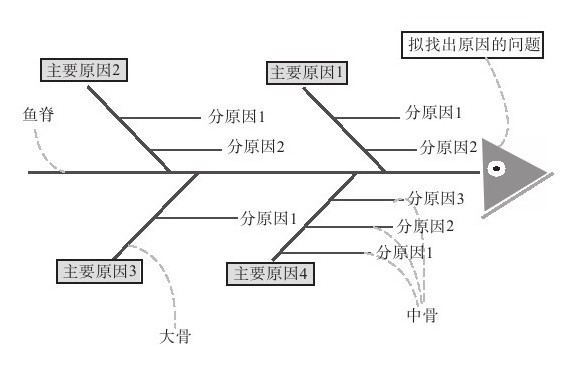

### 2.3 需求规划

当完成了需求的收集，我们往往会面对大量的、混沌的数据不知所措，我们会认为掌握现状是如此不可能，我们很难从这样的混沌状态下吸取营养。如果你希望从需求调研中获得最大收益，你必须沿着一个清晰的、简单的逻辑结构把这些需求体系化，而不是马上投入到对应功能点的研发工作中，这是我在本书中一再强调的“结构性”思想。在之前的阶段我们仅仅是对项目进行了重新认识，在这个阶段我们需要将我们的智慧融入到项目中，并且请注意：这个过程也是“结构性”的。如果没有找到事物的源头，我们很难还原事物的本质，也就无法解决真正的问题，但事实上还没有认清本质就开始急于处理的例子较多。

需求的规划过程我们可以认为是“充分认识——导入思想——整合规划”的过程。当我们收集了大量的信息并使之结构化之后，我们已经能够比较充分地理解“项目外围”了，但这离我们理解项目的本质还有很长一段距离。我们对项目的“充分认识”并不是停留在用户研究、市场或者行业研究等阶段，孙子曰：“知己知彼，百战不殆”，我们需要将我们自身与市场、用户联系起来，充分认识到“我们在哪里”。

当然，我们永远不能只依赖“我们在哪里”和“我们想去哪里”做决定，我们应该充分利用我们的智慧和我们的知识库去思考并得出“我们应该去哪里”。在任何产品的设计中，这一部分都是最具“艺术性的”，最具挑战性的。从相反的角度看，“产品即人品”，如果你没有预见未来的眼光，那么你并不适合产品管理，尤其是互联网产品管理，如果你的思想缺乏深度和广度，我只能很遗憾地告诉你：“你的产品将会很平庸。”但是，任何事物都只是一个起点，并非终点，我相信，如果做了足够多的功课，那么一定能比别人更早地预见未来，而在商业竞争中，你并不需要比狮子跑得快，你只需要比对手跑得快，即使只是一点点。

我们已经清晰地认识到了我们的目标，那么“我们如何去”呢？规划与计划，体现了管理者的智慧，我们需要清晰明了的计划，我们需要我们的规划和计划能够实践，我们需要迅速的行动，我们需要有节奏的行动。节奏，是产品的音符，好的节奏能够使团队一直充满激情，一直充满创造力，而这比其他一切都重要。在整个需求规划的构建中，我们将使用“结构化”使我们充分认识自己的项目，导入自己的思想，释放自己的创造力，我们对自己的远景进行整合，并进行细致的规划，下面一一介绍。

#### 2.3.1 结构化与假设——充分认识

非常善于思考的人总是擅长将思想结构化，他们能够通过整理思想碎片、提升思考方向的精准度，明确地抓住问题的关键要素。麦肯锡将结构化视为构建问题的关键，其总是不断地重复：MECE、MECE。MECE（Mutually Exclusive, Collectively Exhaustive，相互独立，完全穷尽）意味着将问题细分为明确的、没有重复的子问题，同时确保所有的问题都考虑在其中，比如用户、市场、企业优劣势、政治环境、产业环境、文化背景等问题。

那么我们如何将思考结构化呢？通过对需求的调研与分析，我们已经获得了大量的客观信息，这是我们思维的基础。但当我们面对大量的信息和思维碎片时，很多时候很难找到“思考的入口”。问题构建的第一步是将信息归类，通常，归类的过程有助于我们的思想梳理，人类总是更容易从简单的信息中看到价值，而信息的梳理则是将信息简化的过程。问题构建的第二步是找到贯穿大部分信息的价值核心，如果我们能够通过这些信息特征找到信息的主干，那么我们将很容易透过主干看到躲藏在信息背后的核心价值。最后，当我们把大多数信息与这条信息的主干联系起来，我们将会看到一棵庞大的信息之树，这棵树将帮助我们充分认识到价值的方方面面。此外，我们也经常使用鱼骨图的方式表现信息之树，鱼骨图（Cause＆Effect/Fishbone Diagram）是帮助我们思考的最常用的方式之一。

小知识：鱼骨图

鱼骨图是由日本管理大师石川馨先生提出来的，故又名石川图。鱼骨图原本用于质量管理。问题的特性总是受到一些因素的影响，我们通过头脑风暴找出这些因素，并将它们与特性值一起，按相互关联性整理成层次分明、条理清楚，并标出重要因素的图形就叫特性因素图。因其形状如鱼骨，所以又叫鱼骨图（以下称鱼骨图），它是一种透过现象看本质的分析方法，故又叫因果分析图。

1.鱼骨图的三种类型

鱼骨图有如下三种类型：

·整理问题型鱼骨图：各要素与特性值间不存在原因关系，而是结构构成关系，对问题进行结构化整理。

·原因型鱼骨图：鱼头在右，特性值通常以“为什么……”来写。

·对策型鱼骨图：鱼头在左，特性值通常以“如何提高/改善……”来写。

2.鱼骨图的制作

制作鱼骨图分两个步骤：

（1）分析问题原因/结构

1）针对问题点，选择层别方法（如人机料法环测量等）。

2）按头脑风暴分别对各层别类别找出所有可能原因（因素）。

3）将找出的各要素进行归类、整理，明确其从属关系。

4）分析选取重要因素。

5）检查各要素的描述方法，确保语法简明、意思明确。

分析要点如下：

·确定大要因（大骨）时，现场作业一般从“人、机、料、法、环”着手，管理类问题一般从“人、事、时、地、物”层别着手，应视具体情况决定。

·大要因必须用中性词描述（不说明好坏），中、小要因必须使用价值判断（如……不良）。

·脑力激荡时，应尽可能多而全地找出所有可能原因，而不仅限于自己能完全掌控或正在执行的内容；对人的原因，宜从行动而非思想态度面着手分析。

·中要因跟特性值、小要因跟中要因间有直接的原因-问题关系，小要因应分析至可以直接下对策的程度。

·如果某种原因可同时归属于两种或两种以上因素，应以关联性最强者为准（必要时考虑“三现主义”，即现时到现场看现物，通过相对条件的比较，找出相关性最强的要因归类）。

·选取重要原因时，不要超过7项，且应是标在最未端的原因。

（2）绘制鱼骨图

鱼骨图绘图过程一般由以下几步组成：

1）由问题的负责人召集与问题有关的人员组成一个工作组（workgroup），该组成员必须对问题有一定程度的了解。

2）问题的负责人将拟找出原因的问题写在黑板或白纸右边的一个三角形的框内，并在其尾部引出一条水平直线，该线称为鱼脊。

3）工作组成员在鱼脊上画出与鱼脊成45°角的直线，并在其上标出引起问题的主要原因，这些与鱼脊成45°角的直线称为大骨。

4）对引起问题的原因进一步细化，画出中骨、小骨……尽可能列出所有原因。

5）对鱼骨图进行优化整理。

6）根据鱼骨图进行讨论。

图 2-1 鱼骨图 

完整的鱼骨图如图2-1所示，由于鱼骨图不以数值表示也不能处理问题，而是通过整理问题与出现问题的原因来标明各种原因的层次关系，因此，鱼骨图能很好地描述定性问题。鱼骨图的实施要求工作组负责人（即进行企业诊断的专家）有丰富的指导经验。整个过程负责人应尽可能为工作组成员创造友好、平等、宽松的讨论环境，使每个成员的意见都能完全表达，从而保证鱼骨图正确画出，即防止工作组成员将原因、现象、对策互相混淆，并保证鱼骨图层次清晰。负责人不能对问题发表任何看法，也不能对工作组成员进行任何诱导。

3.鱼骨图的使用步骤

鱼骨图的使用步骤如下：

1）查找要解决的问题；

2）把问题写在鱼骨的头上；

3）召集同事共同讨论问题出现的可能原因，尽可能多地找出问题；

4）把相同的问题分组，在鱼骨上标出；

5）根据不同问题征求大家的意见，总结出正确的原因；

6）拿出任意一个问题，研究产生这样问题的原因；

7）针对问题的答案再问为什么，这样至少深入5个层次（连续问5个问题）；

8）当深入到第五个层次后，认为无法继续进行时，列出这些问题的原因，而后列出至少20个解决方法。

逻辑性的框架帮助我们将信息结构简化，但是很多时候信息本身是复杂的，好像背着厚厚的壳，如同坚硬的核桃一样，固执地抵御我们的思想去敲开它。面对这种问题，建立可行的假设是一种很好的方法。我们知道，通过证实和证伪某个问题往往比逐个研究更为高效，而且从新的视角分析总是能够得出新的观点。好的假设就好像引导图，能帮助我们逐个分析问题，并引出我们的思考。这样的假设有两个特点：能指明某些死胡同；能够防止你的思维误入歧途。

文摘：奥姆威尔·格林绍（OmowaleCrenshaw）在开发非洲的电子商务市场时的发现

——《麦肯锡意识》

在麦肯锡，有时我们要面对大量的数据，这样常常会使我们的分析陷入瘫痪，我们感觉无从下手，客户也是如此。建立门户网站之初，我们的确缺少某些方面的数据，我们务必弄清楚哪些问题是至关重要的。我们只能说：“OK，对最大的3个、4个或5个市场，我们都了解什么？我们有什么估计？”我们尽可能准确地记下它们，并根据这些设定若干假设。这时我们就可以说：“OK，如果我们假设市场的规模是X，那么能够得出什么结论？”

然后重复这一过程，“如果市场规模是X，那么Y必然成立。”我们再去考察Y。如此继续下去。我们更清楚地意识到我们正沿着正确的方向前行。虽然仍在探寻实际的市场规模，但让我们欣慰的是：我们所付出的努力是有实际价值的，我们已经考察了所能想到的所有资源。
