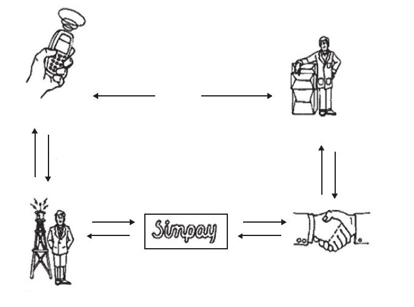
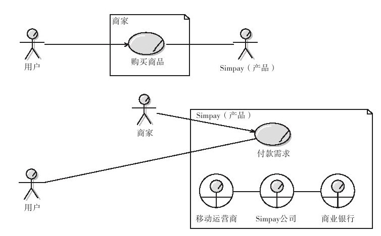
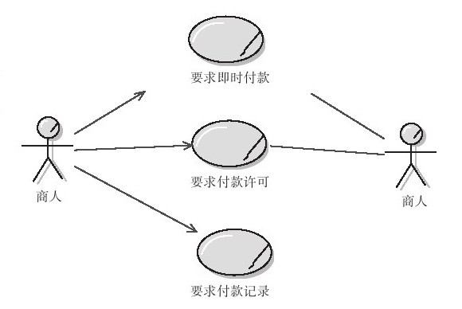
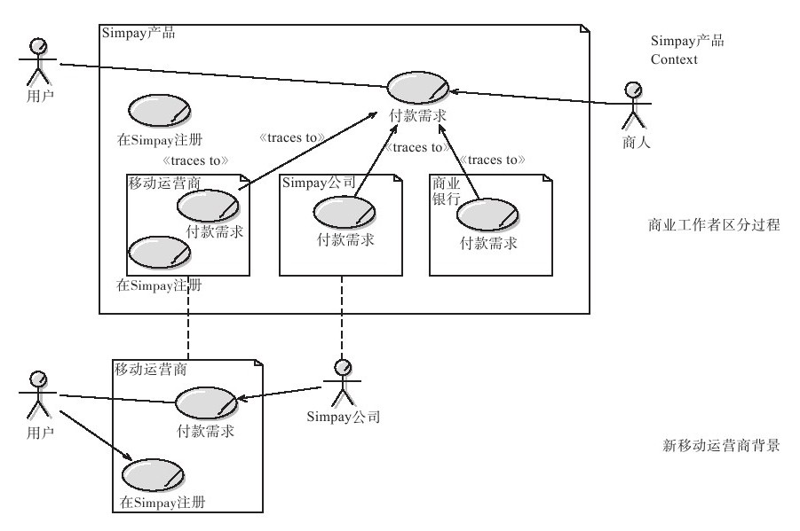
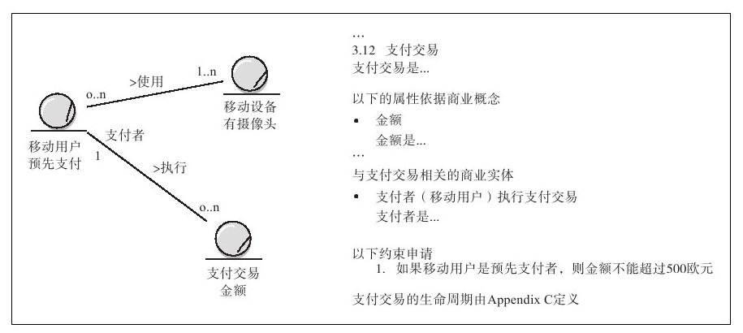
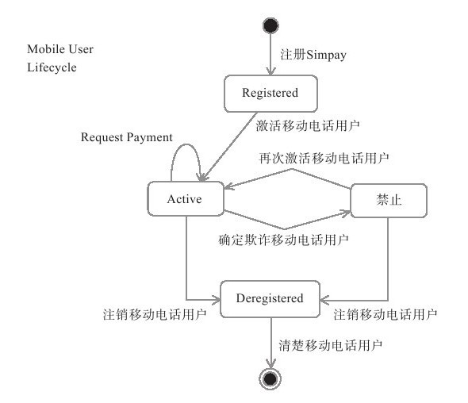

#### 2.4.2 解决方案

建立一套解决的方案，如同其他事物一样，我们要以事实为基础，以分析为导向，最终得到解决的灵感。乔布斯认为，任何公司都能建立优秀的商业模式，但是最终总是因为这个不行、那个不可以，使企业的事业最终夭折。这样的现象经常出现在产品管理的方方面面。很多时候我们经常因为没有足够的耐性或者畏惧去思考问题而不断地回避问题，随着问题越来越多以至于使业务偏离了预先的计划轨迹，最终导致商业模式崩溃。

任何解决方案都需要以事实为基础。如果你希望成为一个卓越的高级产品管理者，你需要认识到：事实是友善的、客观的，它并不会因为你的忽略而消失，而且正是由于问题的困难，你的工作才更有挑战性，这些困难将把你同其他平庸的产品管理者彻底区分开。事实实际上是某种可跨越的鸿沟，你的智慧和能力则是桥梁。当我们深入去思考某个问题的解决方案时，我们经常会陷入自己的认知结构困境里面，而很多好的点子隐藏在事实背后，我们只需要加以调查和分析便可以得出。但是很多时候由于我们对看清楚事实的畏惧而丧失了发现这些点子的机会，人生也是如此。

解决方案的设计主要包括3个阶段：业务目标、业务能力探索、业务过程模型设计。业务目标即是需求开发计划的导入的结果；业务能力的探索可以理解为企业的技术执行能力；业务过程设计主要指针对业务目标进行业务架构设计的过程。下面我来介绍一下业务过程模型的设计思想。

业务过程模型设计也可以理解为业务模型设计，我们可以根据业务流程的大小来定义业务过程模型。一般情况下，各个业务流程之间总是有所关联的，而我们需要区分对待每个流程，通常情况下，细化流程是一种比较高效的，而且是迟早需要的方法。业务过程可能是手动操作或者是自动执行的业务流，它至少包括一个输入流、一个输出流。当某个业务过程较为复杂时，它极有可能是包括了多个子过程的复合过程，此时，我们同样需要用到结构化的思想对整个复合过程进行分解和重新组合，使业务结构清晰化。Polickoff等人认为业务结构的清晰化对项目有至关重要的影响：“缺少体系结构模型，或者开发得很糟的体系结构模型已经常常作为项目走向灾难的一个警戒信号。”

案例一：货币兑换系统的需求解决方案

——改编于《需求分析与系统设计》

1.业务背景调查

各国货币之所以可以进行对比，能够形成相互之间的比价关系，原因在于它们都代表着一定的价值量，这是汇率的决定基础。官方汇率的国家，由国家货币当局（财政部、中央银行或外汇管理当局）规定汇率，一切外汇交易都必须按照这一汇率进行。在实行市场汇率的国家，汇率随外汇市场上货币的供求关系变化而变化。

2.业务目标

一家银行需要在它的门户网站中提供一个专用计算器，使其客户和普通大众能够查明将一个输入金额从一种货币兑换到另一种货币时的金额是多少。

3.业务能力探索

企业技术选用JAVA平台，拥有29位丰富经验的开发人员的开发团队，有成功金融类软件的开发案例。

4.业务过程模型设计

5.业务设计考虑点

1）货币兑换需要应用最新的汇率。

2）汇率可能存在变化。

6.业务过程设计草案

1）使用的汇率需要调用国际最新汇率，而其值为动态值。

2）应用程序可能依靠一个或两个网页来完成。在两个网页的情况下，第1个网页会使用户能够输入要兑换的金额，从组合框中选择“从”哪种货币“兑换”到哪种货币，然后单击“计算”按钮。接着，第二页会显示计算的结果，并提供一个选项（如一个“重新开始”按钮）以回到第一个网页，如果有需要，则可以执行另一种计算。

3）在一个网页的解决方案中，表单将包含一个计算结果域，它不能被用户编辑，甚至有可能在一开始是不可见的。当用户按下“计算”按钮时，这个结果域将显示兑换结果的值。

7.业务过程用例格式

001前台——注册

设计样式：图示说明

用例名：该用例的名称

涉众用户：如游客、系统等系统中涉及的角色

前置条件：用户使用该功能前的状态

后置条件：用户使用后的状态

正常事件流：如用户将会进行什么样的操作，系统将会如何处理等

异常事件流：如用户未进行什么操作将有什么样的反馈等

案例二：使用用例捕获业务需求

——Thomas Behrens，首席技术官，Alpheus解决方案

来自Rational Edge：这篇文章是基于Simpay（一个通过移动电话操作的支付系统）的业务需求工程项目的经验展开的，大致描绘了关于捕获业务需求的7个实用原则。

假定你已经有需求工程规范的一些经验，而且你突然面对一个包括多个公司，并跨越不同商业领域的重大业务需求方案。开始在你的心里出现的问题是：用例是否会在这个项目中使用？我应如何决定用例粒度的正确层次？我应如何构建用例模型？我必须修改标准的IBM®Rational Unified Process或RUP以达到交付标准吗？这篇文章描述了Alpheus——一位国际性的IT顾问，在Simpay（一个可共同操作的手持电话支付系统）组织需求工程项目中应对这些问题的方法。这篇文章将我们在项目中所学到的总结为7个实用的原则，并举例说明了你怎样在自己的业务需求计划中取得成功。

该论述假定读者对需求工程、使用用例及对RUP的基本协议都有很好的理解。

Simpay是一项结合目前细分的移动支付，制定一个可互操作的支付计划新举措。图2-3显示了业务上下文的概观。Simpay处于这上下文的中心位置，其使用开放的接口来整合手持电话商业要求者（代表多个零售商及内容供应者）和手持电话操作者（代表并认证最终客户），完成在线金融交易。Simpay为支付认证、结算并解决手持电话操作者与手持电话商业要求者之间的资金流提供服务。

图 2-3 Simpay商业上下文概观 

业务需求过程被嵌入到一个把支付解决方案（如Simpay产品）转入市场的过程中。产品展现了一个使用手动或自动过程的、从头建造的新业务。由于预算必须控制得恰到好处，因此决定延期实现确切的自动化过程，直到业务已经被建模。

整体项目及商业特性可以摘要为：

·多公司（Orange, Telefa Mes, T-Mobile和Vodafone）；

·重视规模方面（支持约二亿八千万客户）；

·拥有虚拟团队的多国公司；

·持有名誉方面的潜在影响；

·覆盖多重专家领域（举例来说，如无线通通信、财政服务）；

·规则加强器，拥有多种不同的法律约束。

这些特性表达了许多关于建立所有企业涉众的、共同的、一致的业务需求集合的重要性和可见性。

下面我们介绍一个与RUP结合的过程，其跨越Simpay从商业想法到产品部署的整个项目生命周期。我们把活动和交付产物映射到RUP的4个阶段（初始、精化、构建和产品化）及它们各自的里程碑。RUP活动和交付产物最初是针对软件开发过程的，然而这个项目有一个更为宽泛的范围（举例来说，一个可交付成果是创建一家新公司，如Simpay有限公司）。活动和交付产物有时大幅度地偏离RUP，而且这个是与RUP最佳实践相反的进程并不是可重复的。个别交付产物在重复的/增量的基础上产生，提供了早期的评审、验证和质量保证，并且偶尔依靠早期的活动启动。

当我们想要在业务层次上捕获需求，而不指定特定交付产物是手动的或自动的，需要使用RUP业务建模规范作为我们的参考规范，并用需求工程的一些元素进行强化。

下面，将讨论根据我们的经验总结的实践原则。它们将会对你很有帮助：

·为你的业务需求寻找正确的边界（原则1：确定正确范围）。

·适当结构化你的用例模型（原则2：挑战你的用例目标；原则3：使用需求属性决定最好的用例模型）。

·进一步详细说明你的业务需求（原则4：分解的规则——通过业务参与者分解）

·适当描述你的业务用例（原则5：用例描述，陈述“是什么”，而非“如何做”）

·连接你的业务用例，避免冗余，并确认你的需求（原则6：提出域模型；原则7：使用实体生命周期）

原则1：确定正确范围

需求管理的目的是确定正确范围。边界在哪里呢？谁在里面，谁在外面？这是更高层次的抽象，是更为重要的。范围方面很小的变化，就可能会带来对与企业所有者相关的、将要开展的工作及项目运行的最后期限的重大影响。

让我们回顾一下图2-3，这次把它当做一个市场视图。这个视图显示了购买（购物相互作用）和付款的相互作用；它也显示了Simpay为支付中介。现在，比较图2-3与图2-4，除了使用不同的记号（UML）之外，图2-4还显示了两个不同的语境、图片上方是具有销售功能的商人的语境，它在购买商品用例中表现；图片下方是Simpay拥有的支付功能的应用场景，用请求支付用例表现。

图 2-4 商业语境和Simpay语境 

如果认真地看，你将会看到这个特征把Simpay从市场角度分为两个部分：Simpay产品和Simpay公司。当我们发现Simpay产品不仅涵盖了Simpay公司（中心实体）的需要，也涵盖了移动操作者及移动商家要求者实体的需要时，这种区别是必要的。RUP活动和交付最初是针对软件开发过程的，而这个项目有一个更广泛的范围（例如，一个可交付成果是创建一家新公司：Simpay有限公司）。总之，由这些实体实现产品的功能，因此，所有三个项目都包含在这个范围内。

这是在斤斤计较吗？不！它能帮助我们清晰地建立项目边界。这意味着我们可以从早期开始，就避免不必要的讨论。在事后，这些区别可以被看得很清楚，除了新的业务活动外，都要为涉及需求活动的当事者确定边界。这些都是值得研究的工作。

原则2：挑战你的用例目标

一旦确定了范围，你就可以开始确定用例和参与者了。在确定过程中，一个通常的问题是用例模型爆炸式快速增长，特别是当你正在业务需求的抽象层工作的时候。很快，你将会发现你需要表达很多内容。从字面上，停留在你的用例模型的顶层以避免“700用例并发症”。如果你的用例模型正在爆炸式增长，你应该挑战你的用例粒度。对于Simpay来说，在最高抽象层，我们以大约20种主要用例作为结束。记住，一个用例会为参与者提供一些价值；它会成为参与者实现的一个目标。确保所有用例目标都在相同的层次上，并且对于业务建模来说，所有目标都在抽象层上。

图 2-5 不同的目标层次 

有一个来自Simpay语境的具体实例。支付可以立刻实现——支付授权和支付捕获同时发生，或延期实现——授权在捕获之前发生。图2-5显示了一个可能的用例图。然而，请注意用例所表现的目标并不在同一层次。商家的目标是接受支付。他必须服从管理规则，并把支付事务分离为捕获之后的独立授权，这可能不是他乐意的。同时，你被迫表达在请求支付授权和请求支付捕获之间的一些关系。一个简单的解决方案是把这两个用例结合为一个称为Request Deferred Payment的用例。你以更少的用例完成，并进一步得到易于理解的用例建模。

如果在授权和捕获之间有一个长的时间间隙，那么这个时间间隙是什么呢？这你无须关心！时间间隙并不是你分隔用例的指示器，尤其是业务用例，可以是长期运转的。决定是否分隔用例的本质标准是他们的目标是否不同。

导致用例膨胀的另外一个危险是“睡莲并发症状”。当你为一个用例找到一种变化的时候，它就开始了；在Simpay例子中，它可能是支付发生的通道（例如SMS、WAP）。你可能马上被我们例子中的多用途用例所迷惑（要求使用WAP、SMS等方式立即支付），也可能这些用例还存在更多方面。很快地，你就可以像睡莲覆盖池塘一样，覆盖你的用例图。相反的，向目标挑战。如果做些分析，你将会发现目标对于所有这些用例都是相同的。把焦点集中在本质的用例上，稍后你会知道表现这些变更的更好的方法（举例来说，在用例描述的特别需求部分）。

同时，当你确定支持目标后，如要维护重要的业务实体，则应把目标排除在外，使之独立并使用自己的图支持用例包。

原则3：使用需求属性决定最好的用例模型

需求属性包含需求信息，最重要的三个属性如下：优先级，显示一个需求对于商业用户有多重要；迭代，表明需求分配到哪个迭代；稳定度，指出哪些需求可能遭受变更。此外还有更多的属性，但是，让我们把目光集中到上述三个属性上。请确定你在坚持不懈地为你的用例捕获这些属性，因为它们可以使过程变得更轻松。特别的，你将时常会有关于如何构建用例模型的多种选择。当你这样做时，请用上述的属性定位你的用例模型，这将产生最少的重构工作，并聚焦于你的工作。

考虑下列的指导方针以决定你的选择：

·如果某指导方针违背原则2，并导致用例增加，不要应用该指导方针！

·如果两个用例有不同的优先级，避免合并它们。

·如果两个用例被分配到不同的迭代中，避免合并它们。

·如果两个用例具有不同的稳定性等级，避免合并它们。

·不要为取得不稳定用例的模型花太多时间，这个功能可能根本上不需要改变。现在，把焦点集中在稳定用例上，以得到正确的模型。

记住：你如何重构用例模型将会影响其他的工作。业务用户将不得不找到适合新模型的方法，对于不同的可交付变量的追踪也需要被更新。从一开始就正确地构建模型，也将节省其他人的时间。

在上面的例子中，我们坚决反对把延期和即付功能归并到一个单一用例中（如请求支付），因为“初始Simpay开发可以而且也会包括延迟的或直接的支付”。无论选择哪种支付机制，其他的将是以后版本的范围。这种用例属性反复的变化，将导致用例分裂为即付请求和迟延支付请求。

原则4：分解的规则——通过业务参与者分解

现在你有一个结构良好并可以理解的业务用例模型。接下来你要往哪里去呢？一件重要的事情是，不要把功能分解到你的用例模型中，即不要把你的用例打破成较小的部分。若打破成较小的部分，则这样的部分将会变成孤立的，违反用例步骤的最重要的优点之一：在参与者的目标语境中呈现需求。相反的，答案是递归地在当前语境中，基于用例步骤重新应用。

让我们回过头看看图2-4，底部的Simpay产品语境显示由Simpay公司、移动操作者（即图中的移动运营商）和移动业务需求方（即图中的商业银行）实现的Simpay产品。这些实体的RUP术语是业务参与者。这些业务参与者合作完成Simpay产品功能。一个、二个或所有的业务参与者都参与每个Simpay产品用例。通过这一信息，你可以为每个业务参与者（由Simpay产品语境分配的）产生一个语境。每个语境由下面二者建立：通过业务参与者划分用例；从现有的业务参与者派生出新的参与者。这个过程在图2-6中举例说明了，它为移动操作者显示了一个实例结果。带有两段用例和一个新参与者（Simpay公司）的新的移动操作者语境已经由更高抽象层派生出来。现在你就能分开控制（相互调用）新的语境了。

这与功能分解有什么不同吗？是的！取代了在Simpay产品语境（不是由参与者目标激发的）创建孤立的部分，你已经用新参与者表现的精确目标创建了更小的域。看看移动操作者语境的结果。明显的，Simpay公司代表移动业务需求方（依次代表贸易商）做这些事情。然而，移动操作者的领域是自我包含的，它不需要了解Simpay公司参与者做什么。相反的，功能分解方式将把用例分解成许多部分：获得商业细节、进行外汇交易、授权支付、捕获支付。哪种方式更适合管理方案范围呢？

图 2-6 业务参与者划分 

原则5：用例描述，陈述“是什么”，而非“如何做”

很幸运，我们拥有感兴趣的业务代表，他们很快就适应了用例方式和有能力的技术队伍，他们的目标是把需求自动翻译成科技规范。然而，如同它被生成一样，业务代表尽可能地由状态激发，而且科技队伍对于强加于他们之上的不必要的限制因素感到不安。用例通过描述产品做什么来展现需求，以达到参与者的目标。“做什么”和“如何做”间的产品活动是人们，特别是全球性的分布化团队不太清楚的一些事情，误解是正常的。这里有4种类型的指导方针可以帮助我们避免这些错误：

·特定的自然语言表达有技术内涵（如回路）。如果你使用这些表达，则应确保它们在作为技术设计建议时不会被误解。

·业务用例描述商业流。它们决定谁是信息的来源，以及谁是目标。它们没有暗示流的技术实现，没有明确定义信息是否要推或拉、信息交换是批量的或在线的、是否要使用缓存。这样的技术性的决断主要关联到非功能需求。确定人们能够理解业务用例中的词，例如联系、请求。这些用词并不意味着底层技术的通信基础设施存在技术限制。

·争取涉及参与者及产品间的简单交流模式。尝试遵照同步请求/响应沟通模型。这暗示一个请求的响应在用例描述持续情况下，或者被接受，或者不被接受（如在超时的情况下）。当用例已经在它的描述中继续前进时，它不可能接受响应。请求的表达是充分的，并且它简化了描述。应强调的是，它并不暗示同一模型的技术性实现。

·当你为用例步骤编号时，人们通常认为你正在下令指挥应该如何完成功能。然而，用例步骤的顺序通常仅仅关系到参与者的下一个交互。当在这样一组步骤的特定顺序被托管时，请习惯于跟随明确的状态。

交流这些指导方针是重要的。对于Simpay来说，我们在产品概述文档（见页面边栏）捕获它们。在RUP中用例模型和指导方针文档最适合做这件事。更为重要的是，如果你正工作于定制的过程之中，要有一个试验。选取一个用例，并努力与整个队伍前进方向上保持一致，这样每个人都会对你将生成事务及管理期望的方法感到满意。

业务需求交付产物的结构

Simpay产品（如这里所示）业务需求的可交付文档采用了UML类图结构。过程框架和功能架构是高层次的业务需求文档，相当于针对Simpay产品的RUP业务视图和业务用例模型。在产品定义中捕获详细说明的业务需求，其接近于三个业务参与者（在Simpay中作为实体引用）：Simpay公司、移动操作者和移动业务需求方。对于Simpay有限公司而言，产品定义捕获了在RUP中引用、作为业务分析模型的东西。标准的RUP交付产物内容已经被修改，原因如下：

1）业务需求存在于两个抽象层面上（例如，Simpay产品和移动电话操作者或Simpay有限公司或移动业务需求方）。

2）在第二个抽象层从两个不同层次获取细节：

·一个层次为Simpay公司的确切描述，如何建立业务需求（或者通过技术解决方案自动实现，或者由操作者手动编写）。

·另一个层次主要为移动操作者和移动业务需求方，描述设计准则（不包括个别实体）。

原则6：提出域模型

在RUP中，一个域模型（见图2-6）被定义为：在域的语境中捕获最重要类型的对象。域模型是业务分析模型的一个子集，业务分析模型包含描述业务参与者（见原则4）和业务实体如何获得用例功能的业务用例实现。域模型很有用，即使你不提出业务用例实现。它通过为你的用例描述提供具有精确含义的通用词汇术语，来连接你的各个用例。域模型确保相同的术语指向相同的业务实体，正好也捕获如下类型的需求：

·业务实体和它们的多样性之间的联系（比如，一个移动用户使用一个或多个移动电话）。

·限制因素（比如，一个支付不能超过一个特定的数值）和推导规则（比如，利息计算），尤其当这些不只与一个用例相关时。

结构化你的域模型文档，为这些信息（见图2-7）加入占位符。在我的经验中，商业用户对这些细微改进的形式相当满意，而且这些改进能为你提高稳定性和完全性检验：

图 2-7 域模型图和相关文本 

·所有的业务实体及它们的属性是否都已经定义？

·你是否已经捕获了所有的联系？

·所有涉及的业务实体是否至少在一个用例中？

·所有涉及的业务实体是否都存在于域模型的用例中？

当创造域模型的时候，除了根据常识和你的读者偏好之外，你还能使用下列的指导方针：

·使用图帮助描述，尤其是显示业务实体间的彼此联系。

·宁愿冗余的泛化；否则，你可以从你的业务用户那里要求。

·对于简单的关系类型使用属性；否则，将会使图混乱。

·当属性的类型会明显避免制造困惑时，忽略它们。

·如果识别符（比如用户ID）与商业无关，忽略它们。

·只有当参与者的名字有助于澄清语境的时候，才使用它们；否则，把业务实体作为参与者命名，以避免弄乱你的图。

·产生相关条目的简单导航技巧。域模型将会时常被用于查找信息。对于Simpay来说，我们使用IBM Rational Rose作为域模型的捕获信息，使用IBM Rational SoDa来产生简单的导航文档。

一个域模型如何与一个术语表相关联？一个术语表定义了项目中使用的重要术语。以这种定义为基础，一个域模型是术语表中术语的一个子集。但要避免冗余：在术语表或域模型中定义一个条目，但不要在两者里面都定义。通常，当你知道更多关于你的商业域时，将术语从术语表转移到域模型。然而，你的术语表对于那些不存在于业务实体中的术语，仍然是有用的交付产物的内容。

原则7：使用实体生命周期

在商业规范中实体生命周期可以得到充分利用，但是，一个好的解决方案（UML状态图）是前提。你为什么要使用状态图中这些元素？它们如何关联到用例？业务实体（比如，一个移动使用者）通常有跨用例的生命周期。用例往往在不同状态的商业实体中转换。状态图描述了关于你的重要业务实体在哪里、如何被操纵等问题。图2-8所示为一个关于移动使用者业务实体的例子。转变表现了维护移动用户的用例，并在不同状态间转化它。

作为一个分析师，你也可以使用状态图保持你的需求集的一致性和完整性。我的业务实体是如何成为实物的呢？我是否已经错过了一个重要的状态？我是否已经描述了用例中支持的所有转变的状态？我是否错过了影响转变的特别条件？

限定最重要的业务对象的生命周期，在你的文档中描写所有状态。你的用例将以正确定义的域模型术语描述涉及的这些状态，在保持可读性的情况下，把歧义从你的规范中排除。一个用例描述如图2-8所示。

图 2-8 移动电话用户周期图 

移动操作者确认移动用户并未被禁止。这种禁止状态指明了移动用户所处的状态，并为状态展现了一个非常精确的定义。依赖参数选择，你可以使用格式来强调文本中的状态。

生命周期最好作为由业务实体定义（见图2-7）耦合的附录，并置于域模型中。你能够使用IBM Rational Rose来维护状态图并文档化状态，而且可以使用IBM Rational SoDa产生易于操纵的文档。

采用这种方式，当你把实体生命周期置于业务用户之前时，你就可以像技师一样，在没有做出需求时，平衡使用它们的好处。

一个对于未来的调查：通过模型驱动架构，你将会独立于一个特定的平台，受益于预先指定的精确性。除此之外，可运行的UML将会使你在开始着手并不惜代价地细分你的需求之前，确认你前面的模型。
