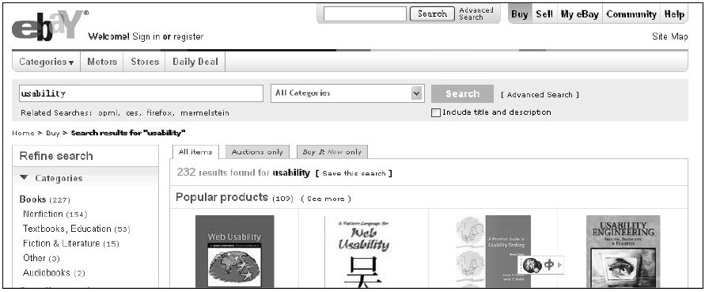

#### 3.3.4 我们需不需要搜索系统

在提出需要一个搜索引擎时，我们一定要非常小心。如果你的网站并没有那么多的内容，如果你的用户并不希望使用搜索的方式查找，那么我建议你取消它。从本质上看，搜索系统的建立是由于用户希望得到与关键字相关的建议，而导航系统的建立则是由于用户希望从某个类别中得到建议，两者存在很强的互补性，同时也可能存在相互争夺资源的可能。我们通常会发现如果一个产品的搜索系统做得比较好，那么导航系统则会做得较差，而这种主要行为并不应该由我们来定义，这是用户行为习惯的结果。

案例：eBay、Amazon搜索系统设计

eBay搜索系统的设计如图3-6所示。

图 3-6 eBay搜索系统设计 

Amazon搜索系统的设计如图3-7所示。

图 3-7 Amazon搜索系统设计 
