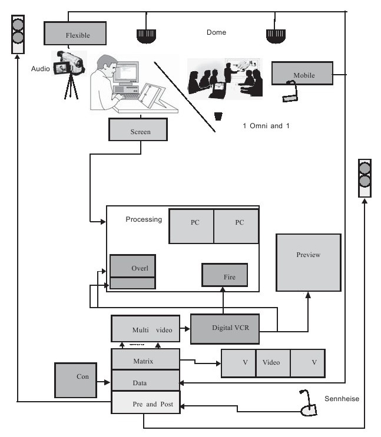
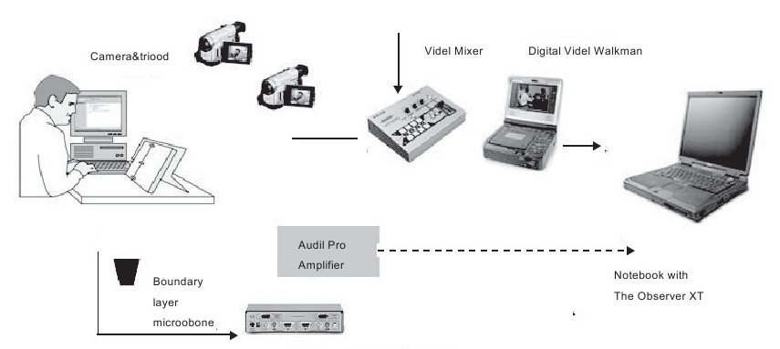

#### 4.2.2 测试准备与设备

很多人曾错误地认为可用性测试是一项非常复杂的工作——需要非常高超的技术、严密的科学设计以及透过高科技设备进行严密的数据挖掘与分析。事实上，可用性测试并不是科学实验，而是通过观察被测试者研究原型可用性数据的一种非常实用的手段。我们设计测试方案时也并不一定需要非常专业的可用性实验室，而是根据测试需要来设计测试环境。测试环境可能是一个简单的房间，也可能是会议室，如果办公室条件不错，那么可用性测试人员也可以用来做可用性测试。也许这间房间并没有单面镜，没有一些眼动仪之类的特殊设备，而是只有几把简单的椅子、一个桌子，以及一台电脑，尽管如此，熟练的可用性测试人员还是可以完成测试。相似的，我们也可以利用会议室来进行测试，只是要求：安静、空旷、不受打扰。因此，应避免在工作地点进行测试。工作地点虽然便于观察，但是环境嘈杂，并非好的选择。

当然，有的时候我们也需要使用专业可用性测试设备进行精密测量。专业设备的真正价值在于剔除干扰因素，从而高效率地完成精准测试。通过长期测试观察发现，高质量的测试空间也可以使参与者和引导者（测试引导人员）感到舒适，并对测试加以重视，这样的结果也更具价值。此外，如果测试空间更为舒适，那么测试效果也会更好。如果让一个测试成为一个轻松简单的旅程，你得到的结果会更加精确和完整。这也就是可用性测试人员把被测试人员称为“参与者”而不是“被测试者”的原因。因为每个人都更愿意只需要“如同普通生活一样”便完成了测试，没有谁愿意被当做一只小白鼠，几乎没有人喜欢“庄严肃穆”。

在一些情况下，你也许需要在不同的地方才能完成完整的测试，有的甚至需要在不同的城市进行。在这种情况下，让不同地方的设备有连接就很必要。一般而言，这些测试设备是为了市场研究而准备，但也同样可用于可用性测试。有时也可以使用酒店里较舒适的房间，当然，若房间里能够提供单面镜和音箱设备当然就更好了。

小知识：可用性测试实验室

可用性实验室的组成如图4-1所示

图 4-1 可用性实验室 

可用性测试实验室通常包括测试室和观察控制室，两者之间用单向反光玻璃隔开。测试室中安装了多个摄像头和麦克风，用于记录被测试者在使用产品时的动作表情和声音，还有喇叭，用于传送测试人员的指令。在观察控制室中，测试人员面前的OBSERVER XT行为分析系统可以控制测试室中的摄像头，以获取最佳的受试者行为图像。摄像机视频图像经过MPEG编码后送入计算机。OBSERVER XT计算机可以通过SCREEN CAPTURE功能控制受试者使用的计算机并显示其屏幕上的内容，如与眼动仪配合使用，还可以显示、记录受试者目光注视的位置及视点轨迹，从而研究受试者感兴趣的区域及目光停留时间。如与生理信号采集系统配合使用，OBSERVER XT系统可以输入受试者血压、体温、心电图和脑电图等生理信号，以便进一步判断受试者当时的感觉。

OBSERVER XT系统可以将多个摄像机的图像同时显示在计算机屏幕上，以便于测试人员观察分析。测试人员使用OBSERVER XT计算机记录分析受试者使用某个产品时的行为图像，得到其各种行为发生的时刻、持续时间和发生顺序及次数，然后进行统计处理，得到分析报告并判断相应产品的可用性情况。

为了方便可行性实验室的户外使用，我们也可以使用便携式的观察实验室，可以随身携带，组装简便，灵活性强。

具体装备如图4-2所示。

图 4-2 可用性测试设备 

是否真的需要一个可用性实验室？

——Joanna Bawa

我们往往认为，真正的可用性测试必须在实验室中进行，然而对于很多公司而言，设立一个专门的实验室并不是一个好的选择。我们将为你展示如何取得结果，而不必建设一个可用性实验室。

无论从哪一个角度来看，定期的可用性测试都是一个非常棒的方法，开发者可以获取新的技能和感知；用户可以获得更好的产品，项目团队可以获得管理层的认可。但如果可用性测试只是产品开发过程中一个很小的部分，那么要获得这些资源将会非常困难：设立实验室需要很大的空间和高质量的家具，还可能需要一些高性能的计算机；可用性实验室还需要额外的观察空间以供测试人员在不被注意的情况下观察测试参与人员。为了测试某些产品，还需要安装摄像机和录音设备来记录测试过程并用于以后的分析，如果你还有更高的要求，目光追踪软件、按键记录程序和焦虑监视器都是必备的，虽然它们的价格可能很高。

让我们回到现实吧，除非你的公司雇佣了一些专职的可用性专家——他们除了为一些大方的客户进行可用性实验之外什么都不做——否则，以上的购物清单只能在表面上令人感觉“专业”，而没有任何实际用处。所以，在购买装备时，我们需要尽量确保合理定位。

内容：可用性实验室是一个极其强大的工具，它可以证明你在可用性方面的专业性，并能折射出可用性文化，激起用户的积极反应。但是，如果客户并不定期使用，或者你不准备将实验室作为可以出租的资源，那么其潜力将受到限制。

逐渐缩小的投资回报率：好的设备确实可以帮助你，但是当你在设备上花费太多时，所获得的回报就会按比例减少。比如，目光追踪软件是一种用来鉴别使用复杂软件问题的好工具，因为即使在用户无法表述清楚他们要做什么的时候，它也能够解释用户的注意力聚集在何处。但除非你计划花费大量的时间在这类问题上，否则这项投资不会产生很大的回报。

数据分析与信息质量：视频数据有很强大的驱动力，尤其是用来劝说那些持怀疑态度的经理们时，视频数据可以让他们知道很多人都在面临相同的问题。但是如果你没有足够的人力来审阅这些需要花费长达数小时才能整理完的数据、进行编辑并将片断缝合到一整盘磁带上，然后标记和存储这些数据，那么这种方法是无效的。

以下选择能够让你用较低廉的成本得到比较好的结果：

租借办公室：如果你不能证明你确实需要一个每天都运转的实验室，那么可以预订一个会议室或大办公室，并在那里架设你的测试，四位实验者使用笔记本电脑工作、一名能熟练使用铅笔和纸的观测者，就可以实现与在最豪华的实验室几乎同样的任务。

电话与在线调查：一个非常流行的、低成本的、收集可用性数据的方式就是进行电话访谈和在线调查，这些方式的成本低、容易实现并且有效，但是，这些调查和访谈的设计本身就是一项技能，也是这类方法的隐藏成本。

场地观察：如果你想明确地知道你在观察用户的自然行为时所询问的那些问题的答案，最好的办法就是参与到同样的过程中，这可能需要时间成本和长途跋涉，但只需要简单地加入用户组，在普通情况下观察他们与你的产品的交互，这样就能获得非常宝贵的观测资料，而这些数据是其他方式无法实现的。

远程测试（基于互联网的）：如果你已经设计好了针对网站或软件的测试计划，那么就有可能以远程方式直接进行测试。当多个用户从他们的家或办公室登录来同时进行基本任务时，你可能无法获得相同的观测数据，但是可以很快地获取很多有效的信息，而不再需要额外的空间。

一个可用性实验室可以是一个强大的有益的资源，如果你的公司对可用性实验非常重视，那么最终你仍需要一个永久的实验室。当你进行此项工作的时候，你要记住：优秀的可用性分析依然主要依赖于可用性专家头脑中的智慧，而不是任何其他的部分。
