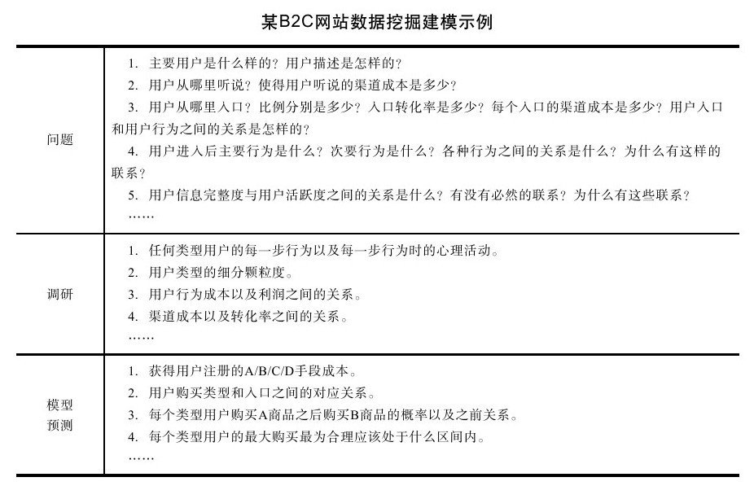
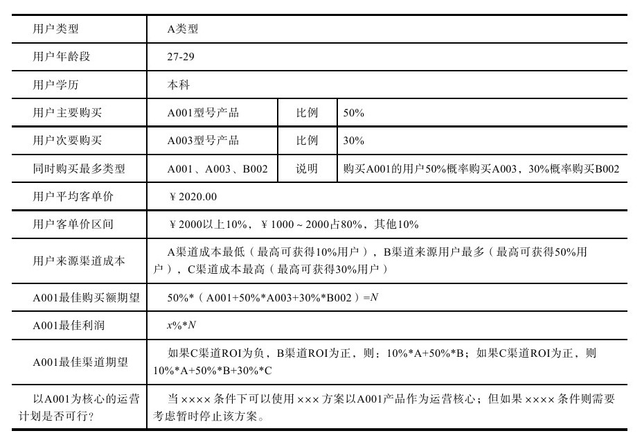
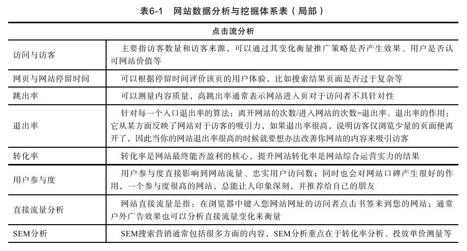
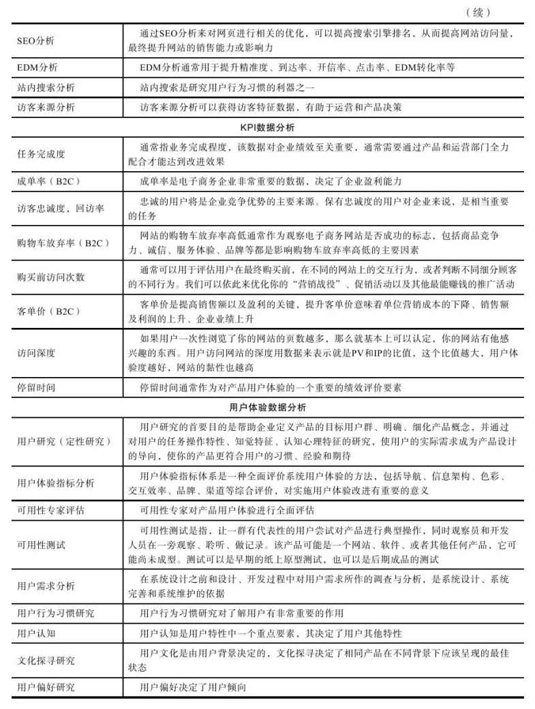

### 6.2 数据挖掘与分析

虽然我们一直在强调了解整个生态系统每个部分的重要性，但是这并不是一项容易的工作。研究分析方法已经发展了很多年，但是由于每个项目的不同，我们依然没有非常完美的、能够适用于所有企业的解决方案。在这些方法中，被普遍认可的研究方式又分为定性研究和定量研究两类。很多用户研究专家采用“猜测——证实”的定性方式针对代表性特征用户进行深度研究，但是即使最佳的结果也只是共性的结论，与我们的目标依然相差甚远。很多定量研究专家采用数据统计的方式进行分析，虽然也能获得某些群体的共同趋向，但是离应用层面依然非常遥远。在研究为什么企业总是难以达到客观分析的目标这个问题时，我们发现真正的问题出在即使我们非常清楚分析的宏观目标，但是没有考虑分析结论的应用和拓展等问题，所以数据挖掘与分析成为一句空话，也没有达到目标。

事实上，数据挖掘与分析是至关重要的，它是企业的命脉，但问题出在我们没有很好地利用它。数据挖掘和分析是两个部分，数据挖掘主要指发现隐藏在表象数据背后的有价值数据，数据分析主要指系统评估数据从而获得包括产品、运营、市场等全方位的解决方案。我们认为数据挖掘和分析不仅仅是从数据获得结论，而且还需要设计必要的数据交互以验证结论。因为数据是动态发展的，所以在关注数据表现的同时我们必须去关注用户行为和产生该行为的原因，必要时我们建议可以通过修改产品或者表达方式以验证我们的构想，这会使整个研究容易得多。在整套方法中，数据挖掘和分析首先要做到客观，其次要做到严密的逻辑推导及能够系统评估。在此基础上，我们便可以做到不仅要关注整个生态系统的宏观情况，还要在微观上认识到每一个节点上正在发生和变化的事件，这对我们做出正确的决定是非常有帮助的。接下来，我们便开始展开说明。

#### 6.2.1 数据挖掘与分析技术

数据挖掘已经被提出并付诸实践很多年了，但近年来由于商业应用的突飞猛进变得格外受关注。在BI领域，数据挖掘又称为数据库中的知识发现（Knowledge Discovery in Database, KDD），也有人把数据挖掘视为数据库中知识发现过程的一个基本步骤。与所有的任务一样，数据挖掘首先需要有非常明确的目标——我们希望从任务中获得什么样的效果。其次需要非常扎实的挖掘功底——丰富的数据挖掘经验，能够从数据中发现问题，最后将所有的结论进行格式化梳理，从中发现问题并获得解决问题的启发。按照传统，数据挖掘过程由以下三个阶段组成：准备，执行，结果表达和解释，今天我们也可以抓住其精髓并通过适当的修改应用于互联网行业中。今天的数据挖掘主要包括挖掘和分析两个部分。本节主要内容为数据准备要素和数据挖掘方法，下一节我们将结合数据分析研究数据挖掘的结果。

1.准备

数据挖掘过程中，准备也许是最重要的一个环节。很多数据挖掘与分析项目获得的结论之所以没有能够有效地应用就在于数据挖掘准备不充分，其中又以项目目标不清晰为最重要的原因。很多用户研究员喜欢获得“偶然的数据”以满足认知的兴奋感，就好像哥伦布发现了新大陆一样，但这其实就是造成项目失败的表现之一——我们可以预料到这个项目没有良好的规划、没有边界、没有核心、没有预测，甚至于项目组不知道为什么要进行这个项目。我们认为数据挖掘和分析项目必须有目标——为什么进行这次分析项目；有清晰的边界——什么是分析的范围；有正确的指导——什么是项目主要解决的问题；有良好的项目管理——项目如何进行以及有什么“规划中的偶然”可能发生。在这样的情况下，数据准备就显得非常重要，它不仅仅代表了分析的框架、范围、要素，而且还代表了如果出现了A情况项目应该怎么进行，如果出现了B情况项目又应该会发生什么改变等。

第一步：分析数据挖掘项目范围和主旨，建立基本模型。

在产品运营中，数据挖掘与分析是一项长期的持续性的工程，但并不是所有的结果都要等工程完全结束后才可以获得。我们可以把数据挖掘与分析当作需要打下的一片江山，而其中的每一个小项目和小迭代则代表着要攻克每一个小山头。就如同沙盘上的战场规划一样，我们在整个运营项目中先将每个阶段的数据分析要点进行标识，而后再具体分析如何夺得下一个山头，将我们的宏观和微观的目标先进行统一。

接下来我们可以根据对整个战略进行宏观分析，归纳出框架性的数据分析要素，然后在此基础上再对下一个小型数据挖掘与分析项目目标进行细分并建立颗粒度较小的数据框架。数据分析基本模型的建立一部分是科学推导，一部分是理性预测，所以我们认为这是科学和艺术相结合的结果。通常宏观数据分析框架包括了解用户有多少个大类、主要的业务能满足什么样的大类用户的需求等，而微观分析框架则聚焦与颗粒度较小的类型中，比如在A类用户中有多少种及什么样的个性化类型，某主要业务又细分成什么样的业务、分别满足什么样的需求等。很多时候局部分析过后我们也会发现宏观分析框架存在问题，这时候我们需要再进行全面的预测和评价对其进行改善。

另外，数据挖掘基本框架模型一般在信息不足够充分的基础上建立，所以一般会存在问题，但是我们也必须力求获得更多有价值的信息来支撑我们建立尽可能合理的框架，其中以往的数据分析经验也是非常有价值的。

第二步：根据基本模型建立数据挖掘框架，并论证其合理性。

在我们完成基本模型的建立后，需要把这个模型变成数据挖掘框架。如同我们可以通过检测每个区域的环境污染来了解城市的污染情况一样，当我们已经对基本模型有了基本认识后，就需要考虑这个模型中那些有代表性的数据都说明了什么问题。所以，我们看到框架相当于一个刚刚修筑好主体结构而未经修饰的大楼，框架之间每个区域都相互关联，但是现在还是空屋，等待我们填入内容来丰富它。

很多数据挖掘专家都有一个独门绝技——数据分析模版，它们适用于某一个行业或者某一个产品，但是它们的构建思路都非常一致——只要填写入数据就可以看出问题的端倪，而且这些问题都一一对应到具体的实践中。当然，他们的模版都已经过千锤百炼，同时他们具有非常丰富的经验和非常的敏感性和嗅觉，这都是这些专家赖以生存的根本。

某B2C网站数据挖掘模版片段示例

备注：本模版用于综合计算A001产品运营方案ROI，通过数据挖掘的方式聚焦能够平稳运营的条件，每个条件的修改都将会产生不同的数据，该数据对运营ROI有决定性影响。

第三步：考虑到数据挖掘中可能存在的情况和变更，使方案更严密。

在完成了所有的框架和模型之后，我们的数据挖掘项目其实已经能够执行了，但是为了使得接下来的执行更加高效，我们还必须考虑到数据挖掘中存在的各种可能性，使整个方案更加严密。通常来说数据挖掘中可能存在的情况主要包括：挖掘中发现实际表现超出预期过多、发现有价值的新大陆、发现实际情况与预设框架相矛盾等。这些情况的发生通常都会对数据挖掘与分析项目产生非常重要的影响。对于这些情况通常我们有两种解决方案。

·当项目预估发生错误时，建议停止正在进行的数据挖掘项目，重新进行项目准备。这种情况通常出现在准备不够充分或者外界变化非常巨大时。我们建议，如果项目预估发生错误应该立即停止并寻找问题的根源，避免进一步犯错。我们也建议，在进行数据挖掘和分析项目时也需要不断进行重新检查，以避免此类问题的发生。

·当项目有新的重要发现时，建议更新数据挖掘与分析的宏观部署，对该发现进行新立项，必要时从需求调研开始重新进行全面分析。这样的情况通常发生在目标客群中新需求突然产生时，这并非研究项目规划的问题，但因为其重要性极高，故必须慎重对待。

在研究项目中，任何情况都可能产生积极或者消极的影响，为了促使项目成功，我们需要非常认真地对待每个细节，将整个方案和整个计划进行多次论证分析，系统性思考，尽可能使项目平稳前进。只有能够确保平稳前进的方案，才是最佳方案。

2.执行

很多企业对研究型项目的执行非常畏惧，一方面是由于很多研究型项目是开放性的，这一类的研究项目通常旷日持久并耗费资源，另一方面是由于研究型项目的管理比较困难，很多研究项目难以通过通常的业绩指标方式进行管理。数据挖掘及分析项目与其他研究型项目不同，其研究目标明确，研究方法也相对闭合，非常适宜以PDCA为核心思想进行管理。

（1）Plan（计划）

之前我们用很大篇幅描述了数据挖掘的各种准备活动，这些都是计划的一部分。在完整的数据挖掘与分析计划中，我们不仅需要资源和思想准备，还需要充分评估研究需要的时间计划、人员计划、研究目标、研究成果预估等，可以将其归纳为5W1H结构。首先，即使非常大的研究目标我们也必须将其细分从而一步一步完成，这样可以避免时间过长难以控制。其次，每个方向的研究人员也不宜太多，以7个以内为佳，否则将面临沟通和管理效率降低的问题。再次，我们也需要对研究成果进行预估，这样可有效地避免研究中出现太大的偏差。

（2）Do（执行）

数据挖掘与分析执行并不是我们想象的那么枯燥，而是一项科学和艺术结合的工作。从科学的角度上看需要数据分析专家从秉承客观、逻辑思考、谨慎判断的角度来考虑问题；从艺术的角度上看需要数据分析专家具有非常强的数据敏感性，能够透过数据的表象发现问题。同时，数据挖掘也是一门比较复杂的学科，这里简单介绍一些方法要点，如果希望获得更加详细的内容，我们推荐你阅读Avinash Kaushik的《Web Analytics：An Hour a Day》。以下为数据挖掘与分析中部分要点数据分析提取框架表格，适用于业务流程比较简单的B2C行业，读者可以根据自己所在行业衍生出对应的分析框架表格，如表6-1所示。

（3）Check（检查）

数据挖掘与分析的检查工作可分为过程检查和结果检查。过程检查主要是针对研究客观性、科学性和逻辑性进行检查。过程检查包括数据的可靠程度分析、研究环境的客观性评价、研究方法的科学性等进行综合评估，我们认为只有过程科学的研究才能产生合理的分析结果。结果检查主要包括研究结果的产生是否科学，研究结果是否与研究预期存在较大偏差，研究结果是否已经足够清晰表达等。在检查的实施中，我们建议采用检查记录的方式，包括清晰描述每一个过程的检查情况记录，这对我们的检查效率以及后期分析回顾非常重要，尤其是针对庞大数据库进行数据分析的过程中。

（4）Action（改进）

数据挖掘与分析的改进主要指针对研究结果检查时发现问题之后再针对这个问题设计研究方案进行多角度重分析的过程。如果通过重分析发现结果与原始研究结果相同，则需要将重分析的过程和描述添加到原始研究结果中，以便日后查阅。如果重分析发现结果与原始研究存在较大偏差，则需要仔细分析研究过程和研究结果存在的问题，了解透彻是什么问题导致了这个研究偏差，如果需要也可以进行重新立项来分析，再新立项分析中则需要注意改进研究方案，并更加谨慎地注意研究中每个环节的过程和推理严密性，避免同样的失误再次发生。

3.结果的表达和解释

最后，我们再来谈一下结果表达的问题。数据挖掘和分析的结果非常重要，所以一定要清晰易懂。我们建议在分析结果上进行说明处理，即这个数据说明了什么、为什么。数据挖掘和分析的结果通常要送达产品部和运营部，他们会根据自己的认识来理解这些结果，但他们未必能够系统性地来看问题，这会导致非常大的偏差。例如我们可以将用户在列表页面停留时间过长解释为用户正在点开列表中每一个商品进行浏览；也可以解释为列表页面太复杂，以至于用户难以理解而必须慢慢理解，在这样的不同思路下很有可能做出错误的决定。
