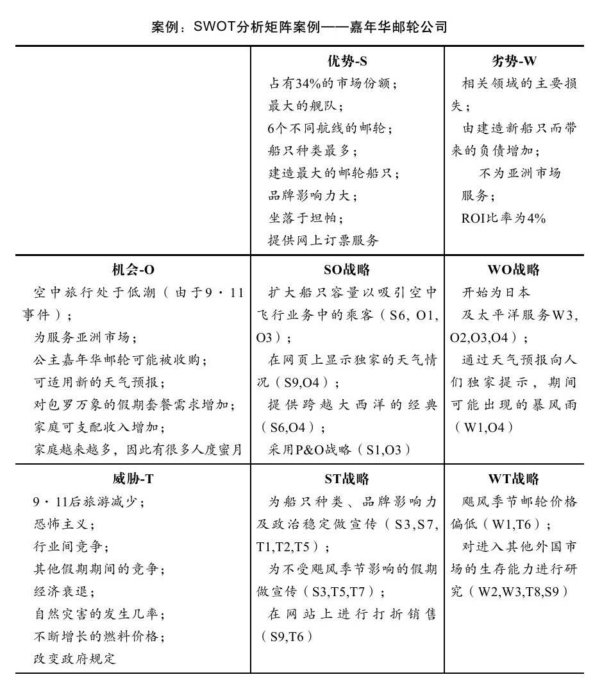

#### 8.2.2 通过SWOT分析识别产品机遇

似乎很少有人知道SixDegrees。早在1997年，互联网第一个SNS网站SixDegrees就根据六度理论开始创建了，可惜由于SNS在当时仍是个比较超前的概念，2000年该网站就被迫出售了。之后也陆续出现过很多SNS站，比如于2003年3月推出的Friendster，曾经获得1300万美元风投，但它没能将奇迹延续下去，之后便被Myspace和Facebook大幅超越。

今天我们仍然在为很多事件感到遗憾。在一些有价值的机会面前，我们应该更审慎地对待。在很多情况下，即使成熟的概念和业务也很可能成为企业创新的包袱。根据Joseph的理论，因为技术进步的速度会超过市场对性能的要求，所以那些最初只用于新兴市场需求的技术后来能够侵入主流市场，从而使新兴公司可能超过老牌公司。

当今技术的高速发展不仅给很多新兴业务带来机会，同时也给老牌公司带来巨大的挑战。如何保持持续的成功，如何分析新的成功机会？机会有很多种形式，高级产品管理人员必须善于发现它们。如果我们能将机会分解，那么便能够对机会本身具有更清醒的认识。Michael Porter识别出决定了一个市场或细分市场的长期内在吸引力的五种因素，它们分别是：同行业竞争者、潜在的新参加竞争者、替代产品、购买者和供应商。虽然Michael Porter的思想难以广泛应用于各个领域，但是他的思考的确很有启发意义。

相对而言，我认为菲利普·科特勒提出的采用SWOT分析的方式对于业务单位战略研究则更有实践意义。SWOT分析是指对公司内部和外部环境进行全面的评估，主要包括优势（strengths）、劣势（weaknesses）、机会（opportunities）和威胁（threats）。将关键外部因素和内部因素进行匹配，是建立SWOT矩阵中最困难的工作，这需要有良好的直觉判断和较强的逻辑性推理能力，而且并不存在所谓的最佳匹配。

1.外部环境分析（机会/威胁分析）

业务单位需要监测那些影响业务的主要宏观环境因素和重要的微观环境参与者，同时还需要建立情报系统，以研究这些因素的重大发展趋势和规律。外部环境的趋势很有可能使机会得到放大，例如，LinkedIn是一个商务社交网站，这个网站拥有超过3500万会员，经济越是萧条，它的人气反而越旺。截至2009年2月，LinkedIn的访问量已经达690万人次，并以每月120万人次的速度递增。2008年8月到9月，雷曼兄弟公司破产之际，该公司雇员和前雇员在LinkedIn上的活动量增加了315%。

从外部环境研究中获得成功的产品机会是产品战略规划的艺术。菲利普·科特勒提出了“市场机会分析（Market Opportunity Analysis, MOA）”用以辨别某个机会的吸引力和成功的可能性。他提出五个问题对机会进行分析：

·机会中相关的利益点是否能令人信服地向锁定的目标市场清晰地传递？

·能否通过有成本效益的媒介和交易渠道来达到目标市场？

·公司是否拥有或能否得到传递顾客利益所需的主要能力或资源？

·公司能否比现在或潜在的竞争者更好地传递利益？

·投资回报率是否将达到或超过公司一开始对投资的期望回报。

此外，外部环境的某些发展变化还预示着威胁。菲利普·科特勒用“环境威胁（environment threat）”对此进行了准确的概括。环境威胁是指一种不利的发展趋势所形成的挑战。产品规划面临的环境威胁主要表现为环境变量引起的产品被市场抛弃的可能性，高级产品管理者必须形成产品应变计划，当变化发生时，产品线发生灵活的更新换代的过程。“一旦管理层明确了一个战略业务单位所面临的威胁和机会，它就能确定该业务单位的全部吸引力在哪里。”（菲利普·科特勒）

2.内部环境分析（优势/劣势分析）

2003年6月12日，eBay正式入主易趣。在2002年以3000万美元收购了易趣33%的股份以后，又以1.5亿美元的价格收购了易趣余下的67%的股份，控股了易趣。易趣是1999年8月开通的一家国内电子商务网站，是其CEO邵亦波和总裁谭海音在哈佛MBA毕业后，回国在上海共同创建的。迄今为止易趣已成为拥有440万注册用户，日均成交金额达250万人民币，35万件商品同时在线，1200万日浏览量的大型专业电子商务网站。易趣产生之前，邵亦波和谭海音分别曾在世界著名咨询公司——波士顿和麦肯锡就职。在网上交易尤其是C2C领域，易趣一直执国内电子商务之牛耳。

而差不多就在这个时候，在阿里巴巴，一场不大不小的风波也正在酝酿。马云与孙正义的看法高度一致：在亚洲，正如软银通过雅虎日本击退eBay一样，阿里巴巴也可以击退eBay。于是做一个C2C网站的构想基本上定下来了。随后，在阿里巴巴的内部网上有人发出了一个帖子，警告阿里巴巴的员工们说：“注意，有一个制作思路与阿里巴巴极为相似的网站正在迅速地聚拢人气，它的名字叫淘宝。”

从整个战略上说，阿里巴巴在此时是出了防守的一招，这一招的名字叫进攻，但马云的计划从一开始就碰到了对手。“我们制定了一个推广计划，但是到各大门户网站去谈投放的时候，几乎无一例外地碰了壁。他们都告诉我们说，eBay在与他们签本年度合同的时候就附加了一个条件，不接受同类网站的广告。于是我们转向次一级影响的网站，碰到的情况也是一样的。”

在这个后来被称为“封锁淘宝”的故事中，马云感到了eBay的霸气。与媒体关于此事的传言不同，马云认为eBay在附加这个“*条款”时并没有像人们所预计的那样要多花几千万块钱。“他们不需要，因为国内所有网站都需要广告。而eBay手里有钱，而当时C2C网站领域又只有eBay一家，因此任何一家想争取C2C网站广告的互联网公司都不会介意，也无法抗拒这样一个条款。谁会拒绝现金？”作为一个可以佐证的数据，eBay在收购易趣以后，在2004年宣布过将投放一亿美元的经费来做易趣的推广，这是一个令任何人都无法拒绝的数字。

这个封锁令整整有效了七个月，在这七个月里，淘宝只能在网下做自己的推广。马云和淘宝的高层想尽了一切手段，至今我们还可以看到这种努力的结果，那就是在中国全大城市的地铁、公交车身、路牌、灯箱等地方，甚至是电影《天下无贼》里，都可以看到淘宝的存在。但那个“网上更直接”的想法始终苦恼着他们，如果就此而放弃网上的推广，马云也就不是马云了。

是中国近代史救了他。“好，eBay不是控制了大城市吗？我们就到农村去。无论如何我必须得找到和你作战的地方。”马云所指的“农村”，是指互联网上的小网站，2000年以后，由于中国互联网用户数的大幅增加和网页制作成本的降低，除了做大众新闻的门户网站外，个性化的小众网站已经出现。这些网站大都由个人制作完成，更多地是出于站长的个性需求和爱好，成为一个个小众的交流平台。马云看上的就是他们。

eBay的全面封锁，不管是不是针对淘宝，最后得到的结果是让马云找到了一种更为廉价和有效的推广方法。同时由于马云在传媒上建立了“eBay封锁淘宝”的形象，同时把自己成功地定位为本土公司，处于一种挑战者的地位。加上eBay的沉默不语，使得马云在淘宝成立一年以后一下子成为媒体追踪的人物。虽然人们还是对马云描述的那个阿里巴巴的商人世界多少还有些怀疑，但C2C的淘宝使得马云和他的团队看来变得更为可亲了。随着网络的普及，越来越多的人有了网上购物的经历，而免费的淘宝也使得易趣上的不少卖家转向了淘宝。虽然马云的狂放还是多少让人有些放心不下，但频频出现的淘宝可爱的蚂蚁雄兵的形象却让马云那张“非连续”的脸多少带上了一种柔和的色彩。

在接下来的时间里，尽管几乎所有初始优势都在eBay这一边，但淘宝的比分却在不断上升：2003年8月17日，淘宝网诞生百日，截至8月16日，淘宝网站已拥有会员50147人，上网展示商品达9万余件，日浏览量155万，每日新增产品7000余件，每日新增会员达2500人。同时淘宝宣布：从8月18日起，前十万名经过身份认证，并在淘宝上有过一次买卖经历的会员，将享受3年之内不收取交易服务费的优惠。同时其还推出同城交易服务，即为同一城市的会员在网上建立虚拟的城市交易社区。2004年3月，根据Alexa检测数据显示，淘宝网网民覆盖率中国第一。2004年4月，互联网实验室发布的个人交易网站增长幅度，淘宝网以768%的高增长率，遥遥领先国内其他网站。2004年6月30日，淘宝网Alexa排名全球网站第18位，位居中国电子商务网站第一。（案例来源于《天下没有难做的生意》）

在外部环境有充分机会时，内部环境则是机会中取得成功竞争能力的必要条件。公司无需纠正所有的劣势，也并非要对全部优势加以利用。内部环境分析可以使公司认识到究竟应该局限在优势领域，还是去获得并发展某些优势。管理顾问乔治·斯托克（George Stalk）提出，获胜的公司是取得公司内部优势的企业，而不是只抓住公司的核心能力。虽然每个部门都可以拥有一个核心能力，但如何管理这些程序中的优势能力开发仍是一项挑战。斯托克把它称为基于能力的竞争（capability based competition）。

我们完成内、外部环境分析后，需要对战略进行匹配，弗雷德·R·大卫对战略匹配的研究非常有借鉴意义：

优势-机会（SO）战略：其强调业务单元应该发挥企业内部优势来把握外部机会，所有的管理中心都希望自己经营的企业处于可以利用内部优势去把握外部趋势与事件所提供的机会的有利位置。通常企业先采用WO、ST或WT战略以逐步达到可以采用SO战略的位置。当企业存在很大的劣势时，努力克服劣势并促使其转变为优势。当企业面临很大威胁时，努力规避威胁以便致力于利用机会。

劣势-机会（WO）战略：其目的在于借助利用外部机会来弥补内部劣势。有时，存在着重要的外部机会，但企业固有的内部劣势阻碍企业利用这些机会。一种可能的WO战略是，通过与该领域拥有该项技术、资源优势的一家企业进行战略合作；另一种则是通过培训等获得必要的技术和人力资源。

优势-威胁（ST）战略：利用企业的优势回避或减少外部威胁的冲击。这并不意味着强势企业总是不断地遇到外部威胁。最近一个采用ST战略的例子是，德州仪器公司利用一个出色的法律部门（优势）的工作挽回近7亿美元的损失，并获得了用户的忠诚。竞争对手对本公司的想法、创意以及专利产品进行模仿在很多产业中都是企业面临的巨大威胁。

劣势-威胁（WT）战略：一种努力弥补内部劣势并规避外部威胁的防御性措施。对于一个面对大量外部威胁和内部劣势的企业来说，必然处于动荡不安之中。实际上，这样的公司很可能不得不为生存、被兼并、收缩、宣告破产或清算而斗争。

对于单位业务战略研究，SWOT分析能够较全面地进行即时、静态的断面分析（Static Assessment），又称快照分析。如同电影的单帧，可以看到演员和背景，但是看不到线索。当环境改变时，竞争动态难以在矩阵中显示出来，所以这一矩阵适用于如何执行所提出的战略及如何估计对竞争优势起决定作用的成本效益的起点。对于业务组合和业务生态圈的研究，SWOT分析也存在片面性。根据波特理论，公司的商业活动就像一个价值链，那么如何对这个价值链整体进行业务组合战略规划呢？我们还需要借助其他模型。

