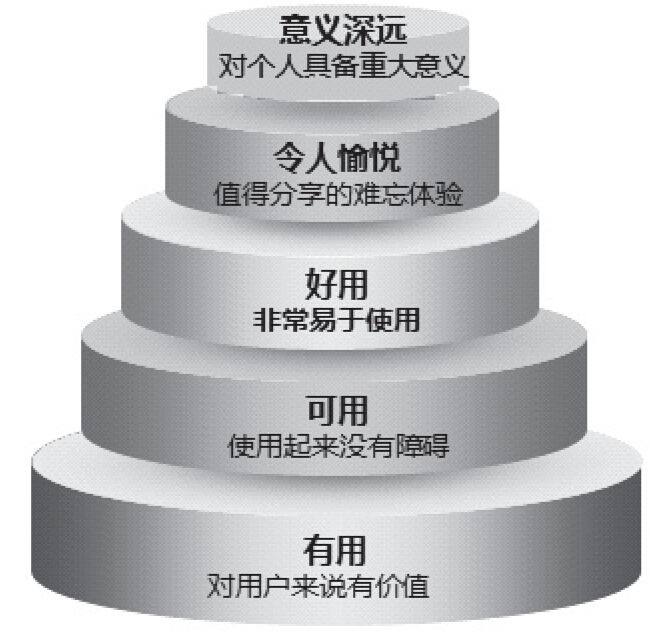

## 5.2 有用>可用>好用>令人愉悦>意义深远

诺曼博士曾说过，当技术满足了基本需求，优秀的设计便开始主宰一切。而优秀设计的目的，就是为了让用户满意。《人机界面设计（实践篇）》提出：产品要让用户满意，最基本的条件应该是产品本身符合用户的最低需求，能帮助用户解决问题；其次，满意是关于行动结果的评价，用户在操作完成过程中要有愉悦感。因此，当人机交互的结果符合或超出用户预期，用户就会感到满意，否则就会产生不满。

为了帮助大家理清产品设计工作的优先级，做到“好钢用在刀刃上”，这里我们给出产品设计的金字塔模型，可以说这是一个基本的互联网产品设计的进化图，如图5-2所示 [[1]](part0346.xhtml#ch1-back)。当用户接触到一个新的互联网产品时，对他来说，就是从“原来这个对我有价值”到“它对我的生活意味着很多”。这个模型从最底部到最顶部分为五个层次，依次是：有用（对用户来说有价值）、可用（使用起来没有障碍）、好用（非常易于使用）、令人愉悦（值得分享的难忘体验）、意义深远（对个人具备重大意义）。

图5-2 产品设计的金字塔模型

下面我们对图5-2所示的五层分别进行介绍。

1）有用：一般来说，我们一开始思考某个需求的时候，总是从功能上——从有用的角度解决问题。想想第一部摩托罗拉手机，其外形就像一个大砖头，但它确实满足了用户随时随地打电话的需求。

2）可用：仅仅让用户使用我们的产品是不够的，还必须让用户使用起来没有障碍。尤其对于现在的互联网产品来说，用户在使用时稍微遇到点障碍，就会离开，选择竞争对手的产品。

3）好用：对于互联网用户来说，产品对他来说有价值、使用起来基本没有障碍是远远不够的，还得让他感觉产品非常易于使用。比如iPad就可称为好用，其使用的是一种更自然的交互方式，其中的各个图形、控件等的操作方式更加接近现实、让用户觉得非常“自然化”。

4）令人愉悦：产品在与用户的交互过程中对用户产生了特别的吸引力，这需要产品运用一些设计上的美学、一些特殊的交互技巧，像苹果的iPhone。

5）意义深远：这是产品设计的最高层级了。不过，对于产品经理来说，很难使自己的产品对每个用户来说都意义深远（苹果也没达到这个程度），这个层级是很主观的，但如果我们能够满足前四个层级——有用、可用、好用、令人愉悦——我们的产品很可能对用户来说就意味着很多、很多。

在介绍完这个模型后，笔者要强调一下个人的观点，如果设计的互联网产品能够做到有用、可用、好用，那么对于产品经理来说，基本已经足够了，因此我们本章的产品设计和下一章的用户体验主要介绍可以帮助大家达到这一层次的一些技巧。

[[1]](part0346.xhtml#ch1) 借签了《情感化交互设计指南》，笔者做了修改。 
