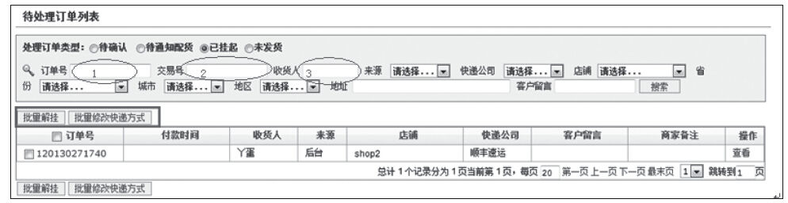
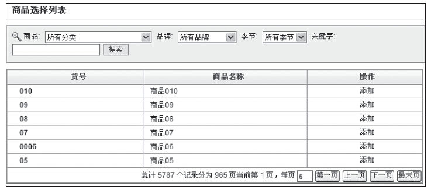
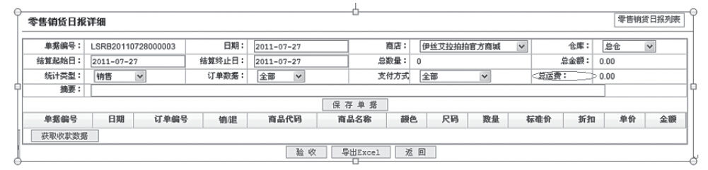
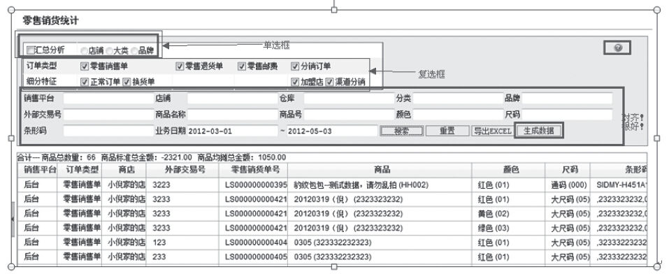
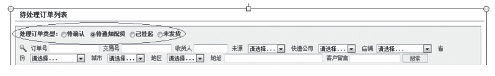
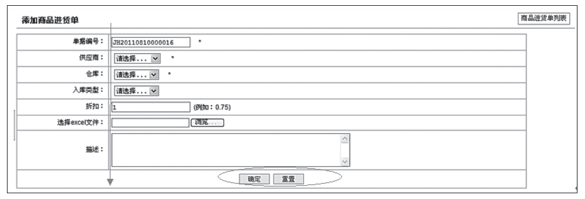
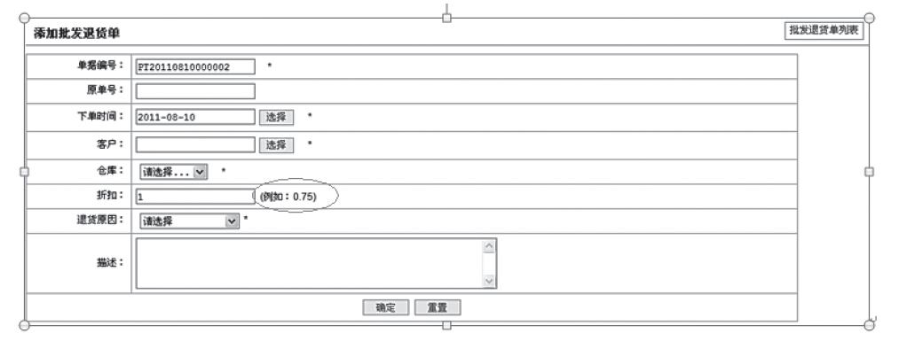

### 6.3.2 打造完美的表单

从细节的角度来看，互联网产品的操作界面都是由更多的细节元素所组成的，包括表单、标签、连接、翻页、按钮、操作反馈、验证码等，这些元素有些只能用于某些特定区块，有些则通用于多个功能区，页面中细节元素的设计在用户体验层面上具有非常重要的作用。比如注册表单、购买表单等，精心设计的表单可以有效提升用户体验，同时能提升用户注册率或商品成交率，在提升产品的商业价值层面也会起到重要的作用。下面我们以表单的组织结构、表单的元素为例，一起探讨如何通过打造完美的表单来提升用户体验。

1.表单结构组织

整体设计思路：整齐、界面清爽、阅读快速和不费力、各表单项先后顺序排列“自然”、填写方便。

比如，可以将表单内容组织成逻辑组，有助于浏览和完成填写。

比如，为便于用户编辑，最好支持表单元素之间的TAB键跳转。如图6-19所示，当光标处在1空白处，按下TAB键，则光标跳转到2处，再按下TAB键，则光标跳转到3处，以此类推。

图6-19 支持表单元素间的TAB键跳转

比如，为用户构建清晰的浏览线：简单表单的眼动跟踪数据图突出了清晰浏览线的重要性。标签输入框及主要动作按钮尽量帮助用户用最少的时间完成任务。如图6-20所示，“关键字”三个字在第一行，输入框却在第二行，加大了用户所花时间。建议：如果能放在第一行，尽量全部放在第一行中显示。如果不能，则将标签“关键字”放在第二行为宜。

图6-20 标签和输入框没有靠在一起

2.表单元素

设计思路：对表单的标签、输入框、动作、帮助文字以及“错误与成功”这五类元素分别进行规划建议。

（1）标签对齐方式

标签对齐主要有右对齐、顶对齐和左对齐三种。

1）标签为右对齐的优点是标签与输入框距离更近，减少用户填写表单时间。缺点是标签的可读性降低。

2）顶对齐虽然能减少用户输入时间，但是表单的垂直空间增加。

3）左对齐方式的缺点是标签和输入框相邻间距增大，增加用户填表时间。优点是容易浏览标签。

如图6-21，为整齐，可以全部右对齐显示。此外，从用户角度来看，他们不关心冒号，故建议全部去掉。

图6-21 个别元素没有右对齐

（2）输入框

基本原则：应当认为所有用户都是新用户，即表单设计应当在易学、明显和防止出错方面进行优化。所以，我们要为所提问题提供合适的输入框（文本框、单选钮、复选框、下拉菜单），且让每一类输入框都符合用户的预期。

各类输入框规范化设计说明，如图6-22所示。

1）文本框：允许用户选择输入任意数量的字符，可一行或多行。用户预期——输入答案。

2）单选钮：允许用户从两个或多个总是可见并互斥的选项中只选择一个。由于单选钮代表互斥关系，应当有默认选项（见图6-23）。用户预期——仅能选中一项。

3）复选框：允许用户选择列表中的任意选项，一或多个，数量不限。用户预期——可多选，也可一项都不选。

图6-22 界面中的多种输入框

图6-23 单选钮

4）下拉菜单：允许用户从两个或多个排他性选项中选择一个答案。不使用时，下拉菜单仅显示当前被选项。优点是如果互斥选项较多，下拉菜单比单选按钮要好些，因为节省空间。但是，最好避免下拉菜单选项过多的情况。用户预期——点击选中一个选项。

此外，需要注意的是：应当确保输入框的长度能提供有意义的暗示，以帮助用户有效输入内容；如果输入框不用通过长度对用户给予提示，则输入框长度应始终保持一致，并为答案提供足够空间。

（3）动作

基本原则：让主动作和次动作的设置一目了然。

一般来说，PC端所有页面统一采用“主动作在左，次动作在右”；IOS系统的App界面主动作（如“确定”）在右，次动作（如“取消”）在左；Android系统的App界面主动作在左，次动作在右。

主动作和输入框对齐以减少填完表单所花的时间。如图6-24所示的界面，主按钮“确定”应该向左侧移动以和输入框对齐。

针对进程中的动作，不要依赖帮助文字来提醒用户不要两次点击主动作，因为用户很可能看不到，而应当通过禁用主动作按钮来阻止用户这么做。即：点击一次按钮后，即便误二次点击，系统也不会响应。

图6-24 “确定”按钮没有与输入框左对齐

进程中动作的提醒：在系统对用户操作需要一定响应时间的情况下，建议系统增加提示语，如进度条说明等。

（4）帮助文字

基本原则：不要依赖帮助文字来弥补表单缺点。尽量减少表单中的帮助文字，以促成更好的设计方案。当然，前提是给用户呈现简单易用的表单。

对于一些用户不熟悉的数据最适合使用帮助文字进行解释，如建议填写的方式及说明等。最清晰的方式是简洁的帮助文字靠近问题，如图6-25所示。

图6-25 清晰的帮助文字

图标、链接或按钮用于激活的帮助文字触发器，应放在标签旁，不要放在输入框旁。

如果操作不可逆或会对系统产生重要影响，最好使用帮助文字加以提示、说明，以便不要让用户轻易出错。

（5）错误与成功

基本原则：让用户感到自己很聪明。

发现错误并及时引导用户纠正，和直到点击“提交”按钮时才报错比起来，用户更容易接受前者。等到点击“提交”按钮时再显示错误已经为时已晚，因为此时用户正期望进行下一个操作。如果让用户第二次看同一个表单，而且满眼错误，他的期望便会被打破，便会开始怀疑自己第二次还能否填好表单。我们的目标是让用户觉得自己很聪明，有足够的把握和能力来使用我们的产品。做到这一点，用户就会更加喜欢上我们的产品。当然，如果可能的话，应该尽量避免错误，而非检测错误。即使用户的错误不能被提前阻止，至少应该及时检测到，这样用户在使用产品的过程中就会胸有成竹。

如果有错误阻碍用户完成填写表单，应该用最明显的方式（比如，红色字体文字、警戒图标等）明确告诉用户。错误消息是表单中最重要的元素之一，最好以重要的形式显现错误。当然我们的产品也应当提供可操作的补救措施，帮助用户轻松解决错误（如“撤销”等）。

如果表单处理成功，可用成功消息清晰传达并通过成功消息显示结果。可加上“XXX处理已成功”等文字说明。

最后，笔者这里表达一下个人观点，表单设计的完美境界是：用户关注于当前任务，而忽略了表单的存在。对于产品来说也是如此！
