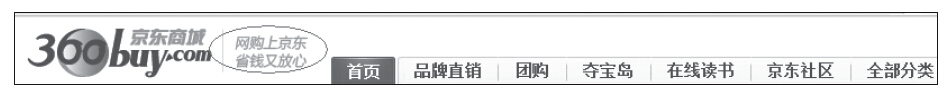
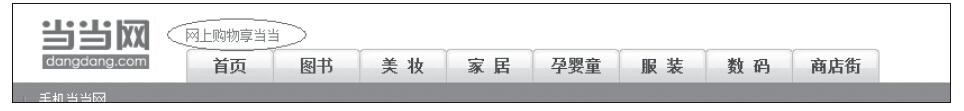

### 6.5.2 主页

主页主要是为了吸引用户别让他离开，并最好能点击一个链接。用户一般进入主页后不会立即在商业网站上交易，他们希望能够发掘自己真正想要的东西。所以，主页的主要目标用户其实是新用户。我们可以通过以下几点设计来提高用户体验。

首先，如果用户看了你的网站而无法立即知道你是做什么的，那就需要“功能标语”，功能标语是来描述我们的产品是做什么的，比如京东商城的功能标语是：网购上京东，省钱又放心，如图6-30所示。当当网的功能标语是：网上购物享当当，如图6-31所示。

图6-30 京东商城的功能标语

图6-31 当当网的功能标语

其次，要满足用户的期望，展示重要的内容。用户都喜欢直接到达目的地，所以为了让用户更容易找到他们要去的“目的地”，要把最重要的内容放在首页。这些内容可以是：最畅销和需求量最大的产品、公司希望重点推的产品或服务、用户如何获得帮助、在哪里登录等。

此外，我们也可以根据数据分析出哪些信息是重要的。比如根据在线购买或注册统计数据找出哪些产品或服务是当前最吸引用户的，在主页上介绍这些产品或服务并提供链接；比如，根据服务器日志数据显示哪些页面访问最频繁，并在主页上增加这些页面的介绍及链接；再比如，根据外部和站内搜索数据显示用户在网站上寻找了什么，我们可以找出搜索频率最高、最热门的项，并在主页上提供明确和明显的介绍及链接来指向这些搜索项。

当然，我们都知道商业行为很少发生在主页上，但用户体验不好的主页却能在用户进入更深层次页面之前就把他们“赶跑”，从而使得我们产品的商业价值难以最大化地发挥，也影响了我们产品经理自己的KPI。
