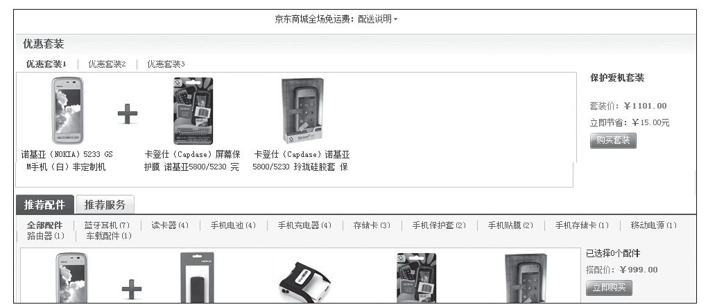
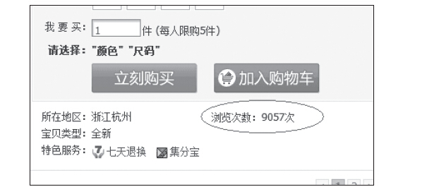
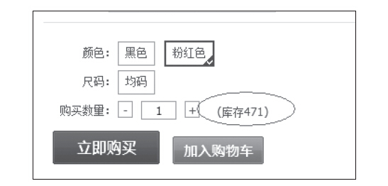

### 6.5.4 详情页

详情页的主要目标就是帮助用户深入了解产品或服务、突出和其他竞争对手相比具有的优势等，从而说服用户接受我们的产品或服务。这可以通过详情页的关键指标（“加入购物车”的百分比——成功地将所供商品条目加入到购物车的访客的百分比；“潜在顾客开发”百分比——成功完成所要求的步骤进入下一步的访客的百分比）来得以体现，为此，有几点值得我们借鉴。

首先，可以包含相关项来强化所提供的产品或服务，在详情页中添加相关的“你可能还喜欢”或可选配件条目可以提高产品或服务的吸引力。当然，相关条目既能增强也可能分散访客对主要产品的注意力。如京东商城的相关产品推荐，如图6-34所示。

图6-34 京东商城的相关产品推荐

其次，可以从用户的“社会认同”心理入手，在我们的详情页提供一些“社会认同”信息，如用户评级、下载量、浏览量、用户评语等等，如图6-35所示。

图6-35 京东商城的商品详细信息

此外，影响用户体验的一个重要因素是供货情况。对于用户来说，最讨厌的就是在他进入结算流程的时候告诉他本商品缺货。因此，产品经理非常有必要将库存系统与我们详情页的库存信息及时同步，如图6-36所示。

图6-36 京东商城的商品详细信息截图
