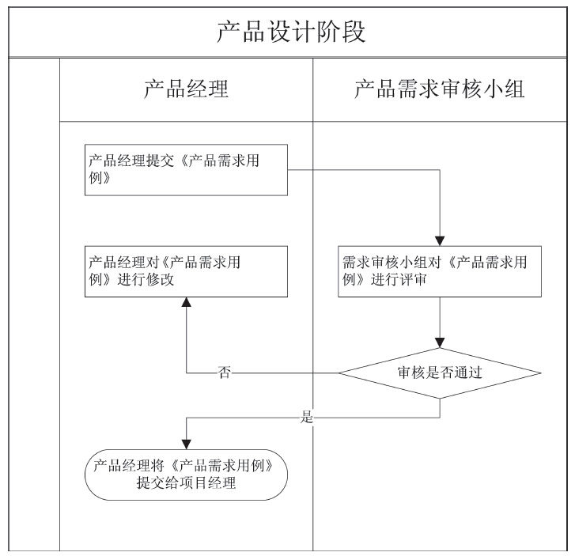

## 7.1 产品需求评审

### 7.1.1 产品评审委员会

在产品创意阶段，产品经理需要根据自己对市场的观察、商务人员的反馈以及自己对新产品的判断等多种因素，来确定产品的某个市场拓展方向。并在此基础上，对于确定的市场进行分析（具体方法与技巧可参照第3章）并形成业务分析文档（本阶段的输出物一般为MRD，即《市场需求文档》，此处不做详细介绍）。

在产品的《市场需求文档》通过评审的基础上，产品经理一般需要对第一阶段的业务分析进行细化，形成详细的《产品需求文档》，从而提交给技术开发部进行产品的具体开发。本阶段输出物为PRD，即《产品需求文档》（或称《产品需求用例》），简要流程如图7-1所示。

图7-1 产品设计阶段流程（简图）

在产品设计这个阶段（当然也包括在市场需求文档阶段），为了制定更及时、可靠的产品设计方案，同时也为了有效地加快产品设计进度，无论是大公司还是小公司往往都会组成一个产品评审团（或者叫产品需求审核小组）。成立产品评审团的主要意义就在于防止产品需求分析阶段出现重大错误或遗漏，从而有效降低风险。关于产品评审团的一些注意点，笔者结合实际工作体会，有以下总结，供产品经理们参考：

1）每次新需求及需求变更都需要做产品需求评审，而且每个关键职位角色的相关同事都要参与。同时为了保证沟通效率，总人数最好控制在10人以内。

2）大版本建议控制在3次内定稿；而需求变更建议1次，最多2次定稿。

3）针对用户体验要求较高的产品版本，建议可以分为2次评审：第一次把业务逻辑定义清楚（包括流程图、主要流程、主要的交互原型等）；第二次产品经理把所有详细的细节给出来（PRD及所有交互稿）。

4）召开需求评审会前产品经理最好与有关人员分别单独沟通，对一些细节最好提前完成多方确认，尤其是同部门之间最好在会前就已经沟通确认完毕，这样在会上的评审效率会非常高。

5）产品经理尽量用数据和事实来阐述需求分析思路，比如由数据来说明提出的需求是确实有必要的，说明你的思路能缩短用户时间、能提高用户的在线时间等。

6）不要有频繁的需求变更。原则上，通过需求评审后，需求变更次数应控制在3次以内，且产品经理、研发人员、项目经理最好做需求变更评审，评审通过后，相关文档要第一时间做及时更新。

7）关于“需求变更”的重要补充说明。就笔者所知，大部分公司的产品需求变更是这样处理的：产品经理更新PRD，发邮件给到研发人员，或者直接找开发人员沟通。不过，这种方式存在的问题是：研发人员有可能不看邮件就疏漏掉了，或者出现研发人员对变更的影响没法评估、评估不够全面等情况。所以建议需求变更一般都要评审，然后再决定要不要变更。而且参与的人员必须包括产品经理、项目经理、研发负责人、测试负责人。这样，就可以有效降低因需求变更而给产品带来的风险！
