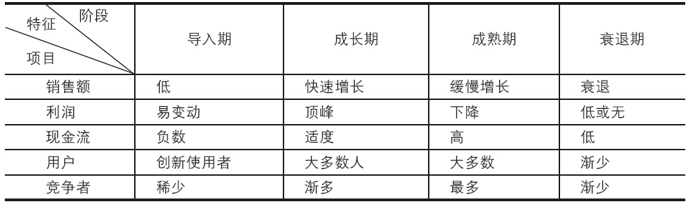
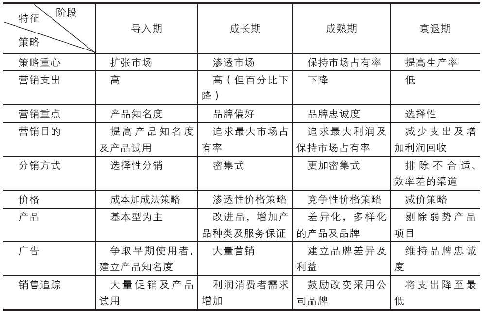
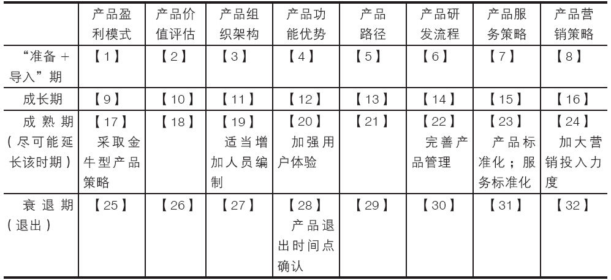

### 7.3.4 产品生命周期管理

最后我们来谈一谈互联网产品的生命周期管理。

和人必然要经过婴儿期、少年期、成人期、老年期类似，所有的互联网产品也会经过四个阶段：准备+导入期、成长期、成熟期、衰退期。比如，产品经理首先想象出一款产品，评估后认为很有前途，然后去开发并将产品上线，之后产品越来越受欢迎，但过了一段时间后，用户数量渐渐地达到瓶颈，然后下降，最后这个产品退出了市场，商业价值就此终结，这就是产品一个完整的生命周期。所谓产品生命周期，是指产品从进入市场开始，直到最终退出市场为止所经历的市场生命循环过程。产品只有经过研发、测试、推广，然后进入市场，它的市场生命周期才算开始。产品退出市场，则标志着生命周期的结束。

产品生命周期管理（PLM）则是指从产品的需求创意开始，到产品退出市场的全部生命历程。PLM是一种先进的企业信息化思想，它会帮助产品经理思考在激烈的市场竞争中，如何用最有效的方式和手段来为产品、为企业增加收入和降低成本。因此对于产品经理及公司而言，努力优化产品生命周期的管理是非常重要的。一套高效、完善的PLM解决方案能让企业建立详细、直观和可行的产品信息；及早综合各个参与者的信息，从而发现和解决关键问题。对研发过程中的交付物、研发流程和资源配置等关键因素进行控制。可以为产品在现有资源范围情况下，在每个阶段的投入产出比（ROI）达到最大化提供管理依据。

具体地说，PLM的显著好处是缩短产品上市周期、降低开发成本、改善产品质量和提高用户满意度，还有一个非常大的优点是：降低产品的风险。

一般来说，IT产品各生命周期的特点如表7-4所示，各生命周期的应对策略如表7-5所示。

表7-4 产品各生命周期特点

我们上面介绍的是IT产品的生命周期管理，鉴于互联网产品的行业特殊性，表7-5中产品各生命周期的应对策略并不能完全照搬到互联网产品中来。为此，我们介绍一个全新的模型供产品经理们参考和借鉴。我们先给出互联网产品生命周期管理体系的三个原则：

表7-5 IT产品各生命周期的应对策略

1）互联网产品生命周期管理用于指导产品未来发展，未雨绸缪，降低公司及产品风险。

2）尽快使我们的互联网产品进入成熟期并延长产品的成熟期寿命，即尽量延长金牛型产品的寿命期。

3）因为产品生命周期的管理是企业、产品相关负责人（通常为产品经理）的主动行为，所以出于风险管控的目的，当产品迟迟进入不了成长期时，应尽快让产品退出。

为此，我们介绍的互联网产品生命周期管理模型可以帮助产品经理解决：从哪些方面以及如何在每个生命周期中管理当前阶段的互联网产品。

在整个产品生命周期的前期，主要是产品评估、需求分析、功能开发为主。在产品进入成长期、成熟期后，尤其也要注意产品的用户体验层面。具体体现在模型上面（见表7-6），产品盈利模式、产品价值评估、产品组织架构都始终贯穿产品由生到死的整个过程。具体“落地”层面又有五大方面作为保障。分别是：产品功能优势、产品路径、产品研发流程、产品服务策略、产品营销策略。

表7-6 互联网产品生命周期管理模型

我们按照各个生命周期（“准备+导入期”、成长期、成熟期、衰退期）的顺序依次对表7-6中的“【1】至【32】”做详细解释。

1.“准备+导入期”产品管理

本阶段重点是抓紧产品技术、性能的完善；市场活动的宣传；产品组合销售，老产品带新产品；新老用户的价格策略；研发介入试销用户的实施，完善标准产品框架；积累实施经验。

【1】针对本阶段，思考：产品是如何盈利的？如免费+收费；送剃须刀+卖刀片；“主送+附搭”；转卖为租；轻资产，如美特斯邦威；知识专利转让费；实体卖产品+互联网卖服务；山寨模式。

【2】针对导入期阶段，确定待解决的问题：

1）产品要解决什么问题（产品价值）？

2）为谁解决这个问题（目标市场）？

3）成功的机会有多大（市场规模）？

4）怎么样判断产品成功与否（度量指标和收益指标）？

5）有哪些同类产品（竞争格局）？

6）为什么我们可以做这个产品（竞争优势）？

7）时机合适吗（市场时机）？

8）如何把产品推向市场（运营推广策略）？

9）成功的必要条件是什么（解决方案要满足的条件）？

10）结论（做或放弃）。

这个步骤非常重要，它将在很大程度上决定一个产品的生命力有多强以及这个产品未来究竟能走多远。

【3】针对本阶段，组织架构通常选择以下四种中的一种：

1）现有职能团队（在现有的职能型结构中进行创新业务，完全融入常规的组织和管理结构中）；

2）成立跨职能团队（在既有的组织结构内运作，但不受现有的管理层管理）；

3）脱离既有的组织和管理层，组建独立的业务单元；

4）当前业务+新产品业务（同一套管理班子，在并联型组织中运作，即为创新业务设立独立的业务部门并构建自己的流程、结构和文化，但受到现有的高管管理）。

注意：对于创新型产品，在导入期建议采取第4种架构。

【4】针对本阶段，思考产品原则：

1）确定什么最重要、什么不重要，哪些原则是根本性的，哪些是临时的。（产品卖点、核心功能，涉及竞品分析）

2）此阶段产品要解决什么问题？（产品需求）

3）要为哪类用户解决这个问题？（用户定位）

4）产品要达到什么目标？（产品目标）

5）每项目标的优先级是什么？

这个步骤与【3】有一定的重叠，但本项内容的思考将着重在于帮助产品经理认清自身产品的核心功能及卖点。

【5】针对本阶段的产品设计思考如下：

1）为什么要做这个产品设计？出发点和目的是什么？重点的体验目标是什么？

2）这个产品要满足用户的什么/哪些需求？用什么/哪些功能设计来满足？先满足什么需求？再满足什么需求？

3）这个产品在系统的众多功能中，设计重点有哪些？重要性的先后顺序是什么？

4）这个产品在系统中和其他产品的关联点有哪些？需要其他产品什么样的配合？

5）该产品需要做好哪些数据统计点？这些数据可以说明什么？

【6】执行不只是一个战术问题，还是一门学问，也是一个系统，它必须充分融入到产品研发过程的各个方面。针对每个环节都需明确“工作内容+责任人”。例如，需求分析（张同学）——概要设计（王同学）——产品需求文档（徐同学）——所有功能点（原型及PRD）（徐同学）——UED（UI、视觉、重构）（徐同学）——研发（张同学）——内测（徐同学）——预发布环境（徐同学）——线上环境（徐同学）——跟进线上测试（徐同学）。

此步骤好处在于，一是规范化；二是责任到人。

【7】针对本阶段，思考：

1）产品标准服务。

2）利用用户关系管理系统，对用户进行服务管理。

3）有没有服务创新？有的话，是哪些？积累服务经验作为此阶段服务策略的重点之一。

【8】针对本阶段，思考：

1）产品定位；

2）product产品；

3）place渠道；

4）promotion促销；

5）price定价。

在思考这些方面问题过程中，有助于产品经理对产品的价值及功能卖点进一步深化认识。

2.成长期产品管理

本阶段重点是增强产品质量和用户体验；开拓市场，加大推广力度，积累产品的用户数量以及竞争对手分析和策略拟定或调整。

【9】针对本阶段，产品盈利模式以能创造大量利润且能快速将产品推进成熟期为最高优先级。如，当年盛大网游率先推出的“come-stay-pay”模式，采用“免费游戏，道具收费”的产品盈利模式，一举奠定了迅速将网游产品推向成熟期的基础。其余思考思路同【1】。

【10】本阶段在产品成长期依然还要思考“确定待解决的问题”，同时对于导入期的一些结论和分析需要依照市场变化做出一些有针对性的调整。结论如果是“放弃”意味着产品进入夭折期。其余思路同【2】。

【11】本阶段组织架构管理同【3】，对于新产品，在成长期建议采取【3】中介绍的第4种架构，即当前业务+新产品业务（同一套管理班子）；在并联型组织中运作，即为创新业务设立独立的业务部门并构建自己的流程、结构和文化，但受到现有的高管管理。

【12】此阶段内容的思考会帮助产品经理认清产品的核心功能及卖点。其他管理思路同【4】。

【13】本阶段内容属产品设计层面。可以帮助产品设计师设计出更好的产品。此外，每个产品阶段重复思考这一问题，会加深对产品设计的认识和理解。其余设计思路同【5】。

【14】在成长期，研发流程依然很重要，流程规范化；责任到人。其余思路同【6】。

【15】将积累的服务经验整理为产品进入成熟期的服务标准，其余思路同【7】。

【16】本部分内容在思考过程中，有助于产品经理进一步深化对产品的价值及功能卖点的认识。处于成长期的产品，应加大推广力度，快速占领市场份额，大大增加用户量，尽快步入产品的成熟期。其余思路同【8】。

3.成熟期产品管理

本阶段重点是适时改善产品缺陷，增加功能亮点；优化用户体验。进一步扩大投入，并有效增加收入。

【17】思考思路同【9】

【18】思考思路同【10】

【19】针对本阶段，建议成熟期产品的组织架构采取【3】中介绍的第3种架构，即脱离既有，组建独立的业务单元。此外，鉴于本阶段研发任务的繁重，可适当增加人员编制。

【20】进入成熟期阶段，产品的稳定性及功能全面性已经基本满足，应结合行业发展，适当新增一些“市场标配”功能，同时应将产品的用户体验放到很重要的位置上。

【21】本部分内容属产品设计层面，成熟期的产品阶段重复思考这一问题，会加深对产品设计的认识和理解。

【22】在成熟期，研发流程已经达到最大规范化，责任到人。同时为继续提高产品质量，建议为解决用户体验问题而专门成立一个小组（可以兼任）。

【23】结合之前积累的服务经验，将服务标准化。

【24】处于此阶段的产品，是公司的金牛型产品，应加大市场投入力度。

4.衰退期产品管理

本阶段重点是执行产品退市并进行产品退市总结，此外，也要拟定和开展后期服务策略。

【25】略。

【26】针对本阶段，确定待解决的唯一问题：结论（“做”或“放弃”）。若结论为“放弃”则意味着产品进入夭折期。

【27】此阶段缩减产品组织的人员编制，减少人员配置，向其他成熟期产品部门或新业务部门增加人员配置。

【28】需要强调的是，认真选择时机是制定成功退出计划的关键。在对销售收入进行连续下滑的定量评估后，再定性评估4方面问题：

（1）产品还能销售吗？终止一个产品的最基本的原因是其市场反馈不理想；

（2）产品还能获利吗？

（3）产品过时了吗？市场上是否有大量更有竞争力的替代产品出现？

（4）产品的竞争力如何？

得出结论后，即是“做出退出决策”。建议在做出决策的3个月后，对外公开退出计划。并依据市场情况持续提供6~12个月的服务。

此外，我们特别补充一点：如果产品未进入成长期，则退出计划可以适当加快。

【29】略。

【30】此阶段，由于人员编制减少，流程尽可能简化；为保证公司品牌和形象，还是要坚持责任到人。

【31】此阶段，建议终止所有积极的产品服务。

【32】此阶段终止所有积极的产品营销及推广。
