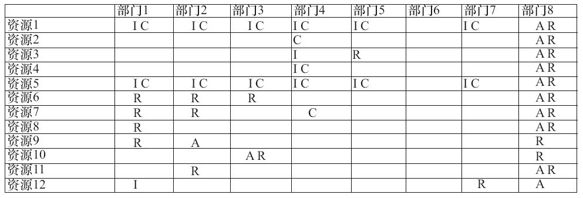

### 第21件事 资源支持离不开RACI表

小O最近几天不知怎么啦，看起来挺郁闷的。老K师傅刚开始没怎么在意。接下来几天，小O表现出消极怠工的苗头，老K师傅一看状态不对，于是问小O发生什么事情了。这一问不要紧，却问出了一个产品经理经常碰到的头痛问题——资源协调的问题。小O郁闷是因为在就产品问题进行跨部门沟通时，总被另一个部门的同事搪塞和敷衍，要么是忙没有时间，要么是人手紧缺抽不出人手协助小O，差点将小O气出病来。老K师傅寻思，十步法的第九步寻求资源支持或许能解决小O的苦恼。

资源主要包括人力资源、物力资源和财力资源。人力资源，即需要多少人；物力资源，即需要多少软硬件设备；财力资源，即需要多少预算。根据产品或项目目标，资源估算时要考虑需要什么样的资源、需要多少资源、什么时候需要、谁有权决策。

公司是由不同部门组成的一个有机整体。公司的良好运作离不开各个部门之间的协同和合作。首先需要明确自己所属部门与其他部门之间的相互依存关系，比如与上级部门或同级部门之间的关系。如果资源存在前置条件，而这个前置条件只有上级部门才能满足，那么这种资源就需要向上级部门寻求。反之，如果上级部门提供的资源不符合要求，则自己的产品或项目很有可能就要遭遇延期甚至失败或废掉的命运。上级部门资源包括但不局限于基础技术资源支撑、数据统计分析资源支撑、用户共享机制资源支撑、用户运营推广渠道资源支撑、内容资源支撑、硬件设备资源支撑、关键人才资源支撑等。寻求支撑的时候要注明需要什么样的资源、需要多少、什么时候需要、谁有权决策，这样的资源规划才有意义，这样也方便提供资源的部门提前做好准备，以备不时之需。

比如说人力招聘需求，需要告诉人力部门招聘的岗位有哪些，优先招聘的岗位是哪些，需要招聘多少人，人员水平是初级、中级还是高级，期望何时到岗，目标公司是哪些等。

此外，我们可以使用工具（RACI表）进行资源支撑规划，如图3-21所示。

图3-21 RACI表

RACI表中R代表Responsible，是负责的意思；A代表Accountable，是驱动的意思；C代表Consultable，是求教的意思；I代表Inform，是知会的意思。

小O这才意识到资源规划的重要性，让上级部门或同级部门了解如何配合你的工作是做资源规划最重要的目的所在。

资源主要包括人力、物力和财力资源。资源支撑的对象主要有上级或同级部门。资源估算时要考虑需要什么样的资源、需要多少、什么时候需要、谁有权决策。做资源规划最重要的目的是未雨绸缪，可以使用RACI表，让资源提供部门提前计划和协调资源以配合你的工作，发挥协同效应。
