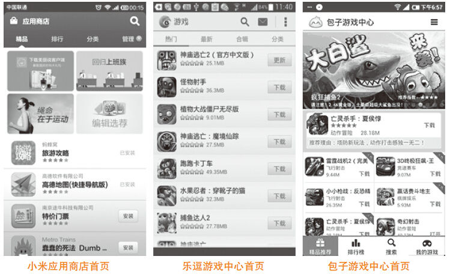

# 07 透过用户行为挖掘本质需求的方法

周伟

一个偏执于互联网社交产品设计的一线工作者。在创业路上的产品经理，期望探究用户的底层需要，专注做点东西，对得起不多的光阴。

曾供职于腾讯科技微博事业部，任腾讯微博产品经理，负责微博QQ客户端项目；YY娱乐产品主管，负责Web YY项目。多次互联网创业失败经验，坚信优秀的产品经理是理性的艺术家，没有对生活的深度体验和思考，没有对人性的理解和独有的产品天赋，就只是一个在屏幕前憧憬的人。

精彩观点

产品总是在满足用户行为中迷失，在追求用户核心需要中成功。

9月7日，一个平常的下午，坐在某小店喝东西，突降暴雨。这是一个兼营简餐的咖啡厅，店里很热闹。十来桌客人，每桌基本都点的是饮品和小食，客人涵盖所有用户年龄段。两位男士一桌在谈论一些严肃的类似工作的话题，两位女士一桌估计是在抱怨着什么，两位异性一桌各自玩着手机，偶尔交谈，有一个年长者在看书，有一群好友在欢笑就餐，也有我这种“偷窥者”……

看似同样的场所，同样的吃喝交谈行为，但是背后却是不同的动机。每个人都在获取着自己的需求。小店如同是一个产品，当它想去满足餐厅、会议室、客厅、书房之类的功能需求时，我想老板会无所适从。但是，这样一个相对安静舒适的环境，恰到好处地满足了不同行为背后的需要——社交需要。好的产品一定会聪明地分辨哪些只是用户的行为，哪些是用户行为背后的需求，且超越期望的满足。

如何分辨用户行为和需要？人本心理学之父马斯洛举了这样一个例子：我们需要钱，目的是买一辆汽车。原因是邻居有一辆汽车，我们又不愿意感觉低人一等，所以我们需要钱，目的是为了拥有一辆汽车。这样我们就可以维护自尊心并且得到别人的爱和尊重。所有的用户行为，都可以追本溯源地找到它们的最终目标或结果。它最终一定是我们不能再追溯下去的目标或者需要，这些需要的满足本身就是目的。这样长期观察、分析、追溯，会逐渐透过行为看到本质的需求。

产品经理需要透过庞杂的信息去分析事物的本质，寻找到目标用户群和他们的需求，忙于满足行为而堆积功能很累很受挫。如何定位目标用户群的本质需要？下面分享几个方法。

1）用户跟踪调研：产品经理实地真实场景的大量参与、观察、需求收集。

2）线上检测分析数据，试出相对正确方案。

3）深度访谈样本用户。

4）现实场景的线上还原。

5）产品经理的沉浸式场景假设（张小龙大招，不建议随便尝试）。

实践案例

游戏用户的需求不是玩游戏，而是获得快乐和成就感

这里分享一个在满足用户行为中失败的典型案例：我在2013年初离职创业做了一个手游应用市场，市场切入的时间点很好，正是手游爆发严重依赖渠道的时候；资源也充足，投资、预装渠道、CP合作也不差，结果却不尽人意。这看起来的万事俱备中，少了最重要的一点：你解决什么用户、什么需要？

用户来手游应用市场是下载游戏，所以我们提供的功能为下载游戏，不断提高游戏下载的速度，丰富游戏的种类，做精品游戏推荐，这是产品最基本的功能：让用户找到自己想玩的游戏，下载。然后呢？我觉得没有然后了。单纯满足单一行为，很难做到与竞品的差异化和自己的独特优势。小米应用市场可以下载游戏，乐逗游戏中心可以下载游戏，那包子游戏中心的核心价值是什么呢？没有。

下面是几个主要手游市场的主界面截图。

换一个角度看这个问题。用户为什么要下手游？为了玩手游。为什么玩手游？为了获取快乐，获得成就感……这背后的需要是什么呢？快乐！正如腾讯游戏的slogan：用心创造快乐。游戏本身只是满足用户对快乐这种底层需要的一种途径，玩游戏是一种行为，立足于让用户通过手游这种方式获得快乐，产品的想象力突然非常大。下载游戏、游戏攻略、游戏背后故事分享、打造排行榜、挑战好友、游戏周边，甚至游戏外挂不都可以让用户从中获取快乐吗？聚焦一个点，做到极致，逐步建设一个用游戏满足用户快乐的产品，我会爱不释手。

实践案例

YY娱乐Web直播是一款满足用户核心需求的好产品

接下来，分享一个在不断满足目标用户群需要中获得一定成绩的案例，希望对如何把握和满足用户需求有所帮助。

这是一个我一直不太认同的“屌丝产品”，在线视频秀，但它真实还原了现实中的娱乐圈，将人内心的需求满足到了极致。且不谈那些成功的公司，仅聊聊它带给了用户什么。个体可以付诸较小的成本获取当名人的快感，几千万低收入用户在这个半真实的社区中获得了内心极大的归属感，他们快乐，他们沉醉。从某种程度上，甚至降低了社会犯罪率。

亚伯拉罕·马斯洛把人的底层需要分为生理需要（physiological needs）、安全需要（safety needs）、爱和归属感（love and belonging，亦称为社交需要）、尊重（esteem）、和自我实现（self-actualization）5类。一个简单的直播间，把爱和归属、尊重这两层需要发挥到了极致。换一种表达，人是具有群体属性的，每一个孤独的个体都渴望在群体中找到自己的位置，现实如此，虚拟世界亦然。个体在群体中位置由低到高可以粗略分为3个层次：存在感、认同感、优越感，不断地得到群体的反馈可以获取存在感，不断地正反馈可以获得认同感，认同感的比较胜出获得群体中的优越感。举个小例子，凤姐是一个非常有存在感的人，她被关注，不断获取群体对她的反馈。

视频直播间通过刷公屏、虚拟礼物、出场秀，甚至送礼物时的动画效果，将现实生活中明星被围观、土豪挥金如土、粉丝簇拥的感觉真实地还原且放大，吸引了不能在线下获得如此大存在感或优越感的普通用户。

在右侧公屏普通用户不断地发言、送鲜花来期望被关注，渴望在这个虚拟群体中得到反馈，尤其是主播的反馈，以获取存在感。这种女主播赚钱赚人气、普通用户赚存在感、付费用户赚优越感的虚拟世界将人在群体中底层需要的满足真实还原，就是最好的产品。谁能在激烈的同质化中竞争将需要最低成本地满足到极致，谁自然就会领跑。

总结分析

用户的需要说到底就那么几种，亘古不变，互联网应着这个时代，在更高效、更低成本地解决人们现实生活存在的问题。不臆想需求，而是在对生活、对人的观察中体会种种行为背后的心理诉求是什么，用互联网的方式获得超越期望的满足。

深刻和永不停歇地观察；充分理解互联网的本质；灵活使用它提供的各种素材（Web、App、智能终端等），最大限度地降低解决用户问题的成本；这才是互联网产品经理的使命。理论是枯燥的，但是优秀的产品经理就应该有那么点天赋，一种热爱产品，探究本质，渴望深度体验生活和思考生活的天赋。个人拙见，仅做参考。
