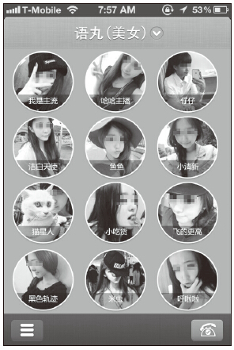
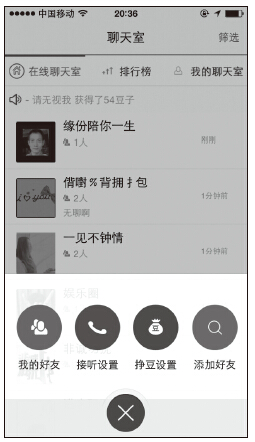
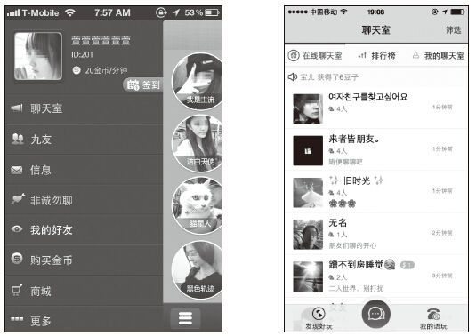
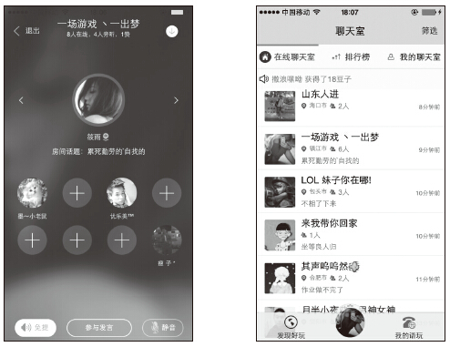

# 09 结合使用场景打造满足用户需求的产品

焦尚松

网名Nairo，中国最大的产品经理平台——人人都是产品经理（<http://www.woshipm.com>）核心管理团队成员，产品之夏负责人。伪极客，个人站长，行走在产品路上的产品人一枚。先后经历电商、视频、语音社交方向及Android、IOS和PC平台，创业公司O2O电商模式失败的尝试、上市公司视频社交的探索、原贵阳朗玛啊噜哈产品经理、语玩产品经理，现创业中。工作7年，希望能再次突破。

精彩观点

噪音会影响到声音线索。那么在噪音大的环境下，我们该如何设计用户认为重要的信息的提醒方式？反之，在非常安静的会议室，又该如何设计提醒方式？

比如许多语音即时通信工具既可以让用户通过公放来播放语音信息，也允许用户通过听筒来收听语音信息，后者有效地避免了噪音的干扰。

在不同的使用情景中，用户有不同的姿态。比如，走路、坐着、干活中、贴耳倾听，等等。各种姿态下的持机方式各有不同，它们不仅会影响到用户的操作，也会影响到用户的注意力分配。

移动端的产品设计，受限于手机特性及客观条件，需要结合用户的使用场景判断。

·当我来到一个陌生城市时，可以使用手机地图进行导航。

·坐地铁、乘公交时，可以使用手机社交软件打发寂寞。

·运动时，手机可以作为一个监测仪器存在，或者听听音乐也是好的。

如果依靠电脑来完成这些事情。

·当我来到一个陌生城市时，即便我带着电脑，但是如何判断我身在何方？

·坐地铁、乘公交时，何处有网络？

·运动时，抱歉，这不是负重练习。

电脑和手机有着各自的使用场景和用户需求，但是移动端需要多一个纬度：使用场景。之前Web端的设计经验只能作为参考，移动端的产品设计，必须深入了解用户，了解使用场景。

PC端和Web端的产品尚有部分译著可以让产品经理直接学习到国外的产品经验，但是移动互联网的一夜崛起，用户场景和使用习惯的巨大差异让很多产品无所适从。Apple和Google提供的设计规范和交互指南，只能让产品符合移动端，但是要让产品能给用户超出预期的体验，必然要结合用户使用场景和使用习惯来设计产品。

做移动产品，需要从特征、框架、细节、适配等角度完整地了解移动产品的设计，并总结经验和教训。对于我们已经了解的内容，得以验证，不了解的知识，得以拓展。比如引导，书中是这么写的：

适时出现和离开

在进入包含某一隐藏操作的页面时，最好是用户可能触发这一操作时再提醒，而不是一进入这个页面就提醒。如果这一提醒不会对进一步的操作造成影响，最好是出现一下（建议3秒左右）就离开，而不是需要用户操作才离开；与之配合的动效最好不要做太复杂的形状或运动的变化。

很多公司没有针对性地设计用户体验，也很少甚至没有进行过用户调研、可用性测试等相关测试；导致部分产品设计功能、处理需求时只能或者依靠摸索，对于用户的体验无法预知。可能用户希望的并不是这样。我们认为的，可能并不是用户所认为的。真正的好设计，只有结合用户的真实使用场景去考虑，才是符合用户预期的设计。

实践案例

语丸（现已更名为“语玩”）是由朗玛信息设计研发的一款基于语音社交的多方实时语音交友应用。最初的几个版本仅有最基本的功能：一对一语音、多人语音。

我们的App在3版时就已经开始在筹划5版的重构和改版，现有的主功能在用户和数据反馈上均很不理想，功能易用性数据和界面设计的效果完全没法看。在准备阶段，产品组A/B测试、焦点小组和可用性测试都做了一部分，而在一次视频回放时，才注意到以下这些问题。

1）我们希望用户看见的，我们自以为很明显的东西，在用户眼里，被其他内容分散了视觉焦点。

2）我们自以为操作顺畅的流程，A-B的操作流，在用户手里，变成了A-C-B的操作流。

3）我们认为用户会循规蹈矩地按照我们的想法来做，实际上，用户的想象力比我们更为丰富。

我们以为的不是用户以为的

语丸第3版主界面的右下角的按钮，按照我们的设计是类似于“隐身”设定（设定之后可以暂时不能一对一通话）。但是在部分用户眼里，这个功能可能会被“忽略”掉；测试时发现，部分用户甚至有到个人资料界面寻找类似功能的经历。

有很多我们在设计中常犯的错误，都是我们陷入设计的细节而忽视了真实用户的操作习惯，有些功能仅是为了功能而功能，从未考虑过功能是否合理、必要。

在后续的版本中，我们将此功能隐藏到底部按钮中，弱化该功能的存在，让用户能保持在线状态，更容易实时互动起来。

语丸第3版主界面

语玩第5版界面

调整后的界面，“挣豆设置”隐藏到底部按钮中；同时将几个更常用的功能放置在一起，更利于用户操作。

操作路径，用户说了算

语玩改版后，重新设计UI、IA（信息架构），对功能进行分析和调整。之前的主页是一个用户列表，但是对于新用户来说，和一个陌生人交流是需要一定时间来了解的，而当时的聊天室仅是隐藏在侧边栏中的一个功能。调整后，聊天室放到主界面，让用户进来的时候，可以先到多人聊天的聊天室环境中，熟悉彼此；相互之间有一定的了解后，后续的一对一语音聊天，就顺理成章。

语玩改版前（左）、改版后（右）主页

为用户而设计，不为产品而设计

在交互上，我们也做了一些尝试。一般来说，一个App的界面当前只有一个操作界面；如果需要在几个界面操作，必须在界面间切换。而对于用户来说，可能在聊天室时，还有和别人沟通，或者查看其他功能的需求；这种需求在其他类型的App上是无解或是成本很高的操作，而我们团队创立的这种向下收缩的方式，既能保证不用关闭当前界面，又能保证进行其他操作；甚至可以像通话一样，可以退出App而不用关闭聊天室。

经过数次讨论、无休止地沟通，以及团队成员各种加班辛苦，重新梳理逻辑、功能，重新设计界面、交互后，6月份第5版功能上线，各种内部测试，提交商店，7月份正式版发布，用户反馈的数据和意见终于表达了对设计的认可。对于产品而言，这就是最大的欣慰。

聊天室收起功能

在《倚天屠龙记之魔教教主》中，张三丰教张无忌太极，教完后张无忌一问三不知；其实非张无忌忘记，而是真正将武功招式铭记在心后，所有招式套路都是不重要的。

总结分析

当你知道怎么做，如何做的时候，就是你已经将书中传达的知识消化为你自己的知识和能力的时候。只有将知识点用于实践，当知识消化后，所剩下的，就是你吸收的东西。

尽信书，则不如无书！
