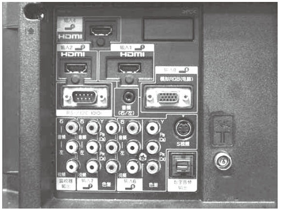
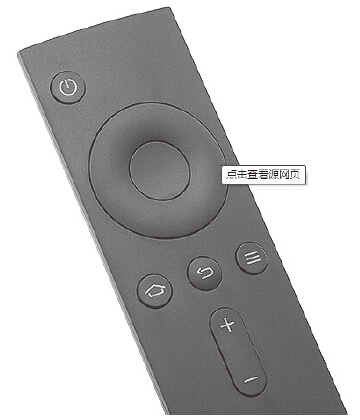
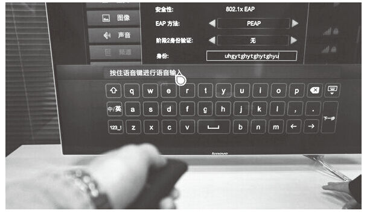

# 16 在产品设计中如何把握用户的“懒”

熊熊叨叨

北京中关村某装机商的产品经理，负责智能电视软件功能设计；爱看电视、爱玩游戏、更爱吃，“捧哏逗哏”都擅长，最喜欢唠唠叨叨，关注从电视到美食等各个行业的用户体验。

欢迎关注我的微信公众号，搜索“bear-says”或“熊熊叨叨”即可添加。

精彩观点

“别让我思考”是产品设计需要一贯坚持的核心。每一个产品经理和交互设计师都需要时刻记住——“熟悉产品每个细节的高级用户们并不是你的核心人群，那些已经懒到不愿意学习和研究你的产品的用户，才可能带给你真正的价值，是你真正要花时间和精力关心的。[[1]](part0490.xhtml#ch1_back)

实践案例

可能让大家失望的是，这篇文章里不会有很牛的商业模式或者对于流量变现的探讨，今天我们要谈的东西更加底层：是发现“人性”和如何解决人性带来的需求。

等等，究竟什么是人性？

相信在翻过几本字典以后，你已经被里面云山雾罩的说法弄得五迷三道不可自拔了，不如我们用平实的言语把它形容得更加接地气一些：所谓“人性”，其实就是让人在一个完全放松的环境中所表现出来的行为和需求，而做出这种行为完全不必考虑外界因素的影响。

相信大家对于这个定义能够达成一个共识，这篇文章将以智能电视产品为例，来讲讲如何把握用户“懒”的这个天性。为了避免读者在阅读后面的文章中一直在纠结到底什么是智能电视，我们先花点时间介绍智能电视。

从2011年开始，家电圈掀起了一股“智能”的热潮，首先搭上这班车的自然是电视：传统电视虽然天生拥有了一块大屏，但其自身并不具有内容，如果把眼下如火如荼的互联网在线视频与电视屏幕结合在一起，则可以给用户提供一体化的内容消费体验。正是基于这样的思路，传统的电视屏幕被整合了以安卓为主的智能操作系统以及语音、空鼠等智能化的操作方式，智能电视就这样诞生了。

但是早在智能电视出现以前，各种NAS和HTPC产品就已经在广大用户的客厅肆虐了很久，但最终我们发现这些设备即便是在发烧友手里最终，也是已经尘封已久、束之高阁的命运，是这些设备不能够解决用户消费内容的需求么？当然不是，NAS和HTPC巨大的硬盘容量足以容纳海量的高清视频内容，这些设备失败的原因只有一个：太复杂了，让用户想得太多。

某品牌电视机背面

面对上图中电视机背面的丰富接口，相信任何人第一眼看到都会恍惚吧？这也正是HTPC等设备失败的最主要原因：上手的容易与否直接影响了用户的接受程度，对于光是连接和设置就能够把人弄得满头大汗的产品而言，这种先入为主的挫败感直接扼杀了后续的用户粘性和活跃度。因此从这个角度来看，就现阶段的技术能力而言，分离开电视机本体的外置内容提供产品几乎都遇到了这个门槛，要想解决这个问题，只有把提供内容的模块整合在电视机内部。

在这里需要强调的是，智能电视给用户提供的核心价值是消费内容，因此用户在使用电视时会进入非常放松的享受生活，而不是工作时神经紧绷的状态，也正是在这种状态下，用户的各种“人性”方面的需求便会不由自主地跳了出来，最重要的其实就是一点：“懒”。

“懒”这件事儿，对于产品经理来说再好不过：用户只有“懒”，才会产生让自己“偷懒”的需求，产品经理就能够从这个角度想方设法满足用户的需求；我们可以把用户的“懒”分为三个逐步递进地需求：懒得学习、懒得操作、懒得思考。

1.懒得学习

正如我们知道的，对于任何一件新鲜的事物，用户首先需要做的一件事就是掌握它的使用方式，这个过程称为学习。先回忆一下从小到大我们认真学习过的一些东西：语文、数学和英语，更大的作用是帮助我们通过高考这个决定前途的独木桥；工作以后我们可能又要学习Word、Excel和PPT等办公软件，但绝大多数人（除了极少数的学霸）基本上都是在受到压力的情况下不情愿地学习这些知识。再回到观看电视节目这个场景中来，完全处在放松状态的用户，对于学习这件事完全没有主观能动性，因此对于智能电视交互方面的设计，我们有必要在用户日常生活形成的传统认知中找到可继承的交互方式：五向键和空鼠就是很好的例子。

小米智能电视使用五向键的方式进行操控

五向键的操控方式由于具有非常清晰的指向性，在生活中已经非常多见：从早期的诺基亚手机到几乎家家都有的广电有线电视机顶盒，可以说各个年龄段的人群对于这一交互方式已经烂熟于心，完全不需要指导用户进行学习，因此有实体按键的五向键交互足够简单清晰，丝毫没有学习成本，可以成为智能电视交互设计的保底思路。

空鼠这种操纵方式则是参考了PC上鼠标的使用体验，让光标（焦点）随着手的移动而走动，突出了交互方面的自由和随心，更重要的是借鉴了用户对于鼠标在平面上的操控体验。随着电脑的普及，鼠标的使用体验已经越来越被低龄和高龄两个年龄区间的用户所接受，我们经常可以看到刚刚上学的小孩和已经退休多年的老人熟练地使用鼠标，因此在智能电视上使用空鼠交互，相对的学习成本也是较低的。

联想智能电视使用空鼠方式进行交互

除了这两种较为基本的操纵方式以外，我们也能看到在已经上市的智能电视产品中还有一些使用长按、手指滑动甚至是双指滑动的交互方式，在标榜自己操作炫酷的同时，也需要用户付出不菲的学习成本；至于孰优孰劣，就看产品经理在“卖点”和“用点”之间如何取舍了。

2.懒得操作

既然智能电视这个产品设计的初衷是希望便捷地把优秀的视频内容提供给用户，那么最极致的体验应该是用户完全不需要做任何操作，想看的视频直接播放出来，但限于当前科技的限制，这一幕还只能停留在阿凡达或者黑客帝国中，不过在产品设计中，我们依然应该尽可能地帮助用户少做操作达到这个目的。

联想智能电视在开机后的第一个画面上不仅提供了推荐视频的海报以及其他内容的分类入口，更是将主推节目的精彩视频片段放在了最主要的位置上，我们可以想象一下用户的使用场景：当用户注意到推荐的某个节目海报自己可能感兴趣时，会首先进入这个节目的详情页浏览，如果看到节目的文字介绍和演员并不中意，则会退出后再尝试寻找别的内容，精彩片段介绍则让用户完全避免了进入—退出—继续寻找喜欢内容的这个体验不好的流程，能够直接了解到这部电影最精彩的地方，从而迅速做出选择。

另外一个例子，来自于上图的乐主播功能。这个功能针对的是用户在观看直播电视时的痛点而设计的。当用户在观看直播电视时，经常对电视节目中的一些关键信息感兴趣，例如，想要看前一集/后一集，不知道出演重要角色的演员是谁以及想要了解电视剧的剧情介绍，等等，按照传统的方法当然也能够解决这个问题，只不过需要用户拿出手机或者平板电脑打开搜索引擎查询，而乐主播功能直接把这些和节目相关的内容整合在了一起，用户只需要在遥控器上按一个键，就可以轻松在电视屏幕上获取这些内容，这样给用户省去了反复查找所浪费的时间，让用户可以继续把精力集中在电视屏幕上。

3.懒得思考

回顾一下我们蜷缩在沙发上，手握遥控器看电视的情景：在还没找到我们喜欢的节目时，我们真的是一直聚精会神地盯着屏幕，希望弄清楚这个节目是不是我喜欢的。听起来很合理，但实际的情况并不是这样：更多的时候，我们是在茫然地一遍一遍地按遥控器的上下频道键，却不知道该看些什么，这并不是说目前的电视节目太多而无从选择，而是思考这件事对于收看电视的用户而言太过沉重，为什么要去要求一个试图放松的人来开动脑筋思考呢？乐视智能电视开机后会直接进入一个叫作“轮播频道”的功能，轮播频道将乐视目前自有的视频内容进行编排后，将点播内容以直播频道的形式展现且无广告，这既保证了节目的质量，又让用户无须思考，换到哪个台就看哪个，第一时间满足了用户“找到一些能看的东西”这个需求，解决了用户的“懒得思考”这一根本痛点。

总结分析

（1）正面看待用户的“懒”，是产品功能设计的首要原则

用户的知识、教育水平千差万别，但归根到底都要坐到电视机面前来欣赏电视节目，这也是用户放松休闲的过程，因此这里用户的“懒”实际上透露出来的是人的本性，对于智能电视用户是如此，对于任何需要以用户“消费内容”为核心价值的产品也是如此，“懒”是一种与生俱来而不易被改变的东西，因此对于产品经理而言，只有把握清楚“懒”的意义和价值，尽可能将交互和产品设计做得简单再简单，才能让用户喜欢你的产品。记住：没有一个用户是花钱来上课的。

（2）只有合理把握“懒”所带来的真实需求，才能让用户用得更好

从懒得“学习”到懒得“思考”，实际上折射出用户坐在电视机面前的一个非常深层的需求：相比较内容消费来说，消磨时光的意味可能更多一些：如果还在为如何“把好的内容提供给用户”而纠结的话，显然在这方面已经跑偏了。而在线视频或音乐网站的产品相比较智能电视交互更为简单，因此，对于“懒”的设计思路，就该向“精准推荐”引导，尽可能让用户便于找到自己喜欢的内容。

[[1]](part0490.xhtml#ch1) 观点参考《Don’t Make Me Think》一书。
