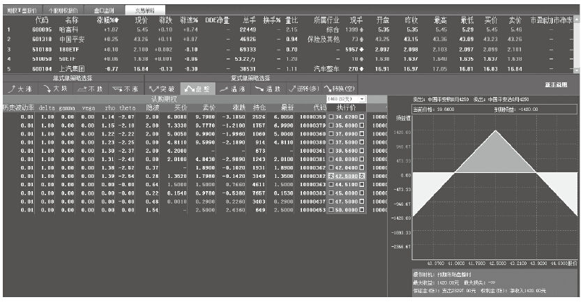
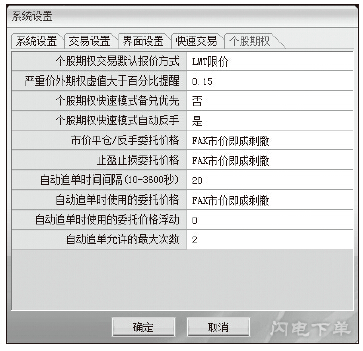
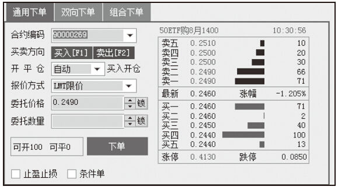
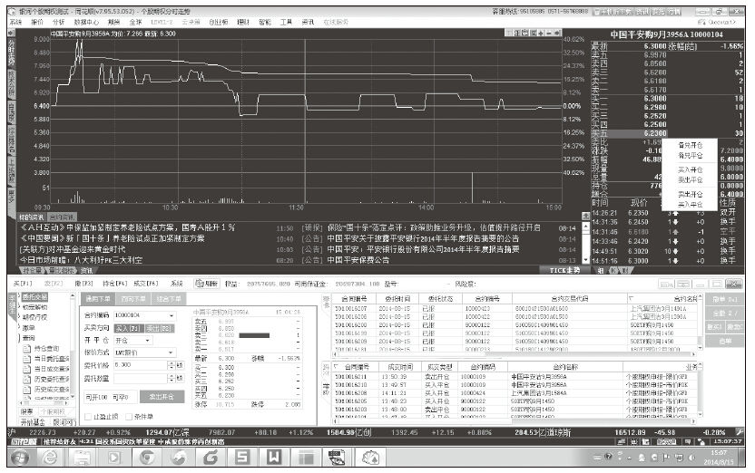

# 26 产品的反脆弱设计

卢芳芳

同花顺产品经理。差点儿90后，曾经对自己的预期是“可萝可御”，现实却是女汉子一枚。擅长金融证券行业交易产品的整体规划和设计，包括股票、股票期权、自运营交易、策略交易、网络投票等多个产品。熟悉第三方支付、医疗辅助生殖、挂号行业、企业费用报销系统、考勤系统、产品运营支撑平台等的产品设计。

精彩观点[[1]](part0500.xhtml#ch1_back)

在企业管理中，一成不变的传统行业（如银行体系）是脆弱的，而“快速失败、迭代创新、保持愚蠢”的硅谷公司是反脆弱的。例如，余额宝挑战了传统的基金行业，在这个过程中，余额宝作为反脆弱获得了收益，更获得了认可，脆弱的传统行业显然是被攻击的一方。

产品是否具有反脆弱性，不在于它是否能用，而在于它是否让用户舒服。目前很多传统行业（如金融互联网）的产品，虽然解决了部分人的刚需，但是门槛高、黏性小，没有给用户传递出外观上精致，使用上舒适，或者理念上前卫，更跟有趣和幽默感无关。比如，目前的金融业服务了20%的客户，赚了80%的钱，而80%没有被服务的、该被服务好的潜在用户成为中国未来金融行业发展巨大的前景所在。在这个极具个性化、要求质感的时代，随着互联网公司的迅速壮大，传统行业的蛋糕越来越多地被瓜分，显得越发脆弱的传统行业产品迫切需要反脆弱设计。

实践案例

反脆弱产品应当以一种简单、平顺、自然的体验来解决用户的麻烦与问题，而不是复杂、晦涩和做作。这就要求产品经理能够换位思考，从用户的角度去理解，从而明确用户真正需要的是什么，追根溯源，从用户的表面需求出发，层层递进，并直达最核心的本质需求，不被千变万化的用户场景所迷惑，引导用户而不是被用户所引导。

以余额宝为代表的互联网金融在极短的时间内野蛮生长，而使得本来波澜不惊、安安静静的金融水池子突然变得如翻江倒海一般。马云先生曾提出了金融互联网和互联网金融的区别。金融互联网使传统的金融行业走向互联网，互联网金融是指互联网企业涉足金融行业。由此看来，互联网金融是反脆弱的，金融互联网是脆弱的。但是，互联网金融生产不出最好的金融产品，真正生产金融产品和服务只能是在金融机构。互联网金融不可能生产市场上最好的金融产品，因为互联网的优势不在这里，而在于做好互联网服务，将互联网技术做得更先进，将社交、交互做得更好。

我主要负责同花顺交易系统软件的产品设计。交易系统是公司的传统业务，主要向券商等机构提供证券交易平台等系统。公司已经看到了现在的互联网公司带来的冲击，正在往金融互联网的路上前进。希望能够吸收互联网“开放、平等、协作、分享”的精髓，依靠更先进的互联网技术优化自身的核心竞争力，降低脆弱性。举个最近在做的项目——股票期权来说明证券金融行业产品的反脆弱设计。

1．巩固专业优势

（1）适当性管理

通过了解用户的身份、财产与收入状况、证券投资经验、风险偏好、投资目标等相关信息，有针对性地通过问卷调查、知识测评、资产情况及交易经验权限的检验等多种方式，对投资者交易资格进行准入控制。

（2）注重风险揭示

合约限仓、限购、限开仓、合约调整、合约临近到期时行情界面显示，委托下单时提醒，登录委托端针对持仓弹窗提醒这3种提醒形式，与保证金制度、强行平仓制度一样，都是为了有效防范和控制期权交易的风险而进行的一系列制度设计。

（3）运用策略更为丰富

行情部分设计了很多组合策略。股票期权双方都可以是普通投资者，可以进行卖空。由于买卖双方力量较为均衡，有利于形成更合理的价格发现机制，从而避免出现股票期权价格虚高的情形。期权行情提供T型报价信息和两大类共10种策略交易，提供期权定价计算工具，快速计算期权的各项数据。

从交易策略看，股票期权交易可以有4个基本交易部位：买入买权、买入卖权、卖出买权和卖出卖权。只要确定目标和风险能力，就可以设计出相应的投资组合。

支持代码自动完成、价格锁定、数量锁定、自动判断开平仓等多种提高操作速度的易用性设计。支持多种策略功能，如条件单、止盈止损、自动追单等，竭力为用户打造出快速、智能、专业的交易平台。

2.做好互联网服务

（1）注重交互性

行情部分的入口由原来层级比较深改为放在显眼的位置，提供简洁的页面，让用户一眼看到想要了解的行情。

交易部分支持两种界面模式切换：普通浮动模式和快速停靠行情模式。

针对股票期权用户的不同需求，提供3种下单模式切换，如通用下单、双向下单、组合下单等。

兼顾用户鼠标、键盘操作习惯的设计，如按F1键激活买入，按F2键激活卖出，按F3键激活撤单，可以使用PgDw/PgUp、+/-键对委托价格进行微调等，满足不同用户快速上手，实现平滑过渡。支持自动刷新，用户不需要不停地切换查询页面、频繁刷新，减少了用户的操作，节省了时间，资金股票的更新更加及时，很大程度上提高了用户的交易速度。

（2）快速促成交易，提高转化率

为了让用户从看行情变成进行交易，在提供行情数据之外和交易建立驱动的关系，盘口下单，以及直接在行情中单击鼠标右键选择或者用双击，对应的买卖盘价格会自动填充在交易部分，从而实现一键下单，保证了用户转化率。

总结分析

脆弱与反脆弱都是相对而言的，互联网金融本身也有其脆弱性，而且像余额宝这样，其规模越大，可能其脆弱性也就越凸显。脆弱的事物如果能够看到反脆弱的特性，进而促进自我进化，那么原本脆弱的事物可能就会发生改变。传统的金融互联网如果能够更多地吸取互联网企业的精神，并且能够恰当地运用，那么降低脆弱性也未尝不是不可能的事情。

金融互联网反脆弱产品设计决胜点如下：

（1）产品思路

金融互联网把风险揭示作为第一位，互联网金融把客户体验放在第一位。

（2）市场主体

金融互联网和互联网金融的市场主体上存在区别即“客户”和“用户”的区别。对于证券行业，产品即商品，客户是要花钱的，是市场的概念，特定的客户带来的价值远高于其他客户，证券行业的用户群不是常规、均衡分布的，是差异化极大的。而互联网行业则不同，产品最看重“用户体验”，所有的用户都是目标客户，每个用户都能带来价值，而且带来的价值基本可以被平均划分。

（3）提高客户黏性

现在的证券行业没有用好现有的数据，客户端目前主要提供开户和交易两项服务，知道用户有多少钱、住在哪里却没有挖掘，只是一个冷冰冰的账户，只是一个可以赚钱、价值投资的工具，入门需要一定的门槛，更别提趣味性、易用性，没有情感的温度和好玩的黏性因素。

如果以上三条都能满足的话，金融互联网产品将会非常强大。这同样适用于其他脆弱性的传统行业产品。

最后，“那些杀不死我的，会使我更强大”这句话送给所有关注反脆弱设计的产品经理。

[[1]](part0500.xhtml#ch1) 参考图书《反脆弱：从不确定性中受益》，纳西姆·尼古拉斯·塔勒布著，中信出版社，2014年1月。
