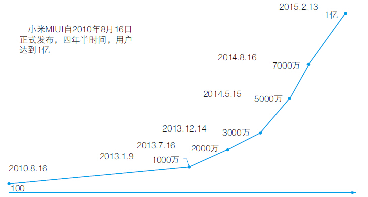
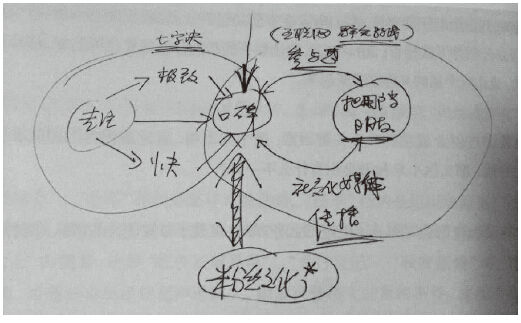
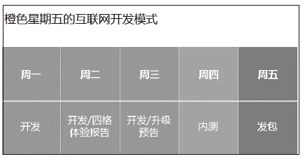
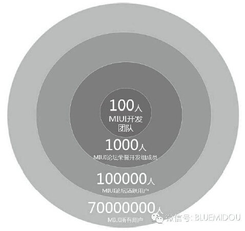
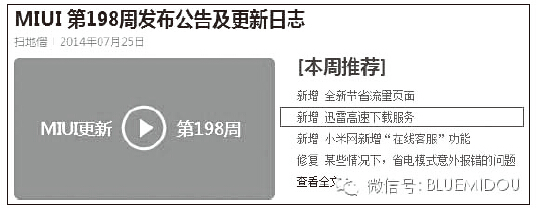
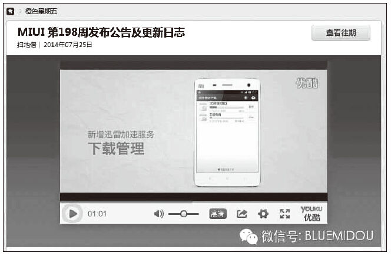
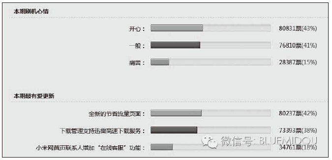
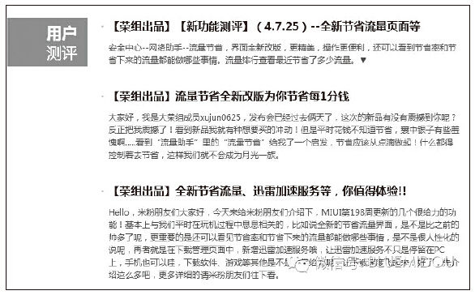
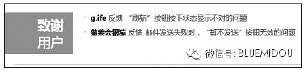
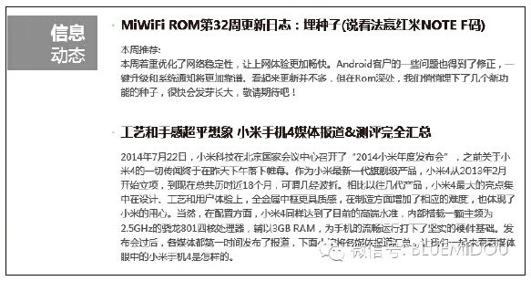

# 31 小米MIUI：用户参与式的产品研发模式

兰军（Blues）

迅雷产品总监。1999年大学本科毕业。教过书，做过销售，跑过市场，创过业。2009年进入腾讯，三年时间历经QQ秀产品中心、SNS产品部，从产品运营到高级产品经理；2012年到YY语音，负责YY语音客户端数据运营和基础产品；2014年到迅雷公司，负责迅雷与小米合作的“云加速”项目，还做些智能硬件的小探索。个人原创微信公众号Blues，ID：bluemidou。已经原创300多篇文章，内容涵盖产品策划、产品运营、大数据、用户研究等，均是来自一线互联网公司的实战经验总结。个人微信号：lanhaoyu2012，欢迎对互联网有兴趣的朋友与我交流。

2014年，我在迅雷公司负责和小米公司的合作项目，大半年的时间，从深圳到北京，两地来回飞，一半时间在北京，一半时间在深圳。这段时间，我们在努力探索双方的合作模式，将迅雷最擅长的“云加速”整合到小米的MIUI系统，大大提升了MIUI系统的游戏、App应用、浏览器、音乐、系统升级等数据下载的完成率和速度。在长时间的合作过程中，除了项目本身的收获，更大的收获是在与小米MIUI团队的联合产品开发过程中，深入学习并融入MIUI的参与式产品开发模式，亲身经历了MIUI用户高速发展的一年。

上面这张图是Blues根据MIUI公布的用户数变化绘制出来的，2010年8月16日，MIUI发布，当时是100个种子用户，后来在2014年8月16日，MIUI6发布时，洪锋有一页PPT，就是感谢这100位种子用户，并邀请他们到了发布会现场。

如果要划分发展阶段，可以看到明显的分界点，那就是1000万的节点，MIUI的用户增长从100到1000万，是个蓄势的过程，1000万之后则是爆发式的增长。虎嗅网曾经在MIUI 5000万用户时采访过洪锋，当时洪锋预测在2015年春节，MIUI用户将突破一亿，如今，预言成真。这其中关键的一点，就是小米以口碑为核心的参与式产品开发模式。

精彩观点

雷军说：“台风口上，猪也能飞——凡事要‘顺势而为’，如果把创业人比作幸福的‘猪’，那行业大势是‘台风’，还有用户的参与也是‘台风’！”小米把用户的参与感看成整个小米最核心的理念：通过参与感来完成产品研发，来完成产品营销和推广，来完成用户服务，把小米打造成一个很酷的品牌，就是年轻人愿意聚在一起的品牌。这是整个小米发展过程中最重要的一个理念——“把用户当朋友”，让用户参与到产品的每个环节，让朋友感觉爽。构建参与感，就是把做产品、做服务、做品牌、做销售的过程开放，让用户参与进来，建立一个可触碰、可拥有，和用户共同成长的品牌。小米的3个战略和3个战术，小米内部称为“参与感三三法则”。

第一个三，是3个战略：做爆品，做粉丝，做自媒体。

第二个三，是3个战术：开放参与节点，设计互动方式，扩散口碑事件。

从“参与感三三法则”来看小米MIUI的产品，首先是战略，MIUI是小米产品生态的核心，先于小米手机诞生；每次版本升级，绝对有成为爆点的产品功能。

参与感伴随着MIUI的第一个版本发布而诞生。小米的第一个MIUI版本于2010年8月16日发布，最初的100名用户是MIUI团队一个一个从第三方论坛“人肉”拉过来的。这批早期的用户参与到MIUI产品的整个研发过程，成为MIUI宝贵的财富。正是这100名用户的积极参与，以及与产品的互动，才形成了小米特有的米粉文化。没有一分钱广告，没有任何流量交换，凭借用户口口相传，到2011年8月16日，MIUI发布整整一周年时，已经有了50万用户。

小米也在用户参与的过程中形成了自己独特的“橙色星期五”互联网开发模式，构建了MIUI 10万人的互联网开发团队模型。截至2014年8月，小米MIUI产品完成了202周的快速迭代开发，成就了MIUI 4年7000万用户的奇迹。细看MIUI的产品开发模式，参与感在小米的开发过程中发挥得淋漓尽致。

实践案例

参与感是雷军关于互联网思维论述的重要一环。如下图所示，参与感是产品的口碑和把用户当朋友的产品理念的连接链条。

雷军关于互联网思维的手稿

产品经理最基本的工作职责就是发掘用户需求、进行产品策划、整合资源、推动产品上线，并不断迭代优化、按期发布，一步又一步向产品目标迈进。而在现实中，很多用户对产品的发版心存疑问。

在Blues的微信公众号后台，一位非常热爱思考的朋友——小胖他爸，提了下面这个问题：

“作为普通用户，我还是觉得大部分升级至少没有我可感知的好处，大到Windows、Office，以及我工作用的专业软件，小到手机的安卓版本、App的更新，除了每次升级可能对硬件要求要提高一点之外。软件从无到有时也许能解决很多问题，但是他们升级带来的可感知的优点太少了。除了有些游戏因为升级有新的关卡，我几乎很少主动升级。所以很多时候感觉升级就是瞎折腾。”

很多产品没有让用户感受到版本升级的好处，源于需求来源不明确，脱离用户。我也经常和同行探讨，按时发版本是产品经理的基本职责，发版时反问一下自己：

每个版本的意义何在？发版本与不发版本，用户感知到的又有多少？（必然有些是用户无法感知的，这里不钻牛角尖）发版本与不发版本，产品数据有无变化？

案例一：小米MIUI的版本开发模式

围绕口碑的核心理念，小米MIUI的研发构建了“橙色星期五”的互联网开发模式：核心是MIUI团队在论坛和用户互动，系统每周更新，如下图所示。

MIUI的开发每周五集成开发版发包，用户当天升级体验，每周六到周一的三天时间升级体验，并在MIUI论坛进行投票，周二生成“四格体验报告”。这是来自用户对产品最直接的评价，在MIUI的版本迭代过程中，四格体验报告淋漓尽致地展示了用户的参与感。

小米MIUI橙色星期五的互联网开发模式

需求来自用户，产品评价来自用户。前文提到的“小胖他爸”的疑惑或许有了答案：每次发版升级，都是用户可感知的，是用户想要的。用户不仅使用产品，同时拥有了产品评价的权利，用户才是产品的主人。

案例二：橙色星期五开发模式

下面以迅雷参与的一个MIUI版本为案例，看看什么是橙色星期五开发模式。

MIUI的10万人互联网开发团队模型

这个版本是MIUI第198周的版本发布，版本号是4.7.25。这个版本号的命名方式非常好理解，就是MIUI在2014年7月25日发布的版本。更新的功能和产品特性如下：

1）新增全新节省流量页面。

2）新增迅雷高速下载服务。

3）新增小米网“在线客服”功能。

4）修复某些情况下省电模式意外报错的问题。

MIUI第198周发布公告及更新日志

（1）版本视频演示

MIUI每一次产品发布都会有一个小视频进行功能演示，直观地告诉用户这个版本更新了什么。一些功能和特性不是所有用户都能快速感知的。用户是否用到，需要特定的场景，而视频演示能直观生动地展现这个版本的更新。

MIUI 198期视频演示

（2）四格体验报告

四格体验报告包含如下4个项目的用户投票评选，用户投票满意度超过30%，该项功能或者特性的产品开发团队将有可能获得爆米花奖。

1）本期刷机心情。

2）本期最有爱更新。

3）下期OTA更新期待。

4）本期最不给力更新。

MIUI 4.7.25版本的四格体验报告

在“本期最有爱更新”的用户投票中，这个版本的“全新流量页面”和“迅雷高速下载服务”的用户投票比例分别为42%和38%，已经算不错的得票成绩，达到爆米花奖项的资格。

（3）用户测评

每个版本均由1000名用户组成的MIUI论坛荣誉开发组成员进行评测，荣誉内测组称为“荣组儿”。每个版本都有【荣组出品】的用户评测报告。

MIUI 4.7.25用户评测报告

（4）致谢用户

每个版本的发布公告，都会对当期提出了有价值反馈的米粉公开表示感谢，对用户的付出表示认可。别小看这个用户致谢，一个能上榜的米粉，会感到无比的自豪，因为这是他参与做出来的产品。

致谢用户

（5）信息动态

对每个版本发布期间发生的产品相关事件信息进行报道。推广产品的同时，让用户了解更多与产品相关的信息，拉近用户距离，因了解而喜欢。

信息动态

总结分析

通过用户的参与来做产品，其实在互联网产品的发展过程中早已存在，尤其是用户参与产品运营。譬如腾讯QQ秀当年的你秀我搭产品，用户提出搭配需求，资深QQ秀用户根据图片搭配同款QQ秀供需求方选用；譬如YY语音通过虾哥论坛收集需求和评价产品。但能把参与感做到贯穿到产品需求到开发、运营的每个环节，并逐步形成体系化，而产品经理、产品运营、产品测试、产品管理者都参与其中并身体力行，小米是先行者。

小米这几年与用户一起成长的历程中还有很多鲜活的一线案例，体现在小米的网站、小米的论坛，有兴趣了解这种“参与式产品开发模式”的读者，可以去参阅小米发版的日志，去浏览小米产品经理和产品运营在论坛与用户的互动，或许更能深刻体会雷军的提出的以“口碑”为核心的用户参与的互联网产品思维。
