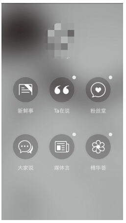

# 34 打造连接明星和粉丝的平台产品

陈邓

欢聚时代100教育产品经理。擅长产品战略策划、项目管理，对在线教育有一定研究。

从高中起保持伪追星族状态，大学起做高校BBS运营4年有余，自诩与年轻一代无代沟。2013年起加入微软追星必应产品，经历战略策划、用户调研、产品设计、线上运营全流程，从产品、用研、交互、运营多角度审视产品历程。2012年加入微软，曾任MSN新闻门户评论平台产品经理，独立带领中方8人研发团队，有一年跨国项目合作经验。

精彩观点

要将1000名一般粉丝转变为1000名铁杆粉丝，关键的难题在于，你必须与这1000名铁杆粉丝保持直接联系。他们会直接支持你。你要尽可能地保留粉丝对你的全部经济支持。你也能从这种直接反馈和喜爱中获益。网络连接技术和小规模制造技术让这种圈子成为可能。

铁杆粉丝模式的本质在于，粉丝能够让艺术家脱离长尾的边缘，使其达到高于粉丝数量通常所能代表的销量。粉丝能通过3种方式做到这一点：每个人购买更多作品；直接从创作者那里购买作品，从而让创作者在每笔销售中获得更高分成；启用新的支持模式。

真正连接明星和“一千铁杆粉丝”，发挥粉丝力量的产品，才是有效的明星产品。

其一，真正连接明星和“一千铁杆粉丝”。首先要定位一千铁杆粉丝。无论是娱乐明星、公众账号，甚至是品牌营销，都需要先找到这些铁杆粉丝，也就是支撑明星的中坚力量。

其二，需要发挥粉丝力量。铁杆粉丝怀有对明星的爱，但现实是粉丝很难找到有效方式发挥自己的力量，也就是缺少“参与感”。一款凝聚粉丝力量的产品，实现的是明星和粉丝之间的高效价值交换。[[1]](part0508.xhtml#ch1_back)

在互联网大举渗入生活的今天，许多产品的主体和用户，会演化为“明星”与“粉丝”形式。

例如，小米手机是明星产品，米粉是其粉丝；雕爷牛腩是宣称“互联网思维做餐饮”的明星品牌，慕名而来的食客转化成为其粉丝；C2C的在线教学平台中，瑜伽、插花、做菜……人人皆可成为老师，追随老师的学生听众，也是粉丝。如何用平台产品构建明星和粉丝共赢的生态圈？在追星必应产品中的调研和实践，让我从最直白的“明星”和“粉丝”入口，领悟到这点：

粉丝经济的关键难题，在于明星必须与1000名铁杆粉丝保持直接联系。第一，要定位到铁杆粉丝，真实全面的展现明星，拉近明星和粉丝的距离；第二，要有渠道有效发挥粉丝力量。

广义的“粉丝”（如米粉）和广义的“明星”（如小米）之间的关系是：粉丝需要明星，满足其崇拜（品牌崇拜、理念崇拜、偶像崇拜）的精神需求；明星需要粉丝，因为粉丝不仅是明星收入的重要来源，而且明星在粉丝中的影响力，标志了明星的热门程度和发展潜力。而粉丝崇拜明星，明星需要粉丝证明其实力，本质上是明星与粉丝之间的强连接。

一款连接粉丝和明星的平台产品，必会围绕强连接打造平台功能、业务逻辑，甚至商业模式。关键的两点和追星平台甚为类似，第一，平台能够方便地定位到铁杆粉丝，为粉丝提供到明星的有效连接。第二，粉丝能够在平台发挥力量。以小米为例，小米论坛的信息结构非常清晰，小米系列产品、小米官方公告、刷机玩机、资源下载等分类，完全贴合小米手机发烧友所需的信息分类，查找资源和答疑解惑非常方便，对于米粉是信息呈现合理的有效连接。

而更为可贵的是，小米和小米论坛做到了上述第二点，让粉丝在平台上发挥价值。小米手机、小米论坛有明显的用户反馈入口，而这些用户反馈不是石沉大海，而是被汇入反馈统计渠道，高效地纳入产品迭代，如MIUI的每周内测更新，以及每月一次的正式版本更新。这种产品和运营共同打造的粉丝参与感，让小米成功地打造了明星到粉丝的连接，增加了粉丝黏性和归属感。

回到最基本的追星层面，在产品策划和运营过程中，我同样感受到了建立信息有效的连接对粉丝用户的吸引力，以及粉丝迫切希望有这样一种平台和模式，能够为偶像贡献自身力量。

实践案例

加入“追星必应”产品时我的想法是：哎呀，终于可以为当年的自己做产品了，咱要是能带着产品穿越回去，就能安慰当年那个苦苦攒《当代歌坛》的小可怜啦。但真正做起来才发现，除了美好的愿景，我们还面临一个最大的问题：做什么样的追星产品？

时至今日，明星粉丝市场竞争异常激烈。一方面是年轻一代的品位爱好逐渐走向多元个性化，另一方面明星总数显著增加，选秀、微博达人、网络自制剧、国外明星都来狠抓中国市场……诸多新兴来源引入了越来越多的明星。

在这种情况下，明星如何脱颖而出？粉丝如何与明星建立最直接的关系？网络媒体方面，常用社交平台已经被逐个尝试，衍生出许多产品形式，如微博主页、微信公众号、明星专属App，等等，效果褒贬不一。彼时我正读到《技术元素》中“一千铁杆粉丝”章节，作者凯文·凯利在国外的访谈和结论，是否同样适用于中国？带着书中的观点和这样的疑问，我开始加入追星必应的策划环节。

1.用户痛点

明星和粉丝还有哪些问题没有被解决？对比凯文·凯利（下文简称KK）的明星粉丝平台观点，我们调研了大量粉丝正在使用的明星产品，结合用户访谈我们发现，明星平台现存的问题与KK所著不谋而合，主要有以下几点内容：

1）明星粉丝连接不足。具体表现为明星本人发布内容少，三天更新一条微博已经是更新频率前10%的艺人了。

2）花边新闻泛滥，而真正对于粉丝有价值的信息太少。

3）粉丝缺少为其偶像做贡献的有效途径。买20张偶像专辑送给别人、追随偶像全国巡演、刷偶像有关的微博热门话题、至多去百度搜索含偶像名字的内容，等等，这些外人看来可能有些不可理解的举动，是目前粉丝常用的支援偶像方式。

对应的“一千粉丝”理论中，前两个痛点正是没有做到“真正连接明星和粉丝”，而第三个痛点也就是没有途径去“发挥粉丝力量”。

传统造星观念会倾向于明星不接地气化，甚至有意识地隔绝明星和粉丝的连接，想想20世纪80年代的天王天后，确实连八卦消息都不太多。而今，明星和经纪公司真的愿意去连接明星和粉丝吗？带着这样的疑问，我们接洽了若干明星经纪公司，发现的确缺少这样的渠道。尤其对于二三线明星而言，一方面是明星和经纪公司想利用互联网圈住更多粉丝，找到新的盈利模式；另一方面是明星的更新和新闻太少，粉丝泡在贴吧、QQ群里，迫切地想第一时间知道明星的动态。

2.产品定位

追星必应定位于首先解决粉丝的痛点，利用粉丝口碑传播，聚集人气，从而吸引明星和经纪公司共同合作。而什么样的产品会区别于贴吧、微博、公众号、专属App等现有产品形式，吸引粉丝呢？团队的产品和运营合力开展了系列用户访谈，联系了拥有30万团员的李敏镐粉丝团团长、华晨宇粉丝团骨干成员，每个用户访谈超过1小时，通过与这些粉丝中意见领袖的交流，探究粉丝用户的普遍心理。调研的重要结果之一，是发现了以下几种形式的粉丝平台都会得到粉丝的垂青：

1）不仅是明星第一人称发布信息，也包括明星的朋友、权威粉丝眼中的明星，全面塑造的明星网络形象会比镁光灯下的明星更真实。

2）经纪公司联合粉丝，组织线上线下活动，让粉丝有办法接近明星。

3）发售包括作品在内的明星官方物品，让粉丝真正有效地为明星做出贡献。

3.产品示例

追星必应是微软“必应影响力”系列产品中的移动端产品，旨在借助搜索技术优势，展现智能和精准挖掘信息的特色，从而成为年轻人喜欢用的追星平台。截止到2014年5月，用户量已过百万，且与多家明星经纪公司达成合作意向。虽然7月从微软离职，后续信息更新有限，但截至当时，追星必应是一款把握粉丝痛点的追星产品。

在追星必应App中，从粉丝痛点出发，着重于以下两点，构建了这款追星产品。

1）在定位铁杆粉丝基础上，全面真实地展现明星，拉近明星与粉丝的距离。

2）产品运营结合，构建发挥粉丝力量的渠道。

第一点对应建立明星到粉丝的渠道，全面真实化展示信息；第二点对应构建贡献粉丝力量的有力平台。在产品层面，我更多参与第一点展示明星信息的移动端产品构建。针对全面展示明星信息，且展示对粉丝有价值含量信息的出发点，我们创新地构建了信息组织方法，和产品界面交互。

在信息组织上，用户痛点是明星相关信息过于繁多，要采用多种方法去多个站点才能获取明星相关信息。比如，一个典型的明星重度粉丝，要关注明星微博，明星贴吧，明星微吧，明星粉丝团微博（一般是多个粉丝团微博），要在贴吧关注明星相关贴吧、作品贴吧，要在多个娱乐站点查看是否有明星美图新闻和最新通告。而实际上，粉丝也愿意关注偶像的亲密友人的动态，得知明星当下的动态（如明星拍戏时探班粉丝发布的片花，明星演唱会时现场粉丝发布的微博），只是苦于没有有效方式获得信息。

定位于这些问题，借助技术优势，我们获得了几方面粉丝获取有难度的信息：明星粉丝团微博；明星的媒体新闻；明星相关人士的微博，从而完整化对粉丝有帮助的信息来源。

对于这些海量信息，需要按照信息对粉丝的重要性归纳组织。根据访谈和粉丝行为研究结果，我们将信息分类排序为：明星本人言论、明星粉丝团动态、明星相关人士与明星有关动态、明星的媒体新闻（媒体指门户媒体娱乐版面，如新浪娱乐）。

在展现信息方面，产品的定位是符合年轻人阅读偏好，同时定位“偶像崇拜”心理，界面设计活泼且高端，使用方法有新意。可以在以下截图中看到产品的发力点：

1）信息呈现。如下图，明星相关的信息分类清楚整合在功能菜单中，按信息优先程度和时间综合排序，且用户可以方便地选择某一信息分类。（由于版权问题，隐去一部分图片，且明星动态为转载，请谅解。）

2）杂志风格，突出图片视频，全面展现明星动态信息。大气且活泼的界面，有没有觉得自己的偶像瞬间高端起来了呢？

在产品发布后，我们邀请了TFBOYS的一位粉丝团团长参与试用，团长小美女给出的反馈是：首先App高端大气上档次，拿出来和小伙伴分享也很有面子；更重要的是，能看到偶像本人的信息，其他明星对他们的评价，媒体对他们的报道，感觉自己的偶像身边非常热闹（当时TFBOYS刚红起来，粉丝并不多）。另外，即使不能参加偶像通告，也不会太遗憾了，因为可以看到粉丝团和权威粉丝的实时更新。

总结分析

在策划运营追星必应的过程中，结合一千粉丝理论我们验证了以下观点：

1）粉丝和明星都需要一个连接彼此的渠道。

2）明星方缺少全面传达信息的方式。

3）粉丝希望有效获得信息，愿意尽自己的力量支援明星。

追星必应App改版后，不仅得到了用户的好评，我们的信息组织和呈现方法也得到了明星经纪公司的普遍认同，达成了多起初步合作意向。

经历一款明星粉丝产品，收获的不仅是对粉丝的同理心，更是对明星粉丝经济的理解。尤其此后进入教育行业打造平台类产品，平台的双方用户“老师”和“学生”，其关系与明星粉丝有许多共性。学生喜欢追随明星老师报课，而老师也希望平台为自己带来更多学生。学生愿意为喜欢的老师付费听课，老师提取听课收入，也是类似粉丝为明星贡献力量的连接。教育类平台可以尝试的模式，也可以是充分建立老师到学生的高黏性连接，充分展示老师的学习类相关信息（不仅是课程，也可以是老师的讲义、观点文章、个人动态），凸显老师的特点，从而吸引学生关注老师。譬如机构入驻模式的腾讯课堂，当报班人数达到一定指标时，平台将提供专门的产品和运营帮助机构推广，打造明星机构。明星粉丝模式的应用方法一定还有许多，期待和各位同仁一起探讨！

[[1]](part0508.xhtml#ch1) 《技术元素（The Technium）》，[美] 凯文·凯利著，张行舟等译，电子工业出版社，2012年5月。
