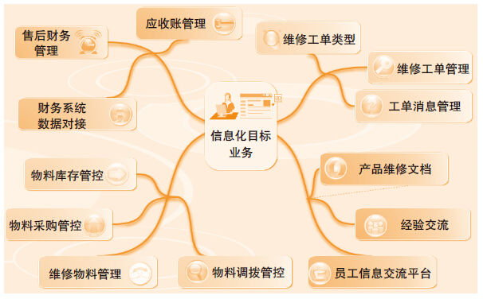
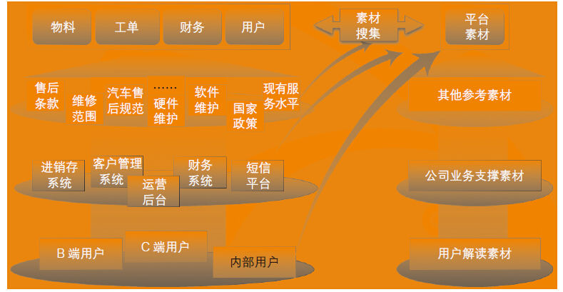

# 41 产品创意的2个法则和5种方法

曾小红

2012—2014年深圳市美赛达科技股份有限公司产品经理，目前在顺丰速运有限公司担任科技产品运营相关工作。从事软件产品相关工作已超过5年，前期积累的主要是项目管理方面的工作经验。在由项目管理岗转至产品经理岗后，通过个人在项目管理方面的经验积累，及对产品岗位认知的不断扩充及深入，在产品道路上能始终保持良好的积极性参与产品相关实践。

目前参与的主要是为车主、4S店、车厂提供服务的车联网领域相关系统集成产品，包括车载终端及手机客户端各类移动终端App，车友门户，车联网管理后台各业务系统等，对车联网行业相关软硬件产品的线上线下业务有较为深刻的理解。

希望在产品道路上能多学多得，能持续探索新产品、好产品。

精彩观点[[1]](part0515.xhtml#ch1_back)

创意的两个基本原则：

第一原则，创意其实没什么深奥的，不过是旧元素的新组合。

第二原则，能洞悉不同事物之间的相关性，是生成新组合的基础。

创意生成的完整方法：

方法1，收集原始素材，无论这些素材是关于当下课题的特殊素材，还是来自不断积累的常识之库的普通素材。

方法2，在头脑中反复研究这些素材，将之不断咀嚼、消化和吸收。

方法3，孵化阶段，将不同元素交给你的潜意识去整合。

方法4，创意的诞生，也就是你大声喊叫“有了”，我“找到了”的阶段。

方法5，创意生成的最终阶段，需要将它应用于现实世界，并做出进一步的修正与发展，以符合显示。

喜欢把这两大原则和5个方法，放到我的生活和工作中的各个场景中加以品味。时间长了，得到的最大收获便是：观点越简单明了，其实越值得深入思考，总觉着日常生活中我们容易忽略一些简单的道理，做一些错误的决定，多少因为不在意，欠了思考。在从项目管理岗位到产品经理入门过程中，以上原则和方法，让我得以有方向地思考和有方法地采取相关行动，持续地培养自己工作及生活过程中掌握原则和方法的习惯。在每天各类互联网信息的轰炸下，能够尽量保持相对清醒的思路，稳定步调继续深入学习，提升自己。

实践案例

从产品的生命周期和产品经理肩负的职责看，在产品迭代过程中，原则和方法也能完全复制这2个原则和5个方法。尽管每个产品经理对产品的理解或经验不尽相同，而践行这2个原则和5个方法，会发现能更容易产生新想法，更容易成就好的产品。

之前我有一个错觉，就是每个产品经理做产品设计应该有他相对明确和固定的业务类型，比如终端业务产品经理、后台业务产品经理，再具体划分可能对应到某个系统了，只有这样，产品经理才更有可能凭借自身对某块业务的熟悉程度来设计出更专业、更符合用户需求的产品。而现实往往并非如此理想，因为资源调配、业务变化等问题，产品经理可能需要在自己并不熟悉的业务领域设计产品，这种情况对产品经理是一种挑战，尤其当自己产品设计经验较少时，会感觉到慌张。在刚接手产品经理岗位时，曾经有这样一次深刻经历，当时为配合公司售后业务开展需要，被安排参与售后信息化系统平台设计，整个信息化平台面向的是公司的所有线上产品（包括各终端硬件和管理后台）的维护，而不再针对某单一产品，用户群涉及内外部用户，且用户对系统使用普遍期望比较消极，更让我不安和紧张的是，在此之前只有一次参与产品设计的经历，且与终端硬件几乎没有直接关系。

尽管不利因素较多，我还是根据以往经验，抽象及梳理了系统目标的大致业务范围。

梳理业务范围后，发现虽然信息平台对我来讲比较陌生，但拆解业务后，发现几乎所有分块业务在以往工作中多少都有涉及，这些知识并不是设计当下才产生的，更多的得益于以往参与项目过程管理的经验，当确定这点后，我对平台的设计工作慢慢恢复信心，回顾新产品创意2个原则的实践，新的产品设计创意，其实也没这么难，不过是旧产品、旧业务的一次梳理及整合，同时找到相关的业务进行抽象，即可为新产品的目标业务圈定基线范围。

梳理完系统目标业务范围后，接下来的工作便是，针对实际条件及现有的业务期望，对目标业务进行摘取，此阶段可以通过标定需求优先级的方式，根据产品需求期限，设计主体功能。

主体功能模块的抽取过程，需要整体考虑需求方的业务期望，现有技术条件实现可行性以及目标用户的配合度等。信息化平台与单一的终端硬件产品最大的区别是，它需要考虑多个系统整合，且因为与实际线下服务流程息息相关，需要关注各个业务闭环。所有前期抽象的功能模块在业务上需要有比较明显的相关性，产品版本覆盖这些功能模块后，能够满足大部分用户的实际业务中的关键需求，并保障业务流、信息流、数据流相对完整，其实新的产品创意是需要分阶段的，每个阶段结合实际条件整合相关性更高的业务输出对应的产品版本，更有利于新产品的有序及快速迭代，这便是原则2的重要作用，需要洞悉各块业务或功能模块与产品的相关性。

回顾信息平台落地的过程及最终产品上线，其实正是产品功能模块搜集、整合、提炼、交付设计、接受检验的过程，是5个过程的反复实践。

信息平台是一个集合了多个主体业务模块，覆盖了公司所有软硬件产品的运维管理业务，如何在最短的时间内结合自己掌握的东西融入产品设计过程当中呢？产品规划设计也需要长期的素材积累。

碎片时间浏览头条、互联网资讯，有空抱起书本读心理、社会、设计等想看的书籍，很多时候这些事情可能都是没有太多目的性的，仅仅因为想了解周围大致发生了什么或是有针对性补充知识，当运用在线笔记把这些内容记录起来后，可能在实际的工作带来启发，可能会成为工作的重要素材，以下是平台初期，整合的相关素材。

新产品创意生成的5个方法中的方法1便是素材的搜集。素材往往包括普通素材及特殊素材，普通素材通常指日常生活的所见所闻，在信息平台产品设计过程当中，普通的素材是我平日从网页上、周边、讨论群中了解到的一些信息，这些信息可能与平台没有直接的关系，但是在设计某个细节性的功能逻辑时会突然想起，然后被引用到。例如，在设计对账功能时，我们想到以信用卡的账单为素材，将其账单管理流程用于平台财务对账流程的对比验证过程中。特殊素材则有可能是与你的兴趣和参与的工作内容相关，特殊素材往往有一个连续跟进的过程，在真正被用到时，特殊素材可以直接起到关键性作用，是产品基本功能模块的基础，在信息平台的特殊素材搜集过程当中，个人对公司系统业务和公司产品用户群的了解都是非常关键的，换句话说，信息平台的素材搜集不是短时间内完成的，是一个长久持续的过程。

在素材搜集后，如何让众多的素材更好地融入产品当中？消化素材是一个非常重要的过程。

方法2则是对素材的消化。对素材的消化其实不只针对特殊素材，普通素材被收集后，有可能在某个应用场景被抽调出来咀嚼、品味，然后消化和应用。对于信息平台产品来讲，当找到了所设计的产品相关素材后，需要通过多个维度去评估、分析和验证，在信息平台的维修工单规划过程当中，我们设计了产品调查问题，对各用户代表进行调查访问，并通过分析调查资料和统计数据，从不同用户角度分析产品功能设计预期效果，不得不说，分析素材的数据在这个过程中的作用非常大，另外，竞品分析是对素材消化屡试不爽的应用，通过对竞品的深度体验后，往往可以找到灵感应用到自己的产品当中。

方法3和方法4是新产品创意成形的思维修炼状态，我个人感觉这状态用战略上重视，战术上藐视可能比较贴切。举个简单例子，在写产品需求的时候，有人喜欢想到一点写一点，有人喜欢想好产品全貌然后一气呵成写出整篇文档。我个人推崇的是后一种，但很多时候是很难这样做的，尤其互联网产品，因为时间的急迫性，有时甚至一个产品需求会被切割成好多功能点分块输出，可是不管是整体输出，还是分块输出，要输出的内容一定已经在你的脑海中孵化成形，然后胸有成竹地放松自己，继而写出脑中早已成形的产品创意说明。信息平台的PRD（产品需求）是分业务模块输出的，在规划过程中，很多时候能够体会平台产品点子不经意间浮现，痛快地输出产品文档的喜悦。

最后将成果付诸实践，也就是方法5，这个方法其实很好理解，信息平台的产品文档，会通过不断的评审修改，来保证文档更可能符合使用者需求，信息平台产品上线后，通过对用户反馈问题的持续跟踪改进，产品的持续完善，使信息平台产品更接近好产品标准，更加贴近用户需求，让信息平台持久运行。

总结分析

引用凯茨·雷恩哈德（DDB广告公司董事长）在此书序言所述：“创意绝非偶然，而是一个循序渐进的过程”。刚接触产品工作时，我也很惧怕产品设计，感觉自己很难有新的创意，然后每天花大量的时间研究竞品，以及行业新品，意图通过这种信息填充的方式，找到相关产品设计的灵感。后来明白，培养产品设计灵感的过程其实是一个漫长的过程，这个过程需要好的心态和思维习惯，而不是临时的拿来主义。对于产品，我认为首先要做的是培养搜集素材，找相关关系的习惯，需要坚持，如果决定在产品道路上走得更远，这个工作必须持续进行，保持热诚及对新产品的关注和探索。“所有的创意生成过程其实都是可以被描述、被传授，并可以不断重复的”，正如文中所说的2个原则和5个方法，它们可以被任何产品经理复制加以实践，为一个又一个好的产品想法诞生及实现提供更多的可能。

[[1]](part0515.xhtml#ch1) 参考图书《创意的生成》（JAMES WEBB YOUNG著，中国人民大学出版社，2014年3月）。
