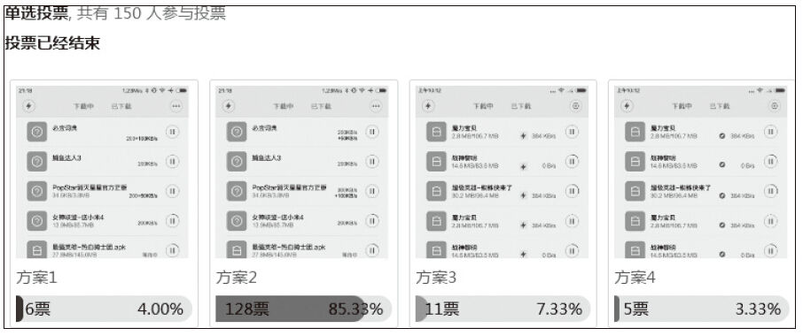
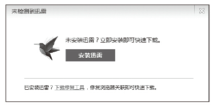

# 45 产品经理提升说服力的4个方法

孙遂意

迅雷产品，主要负责迅雷产品的规划、设计、数据分析与运营推广。个人喜欢旅行、看书、运动。

精彩观点

说服力，就是用理由充分的话让对方心服。

对一名产品经理而言，日常工作中最多的就是沟通，与开发、交互、设计、测试、运营等各个项目成员沟通，只要有沟通就涉及说服，因为需要让对方听懂并心服口服地接受你的产品方案。那么，产品经理如何让自己具有说服这些角色的能力呢？可以从以下几个方面入手：

·说内行话。

·借助权威。

·数据威力。

·换位思考。

实践案例

1.说内行话

每个入门产品经理相对开发、测试、设计等其他角色来说都是外行，但可以通过不断地学习和交流让自己逐步迈进内行的大门，术业有专攻，我们无须成为专家，但起码能识别行话，尽量用行话与项目组成员沟通，避免对方觉得你太外行什么都不懂，不想跟你交流，甚至交流不下去，更觉得你的产品方案不用看就知道不行。

相对工程师来说，如果产品经理在产品需求沟通过程中做不到让工程师准确把握需求，就不用考虑产品实现的满意度了，很可能实现的功能与产品经理的想法大相径庭，或者需求变来变去，都会让工程师崩溃，因为需求上任意一个小小的变化，在代码实现中都有可能产生巨大麻烦，甚至会动摇代码的整体架构。

相对视觉设计师来说，如果产品经理在产品设计需求沟通过程中不能让设计师把握设计要点，可能导致视觉设计师漫无目的，无线返工，直到其不再愿意配合你的设计修改，认为你这个产品经理需求表述不清楚，对视觉狗屁不懂还要求多。

上述这些角色对产品需求不理解或有偏差，通常源于产品经理的需求描述不准确，致使他听不懂或他按自己的内行知识去理解却产生了偏差，而产品经理需求描述不准确可能源于他的外行，长此以往也会失去大家的信任，只要是他的产品方案就必定有问题。这里要说明并非使用一些行业名词就是内行，而需要理解清楚行话背后代表原理和实现成本，不要无用或滥用。

下面结合具体场景进行介绍。

与开发描述产品页面时，尽量从技术角度描述清楚以下信息：

1）页面中哪些是客户端实现，哪些是后台实现？

2）页面中有哪些功能接口，这些接口是以什么协议提供？如HTTP、Socket、SOAP等。

3）接口返回的数据格式，是JSON、XML，还是其他？

与视觉设计师描述产品页面时，尽量从设计角度描述清楚以下信息：

1）产品面向哪些用户群，是学生、白领，还是老年人？

2）各个功能的意图，是为了增加点击率，还是提升易用性？

3）哪些是重点元素，哪些是辅助功能？

4）重新设计的理由是什么，是视觉冲击不够、设计过于复杂，还是抢了核心功能的焦点？

如果能向上述一样描述产品需求，相信工程师和设计师都能对你刮目相看，觉得这个产品经理比较靠谱，潜意识都能给你的产品方案增强说服力。

2.借助权威

从大众心理来看，大家都比较相信权威，权威做法往往会影响人们的判断。同样在产品方案上，大家也更偏爱于权威做法。传统理解上的权威这里不再讲述，在当今这个提倡以用户为中心进行产品规划的时代，用户的观点也是权威，能顺理成章地成为产品方案的说服点。

下面结合具体场景进行介绍。

我们要在一个下载任务列表页展示迅雷会员的加速度，让迅雷的会员用户随时查看自己的高速通道速度，但移动产品页面空间有限，对于如何在有限的界面上展现这个加速度并让用户能快速理解很是纠结，大家都各有道理，有人认为保持原有PC的习惯，就放个加号来加上加速度值就好；有人认为现有产品用户与PC用户重合度不高，非PC迅雷用户可能无法理解，认为搭配个与现有加速服务相同的icon来辅助说明，否则用户无从理解这个值表达的意思，最终我们将有争议的方案整理出来，贴到此产品论坛上，让用户来投票选择，如下图所示。最终借助用户的选择让此功能从设计顺利进阶到开发阶段。

3.数据威力

人们历来对数据有着特殊的钟爱，比如，要说明一种情况，或论证一个观点，如果其中尽是模糊性的语言，而没有具体确凿的数据，别人就会不以为然，认为没有多大的说服力。相反，谁能拿出数据，谁就有真理，谁掌握和提供的数据越多，谁说的话就越可信。用数据说话在增强产品方案说服力上也同理，当然前期是数据真实、可信且能解决对方的疑虑。

下面结合具体场景进行介绍。

我们经常在各种下载网站看到迅雷下载的链接，如果用户没有安装迅雷，就弹出以下弹窗，要求先安装迅雷。从收集的用户反馈来看，很多用户表示，我已经安装了迅雷为什么还是给我弹出下面的弹窗，请开发人员排除相关bug之后，关于产品第一个想到的就是界面引发的问题，是否是弹窗上面的“已安装迅雷”的描述太小了，用户看不到，导致已安装的用户以为弹窗就是给没有安装迅雷的用户看的，所以我们优化了旧方案，让用户明确选择是安装还是未安装的情况，这种解决方案是我们拍脑袋靠直觉给出的，为了让这个优化方案有说服力，我们采取灰度上线，采集数据分析发现新方案的转化率较原先的方案低了许多，拿着这个数据找到之前的开发，告诉他此功能需要回退，虽然新做的代码被下线，开发人员却没有任何怨言，因为大家的目标都是为了提升转化率，而现在优化后转换数据不好，确实不应该上线。

旧方案

新方案

4.换位思考

换位思考能产生同理心，能更好理解别人对问题的看法，进而让自己的观点有个好的着力点。产品经理如果在做产品方案时就能多站在工程师、设计师的角度考虑，不要让对方觉得没有产品经理他们也能做，尽量发出负责任的产品需求，让自己的产品方案具备说服力，从而减少来回沟通的成本。

以产品经理与工程师的换位思考为例，工程师并非要求产品经理尽善尽美地描述出细致的需求，何况不懂技术的产品经理也不可能考虑周全，站在他们的角度通常思考的是：

1）产品核心需求是什么，为什么要做这个需求以及为什么设计成这样？

2）这个产品方案实现的技术逻辑是什么，难点在哪里？

基于上述的思考，我们在给工程师产品方案时，就要说清楚产品需求是什么、为什么要做，可能影响产品技术方案的因素有哪些。

下面结合具体场景进行介绍。

我们在做下载管理App的时候，需要在下载过程中，体现迅雷会员的整体加速效果，于是，设计了一个动画图标，用来展示当前迅雷会员提供的加速度。如果我们换位思考站在工程师的角度考虑如何开发这个动画图标，其技术方案无非两种，一种是自己实现帧动画，一种是直接使用gif组件，很明显，gif组件实现成本低于帧动画，一般开发都会舍难求易而选择前者，如果产品经理在需求设计时能站在技术角度思考，可以在需求中建立使用帧动画以支持产品换肤，那么工程师就不会走弯路了。

没有加速度的状态

有加速度的状态

总结分析

产品沟通要保持自己的说服力，就要想办法提升自己的说服力，有足够说服力，不仅能减少沟通成本，还能逐步塑造个人可信度。

·说内行话：说内行话固然好，但切忌传达错误的内行话，切忌外行人说内行话，不懂装懂，闹出了笑话。

·借助权威：能找到权威做法固然好，但也不能盲目追求权威的做法，势必结合自己的产品方案分析利弊后方可借鉴。如果你能经得起推敲，那么你也能成为权威。

·数据威力：数据能让人信服，但千万不要提供不可靠的数据，也不可滥用数据。要尽量确保数据的来源和分析过程都准确无误，经得起推敲。

·换位思考：换位思考也并非是说站在对方角色考虑问题就完事，还需要有一定的角色背景知识，否则就不具备换位思考的基本素养，只有依靠足够的技术基础，产品经理才能理解工程师对工作和任务的描述，把握技术实现的难度，制定更加合适的产品方案。
