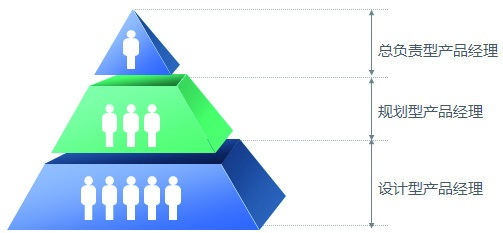
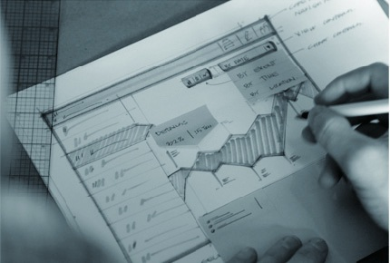
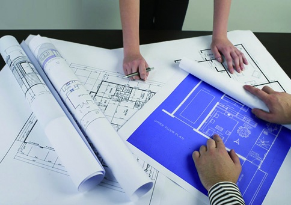

## 1.2 产品经理的金字塔分布

前面曾提到，负责几百上千万用户的叫产品经理，某些公司画Axure原型的也叫产品经理。这是客观现实，行业里面也没有一个统一标准，原因很简单：企业的需求不是标准化需求。事实上，从腾讯、百度、阿里巴巴的招聘信息来看，他们对不同岗位的产品经理要求也是不一样的。

从另外一方面来说，衡量产品经理的标准也是没有办法标准化的，比如对商业的感觉、对数据分析的能力、能不能驾驭百万级产品，这些都只能通过面试官凭经验来判断，无法像做月饼一样套用模具。

接下来，我们一起看看林林总总的产品经理。

### 1.2.1 按照职能划分

企业的需求决定一切，很多时候岗位职能已经定好了，并不是我们想要做什么就让我们做什么，所以我们前期在做选择的时候，一定要好好理解供职企业的JD（Job Descriptions，职位描述）。纵观各企业的不同职能，目前互联网产品经理大概分成以下3类：设计型产品经理、规划型产品经理、总负责型产品经理。

下面我们分别看一下这3类产品经理表现出来的特点。

1.设计型产品经理

设计型产品经理强调的是产品的设计、执行能力。

一般情况下，大致的产品规划大老板已经想好了。产品经理需要负责的是设计满足这个意图的具体产品。包括：产品有哪些功能、有哪些流程、有哪些具体的约束、产品的交互原型设计等，同时还要负责部分体验或数据分析。

设计型产品经理的主要特征是：

◆ 产品处于起步阶段。

◆ 对做成什么样负责，不对要做什么负责。

◆ 有需求分析和设计产品功能的能力，但对产品的通盘性思考不够。

◆ 一般工作经验不是很丰富。

2.规划型产品经理

规划型产品经理强调的是产品的规划（通盘性思考）能力。

一般情况下，大老板给出一个方向和目标，产品经理根据这个方面和目标，进行推导论证，考虑要做一个什么样的产品，才可以满足意图。比如，实现社区化网络建设的目标，或是200万的用户增长数。在这个过程中应该回答：做什么？解决了什么需求？有什么价值？为什么可行？如何做到？

规划型产品经理的主要特征是：

◆ 各企业产品线的核心骨干。

◆ 对要做什么负责，对做成什么样有指导权。

◆ 对于一个产品有独立策划、通盘思考的能力。

◆ 一般工作经验相对丰富。

3.总负责型产品经理

总负责型产品经理强调的是产品整体的运作能力。

一般情况下，大老板给出一个方向和目标，并按照一定配比提供资源，产品经理要根据资源和目标将项目落实：在团队中进行目标的逐层分解，最后按照预期实现业务结果。这个过程包含：目标分解、策略制定、资源的配置和关键点把握。

总负责型产品经理的主要特征是：

◆ 各企业产品线的管理者。

◆ 有资源的决策权，对整体业务的结果负责。

◆ 有很强的战略思维及决断能力。

◆ 一般工作经验比较丰富。

