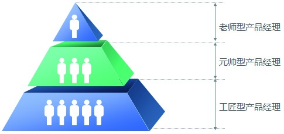
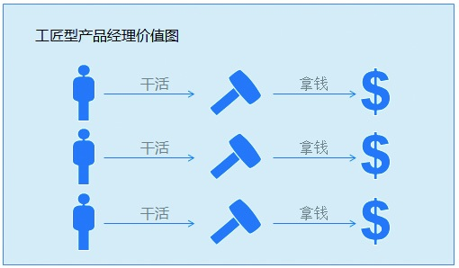
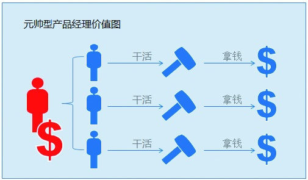

### 1.2.2 按照特质划分

从另外一个维度来看，按职业经理的层次模型产品经理又可分为工匠型、元帅型、老师型。

1.工匠型产品经理

工匠这个词汇由来已久，古时候把木匠、石匠、泥水匠、屠宰匠、剃头匠等掌握某个专业领域技能的、靠手艺吃饭的都叫做工匠。工匠型产品经理主要的价值在于：在某个专业领域里其技能的娴熟程度。一般来说，技能对应的市场供求关系决定了其市场价值，那么这个市场价值往往也就是个人价值的体现。

2.元帅型产品经理

元帅型产品经理，能够在一个领域中带领一帮人来完成一个特定的项目。他的能力体现在全局范围的组织、协调资源等方面。和工匠型产品经理不一样的是，这种类型的产品经理的价值在于：将项目中众人的价值挖掘出来，而不是仅仅局限于个人的技能。

3.老师型产品经理

老师型产品经理通常具有系统思考的能力，对产品经理这个行业有深入的研究，对这个岗位涉及的知识、技能做了很好的梳理，可以使团队很好地成长。一般的产品经理对行业、岗位的理解都是零散的，或者所擅长的领域是结构化的，所以想要成为老师型产品经理，需要不断地思考、实践和总结。
