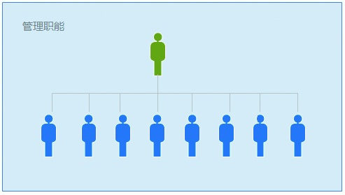

## 1.3 走出产品经理的几个误区

每个人看问题的角度不一样，所以才会有误解存在。比如，某本书一直很强调产品经理的战略思维、价值，新人在看这本书的时候，由于分辨能力还不够，所以下意识里就会把这些东西放大。

另外，也有一些入行不久的朋友，缺乏对产品经理的充分了解，以为掌握产品技能就是全部了。而互联网产品经理相关人才比较缺乏，这就导致他们很容易产生膨胀感。其实可能只是半桶水，略懂皮毛。仔细分析一下可知，大多数误解的产生，是因为静态地、片面地、孤立地看问题所致。

### 1.3.1 理性看待产品经理岗位

理性看待，其实也就是从客观的角度上去看待，不要过于主观。

1.产品经理不是经理

做了产品经理，过年回老家时，一发名片亲朋好友便会说：“混得不错啊，都经理了。”很多产品经理刚入行的时候，也会对这个职位持有同样的看法。从心理学上讲：人们天生有一个本能，下意识挑自己好的一面放大。在“产品经理”一词中，“经理”其实是一个动词，可解释为“经营管理”的意思。所以，产品经理更像是对产品（需求）经营管理（负责）的人。

在大多数公司中，产品经理其实是专业（Professional）岗位，而不是管理（Management）岗位。说得白一点：产品经理就是负责做事的，而不是管人的。说到做事，前面也大致分析过几类产品经理的职责范围。这里再给大家举个例子：

ZC 2009年加入新媒，是中国移动飞信的产品经理。他负责的更多工作内容是：

1）竞争对手分析。

与市面上已有的IM（Instant Messaging，即时通信）软件，比如QQ、阿里旺旺、MSN、Gtalk、Skype等进行对比分析，寻找基于功能的差异。

2）新功能的规划。

规划飞信的功能价值体系，寻找其独有的价值点。在进行一系列准备后，ZC拟定了一套迷你飞信方案，并向公司的领导进行了汇报。

3）产品的研发上线。

和公司的工程师、美术设计师、交互设计师一起设计迷你飞信的具体功能，并讨论怎么让用户更换着使用，最后他和工程师一起将此产品研发出来。

4）产品的优化迭代。

与市场的同事一起推广迷你飞信，最后很多用户都使用了这个产品，而且反馈了很多有用的信息，工程师根据用户的反馈不断地对产品进行迭代、升级。

在这个过程中，ZC更多的是想办法将飞信这个产品不断地向前推进，促使其面市和改善。看吧，这和人们眼里经理应该具备的权力还是不太一样吧！

2.不同阶段职能不同

随着能力的提高，产品经理也慢慢地会被授权去承担一些产品经理招聘、培养新人的工作。在这个过程中，产品经理还是没有资源的决策权，录用、奖惩、开除这些还都是由上层管理者决定的。

当产品经理一词中的“经理”成为名词时，则表示他的岗位职能变了。这个时候产品经理就具有一定的管理属性了，更像是产品经理的经理（即产品部经理或者直接对外称经理）。

接着前面的例子：

ZC由于能力突出、业绩明显，后来晋升为产品总监，开始独立带团队了。这个时候，摆在他面前的现状是：产品项目比较多，他一个人已经忙不过来，下面的产品经理能力又跟不上，只能勉强维持现有的一小块业务。很多想做的项目，由于没人负责以致搁浅。

可见，虽然还是在做产品业务，但由于所站的位置不同，ZC的工作内容也发生了一些变化。接下来我们就一起看看这些变化具体体现在什么地方。

1）组建团队，从什么都自己干变成带领大家一起干。

当事情多起来的时候，一个人能力再强，也不可能什么都自己来完成。既然有很多项目因为没有人能接得起来而搁浅了，那么当务之急是：扩充部门产品经理的数量，组建更大的队伍。于是招聘成了他要解决的第一件事情。

2）分解任务，以团队的力量给出最终结果。

公司的任务下来后，将会被层层分配，最终分解到每一个人身上。在上传下达的过程中，作为团队的管理者，把指标合理地分解给每个人，并且帮助每个成员获得资源以完成业绩变得至关重要。而且作为管理者，他所背负的是整个产品团队的任务指标，所以挖掘每个员工的潜力，以团队的力量完成最终任务，这就是他需要做的。

3）培养团队，提升团队整体的战斗力。

只有团队中每个成员的能力都提高了，整个团队的实力、战斗力才会提升。鉴于此，ZC并没有简单地向大家要结果，而是通过观察分析团队中每个产品经理的情况，制定出一套学习方案来帮助大家一起成长，可谓立足于成长，放眼于长远。

4）引入奖惩，实施优胜劣汰机制。

除了招聘以外，ZC还将适当的奖惩机制融合到工资奖金体系中。多劳多得可以激励部分表现优秀的产品经理更努力地工作，也会激发一些态度消极、不爱学习、表现平平的产品经理的工作积极性。实施优胜劣汰机制，也在一定程度上保证了团队的建设力量。

说到这里，估计大家也逐渐明白了：产品经理本身也是发展的。不同的阶段，产品经理被赋予了不同的职能。而从管理的角度来说，体现出来的更多的是：人员招聘、团队管理、绩效考核、资源分配等。

这个过程也符合很多人从专业走向管理的职业生涯规划。事实上，一个优秀的产品经理，有能力晋升到更高的岗位时，对于他来说，职称是什么已经不重要了。他可以说自己是总裁，也可以说自己是产品经理，好像马化腾就是这样。
