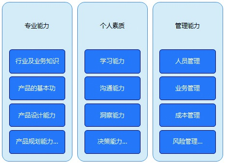

## 1.4 产品经理应该具备的能力

对产品经理的能力模型，现在是众说纷纭，没有一个标准答案，可能每个产品经理都有一套自己的理解，就像武侠小说里的几大门派，少林、武当、峨眉，他们对武功有着不同的诠释，无论是拳架、拳路，还是内外功。

目前来看，最直观的产品经理能力模型是职业经理人能力模型，而冰山能力模型和心智能力模型更趋向于为如何进行自我修炼提供参考。究竟这几种模型要如何理解呢？我们一起来看一下。

### 1.4.1 经理人能力模型

在谈经理人能力模型之前，先来看张图。

这是一张职业能力架构图，不管你是产品经理还是护士长，或者是飞机长，虽然各行业的业务知识隔行如隔山，差异比较大，但他们在专业能力、个人素质和管理能力的构成结构上却是通用的。

现在分析一下上面所说的三种能力之一的专业能力。比如行业及业务知识就是专业能力，对于产品经理来说，做游戏行业，就得知道所有的游戏都是怎么做出来的，游戏的收费模式是怎样的，数值和货币大致的关系，游戏引擎支撑的功能，开发的成本，以及游戏的推广运营方式。

再比如产品的基本功，作为产品经理，起码得知道产品是怎么实现的，要了解网站实现的原理、客户端产品实现的原理、产品设计的原则、应该掌握哪些基本的工具、文档怎么写等。在后面的章节中，将会具体介绍产品规划、产品设计的相关内容。
