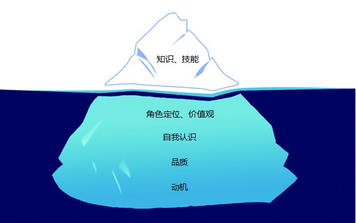

### 1.4.2 冰山能力模型

冰山能力模型听起来有点抽象，它是由美国著名心理学家麦克利兰于1973年提出的。所谓“冰山能力模型”，就是将人员个体素质的不同表现方式划分为表面的“冰山以上部分”和深藏的“冰山以下部分”。

其中，“冰山以上部分”包括基本知识、基本技能，属于外在表现，是容易了解与测量的部分，相对而言也是比较容易通过培训来改变和发展的。而“冰山以下部分”则包括社会角色、自我形象、品质和动机，是人内在的、难以测量的部分。它们不太容易通过外界的影响而改变，但却对人员的行为与表现起着关键性的作用。

之前很多朋友一直不理解“专注、执着、敬业”和能力的关系。这个模型正好可以从品质上解释为什么专注和执著的产品经理，更有可能取得成功。另外，其中的角色定位和价值观也有利于我们认识到：有主人翁（ownership）精神的人更能把事情做好，因为对于他们来说，会觉得这个事情是我该做的，我必须要做好它！
