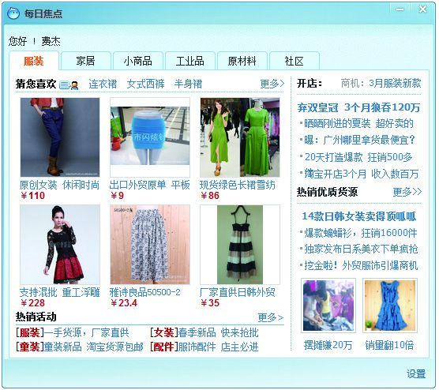
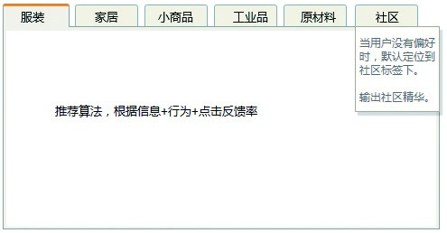
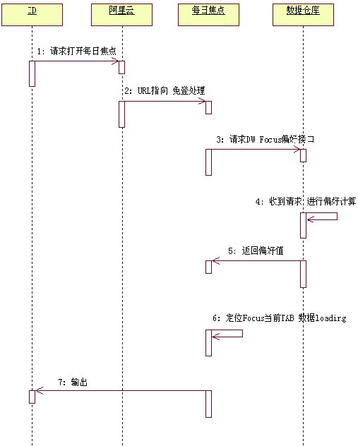

## 1.5 企业青睐什么样的产品经理

HR Linda通过招聘网站发布了一则招聘信息，内容如下：

招聘资深社区产品经理

职位描述：

1）负责社区产品的设计和开发；

2）有过大型互动社区的产品经验，非常熟悉国内外主流的社区网站；

3）根据市场和用户需求，制定所负责社区产品线的发展规划和阶段性目标；

4）负责商业需求分析，推进决策，产出PRD（Product Requirement Document）和Demo等产品需求定义，协调各部门的资源，保证项目如期上线；

5）负责或配合其他部门制定产品运营计划，持续改善产品。

职位要求：

1）本科及以上学历，通信或计算机专业，3年以上社区产品经理相关工作经验；

2）对社区产品有激情和独到观点，有大型社区产品规划、运营和发展相关经验者优先；

3）具备较强的沟通，以及项目协调、控制、推动、执行能力；

4）对社区发展趋势有敏锐的洞察力，有创新意识及良好的分析、研判能力，可提供有竞争力的社区产品；

5）有敬业精神，有较好的文字功底，责任心强，乐观积极、抗压能力强，具有团队合作精神。

企业向来都说自己求贤若渴，什么样的产品经理才算贤？为了弄清楚，我们不妨分析这个JD（Job Descriptions，职位描述）来找出些规律。

### 1.5.1 专业技能过硬

一般来说，在专业技能方面企业都会有一定的要求。比如JD里提到的：“非常熟悉国内外主流的社区网站”、“有过大型互动社区的产品经验”、“保证项目如期上线”等。整理一下就是：“我们希望找一个专业的产品经理，他要了解SNS社区领域的业务，也必须具备一定的产品基本功。”接下来我们具体分析一下专业技能。

1.懂业务

懂业务，其实代表了在这个领域中的积累。很多领域看起来是相通的，但当你跨越的时候，会发现领域间的差异还是蛮大的。

举个例子：

假如你是一名手机APP（Application缩写）产品经理，要去面试这个SNS社区的产品经理，当被问及关系链、双向行为数等问题时，若你在社区方面没有积累，肯定会一头雾水。很多时候企业强调：有经验或有相对成功的案例，其实就是想利用产品经理过去的经验和心得，来降低选用新手产生的大量试错成本。

按照这个逻辑来推理，如果手机APP的产品经理在游戏方面没有积累，而去游戏公司面试WebGame的产品经理，显然也是不明智的，估计在被问及关卡、道具、货币、任务机制、数值等相关知识时会感到一片茫然。

再举个例子：

麦考森是一家做女装的电子商务公司，他们招聘产品经理时有个奇怪的条件——产品经理必须为女性。后来问了半天，他们的产品负责人才告诉我：“女性更容易懂女装，特别是产品展示的时候，衣领大图要怎么展示，胸花要怎么配搭，她们都会有更好的见解。”想了想，好像也是，在这方面，男人的确懂的不多。

2.产品基本功好

产品基本功是一个产品经理专业能力的最基本体现。虽然上面的JD仅仅提到：“负责商业需求分析，推进决策，产出PRD（Product Requirement Document）和Demo等产品需求定义”，这可能是因为他所招聘的是资深社区产品经理，所以没有太多对初级技能的强调。

但很多企业的JD都会提到：“熟练运用Axure、Visio产品设计相关软件”，潜台词就是说：基本的产品技能都得会！用Visio画流程图、用Axure画原型、写产品需求文档都要行。甚至还有一些企业在面试的时候，让你把过去的作品展示一下，其实这也就是想通过实际的产物对你进行衡量。耳听为虚眼见为实，看到了你的作品，就可以更好地判断你的功底。

3.懂技术实现

产品和人一样，是有其内在组织结构的，如果在某个构成部分存在问题，它就会“生病”，懂技术实现，可以帮助你更好地把握产品的架构，让它保持健康。互联网产品，基本上都是通过客户端和服务端进行交互，最后渲染到用户面前的。如果你一点技术不懂，或许这就会成为你产品经理生涯的一块硬伤。特别是还处于设计阶段的产品经理，这会直接妨碍到你进行功能设计。

再来看看前面所展示的JD，上面写到：通信或计算机专业、可以负责社区产品的设计和开发。看来这个岗位是要负责一些新产品的设计和研发的，而不仅仅是社区内容方面的策划。

Google、Microsoft、IBM等企业中的很多产品经理都是从一线的工程师中提拔上来的。因为这些公司的产品更偏向于技术性产品，工程师对业务逻辑非常清楚，他们可将技术与商业场景结合起来考虑，这样就可以获得很好的商业产出。

举个例子：

阿里旺旺每天有很多的用户登录，IM默认用户登录时会弹出“每日焦点”。以前，这个模块只是对原始的资源进行了分配，比如分为3个标签页（社区、资讯、新闻），各个业务方负责各自的运营，这导致CTR（Click Through Rate）很低，很少有用户去点击上面的内容。2010年年初，公司安排我负责此模块的改版，刚开始，我对于如何突破原有的模式也比较困惑。

后来，基于对产品技术的了解，我把阿里巴巴几个主要的场景进行了划分。通过对用户行为偏好进行分析、数据仓库建模，并采用行为和主场景默认匹配推荐的方式进行尝试，这个做法也就意味着：用户在登录阿里旺旺后，所看到的弹出窗口中的内容基本上是与其行业或偏好有关的内容。

在进行调整后，CTR真的涨了5~6倍，用户不再觉得给他推送的东西是没用的了。下图是整个产品模块实现的大致顺序图。

