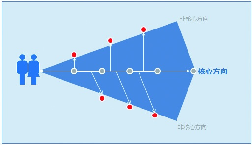

### 2.4.5 回到初衷

产品规划初期，大家有一个目标中心方向，但具体做成什么还比较模糊。很多人在思考的过程中，会不知不觉地偏离预设的轨道，往往想做A产品的，最后变成B产品了。可等发现的时候已经晚了，毕竟投入已经摆在那儿了。作为产品规划人员，要养成结合初衷验证的习惯，这可以降低很多未知的风险。

举个例子：有一个朋友做垂直网站，想先做一个工具带动用户的黏性，于是他做了一个互动的应用。随着移动互联网热起来，他又去做了手机客户端。可用户数一直涨得很慢，这个时候他才发现，他起初要做的事情还没有开始做。
