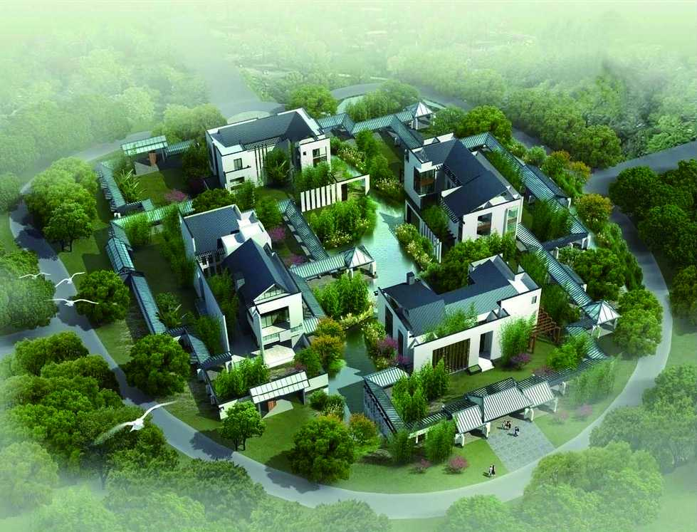
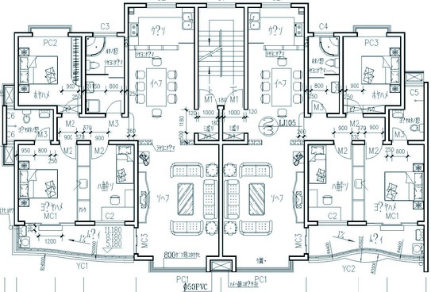
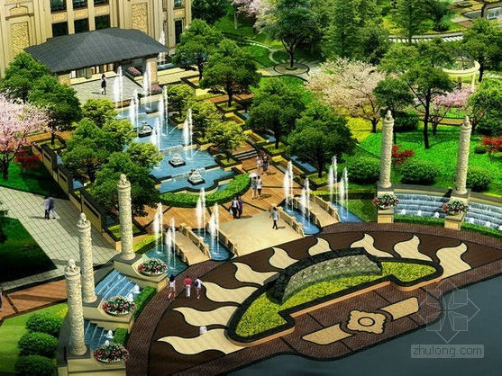

### 3.1.2 产品设计做什么

产品设计要做什么？简单地说，就是回答产品要做成什么样。前面在进行产品规划的时候，我们拿国内某房地产开发商在钱塘江边上开发楼盘为例进行了形象地介绍。下面还以这个房地产商开发楼盘为例来进一步阐释产品设计大概是怎样一件事。

前提是房地产开发商已确定楼盘的具体位置，以及所盖楼盘的用途了。现在要进行产品设计！

在产品设计环节，开发商会根据政府的容积率，计算地上总建筑面积和规划用地面积的配比关系，从而得出这个小区可以开盖几栋楼，每栋楼的占地面积有多少、由几层组成，楼间距大概多少等信息。

然后就需要设计每栋楼的户型结构了，比如80~120平方米的户型格局是怎样的，120~140平方米的户型格局又是怎样的。

接着根据成本预算，设计楼面效果，包括楼体颜色、墙立面效果、园林景观效果等。

总体来说，产品设计的整个过程就是一步步把规划的楼盘变成现实。当消费者看到沙盘或者宣传册上惊艳的效果图时，他们就知道开发商所盖楼盘的卖点是什么、有哪些属性（feature）、有哪些优点（advantage）、买它有没有价值（benefit）了。

将这个过程映射到互联网产品设计上也是一样的，无外乎就是这几步：框架、结构、功能、外观，最后有一个实质性的载体上线（交付），让用户可以直观地看到并使用。
