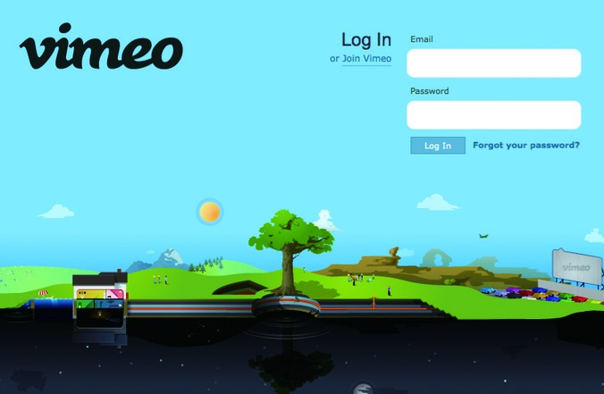
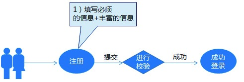
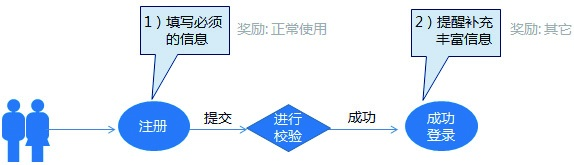
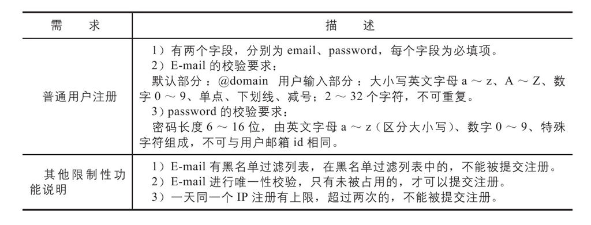
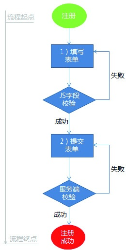
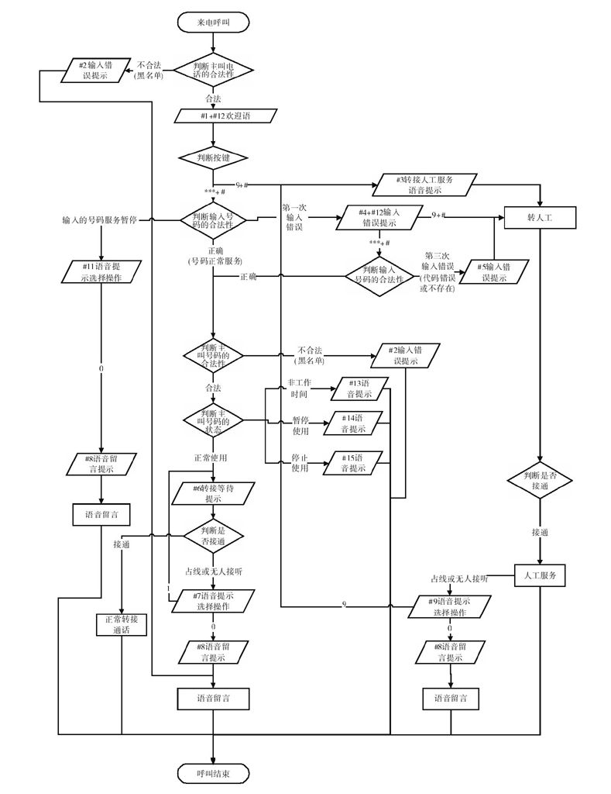
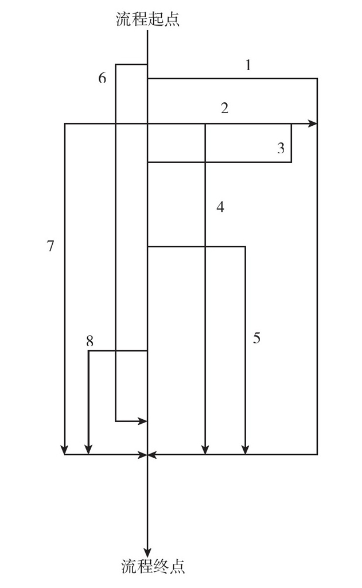

### 3.3.2 功能流程设计

一个好的概念图可以帮助我们直观地认识产品和业务逻辑，了解产品各个模块之间的关系。但是概念设计本身没有具体地约定每个功能的细节，比如，字段、校验的格式、流程的前置条件、后置条件、异常分支流程，这就导致工程师没有办法往下开发。所以产品设计的第二步是“功能流程设计”，它可以解决这些问题，让需求一步步地落实下去。

1.功能设计

很多网站都有会员，会员可以享受更多的服务和优惠，当然，作为会员，也需要填写相关的个人信息，便于网站管理。有些网站在新用户注册会员的时候，恨不得让用户一下子把所有信息都填写完整，但这往往会让用户反感甚至使其中途放弃注册，这就事与愿违了。如何设置会员要填写的内容，这就是我们在进行产品功能流程设计的时候，需要思考的内容之一。

仔细分析一些产品你会发现，它们的功能本身其实并没有太大的区别。但从严格意义上来讲，产品设计是要为目标服务的，虽然同样是设计功能，不同的产品设计理念得到的业务结果是完全不一样的。

1）做对业务贡献最大的功能设计策略。

大家也知道，注册成本是各大网站都会面临的一个问题，所以我们在进行功能设计的时候，也应该有相应的策略。下面是某网站会员线，设计的前后两个需求版本的对照。

这个流程设计，会让很多用户放弃注册。因为用户还没有使用你们的产品，好感还没有建立起来，是不大可能老老实实注册的。

这个流程设计的巧妙之处在于，注册简单，填写基本的信息即可，等用户登录使用后，在一定的场景和时机下，再通过一定的手段提醒用户补充信息，这更容易让用户接受。

2）哪怕是一个功能单元，都要考虑周详，而且要严谨。

以注册表单为例，我们在设计功能的时候，首先要明确想要用户填写哪些信息。对应到技术语言“字段”，则需要约定这些字段的属性，比如，要限定E-mail的格式必须为@domain格式，且密码的长度要在6~16位等。

另外，为了防止恶意注册带来大量无效的用户，后台要有限制垃圾注册的功能，以便进行相关控制。在设计功能的时候，应该从各个方面综合思考各个需求点，这样有助于提高产品设计的成熟度，具体如下表所示。

2.流程设计

企业经营中，免不了要和信息流、资金流、物流挂勾。在产品设计中，一般是以面向对象的任务流为主体进行设计的。其流程主要是通过图形、图表、符号来表达，便于他人了解一个对象如何从任务的起点一步步走到任务的终点。

还是以网站注册为例来进行流程设计。下面是一个最简单的流程图，流程图的最上面是起点，最下面是终点。在这个过程中，用户完成了两步操作：

1）填写表单。在用户填写的过程中，会通过JS实时校验字段的合法性，并且会及时反馈给用户。

2）提交表单。待用户提交表单后，服务端会从IP安全性等方面进行合法性校验，如果通过校验，服务器会反馈注册成功，整个用户注册流程就算完成了。

上面的流程简单吧？但并不是所有业务流程都这么简单，很多产品的任务中会伴随着复杂的异常流程和分支流程。我们经常拨打的银行或者某些机构的400咨询电话就有着比较复杂的流程，如下图所示。

乍一看图中复杂的流程是不是有些晕？其实这里面有窍门，遇到复杂的流程时，你可以假设什么条件都OK，按最理想的流程往下走，这样就可以得到一个主干流程。然后对每个节点上出现的分支流程进行细化，最后就可以很容易地得到一张完整的业务流程图了。

在画大致模拟流程图时，先画完中间主干流程，然后按1、2、3、4、5、6、7、8的顺序将一条条分支流程画出来，最后合到一张大图上就是一个完整的流程图了。

在一些技术性比较强的公司里，还要求产品经理会画一些UML用例，比如：顺序图、激活图等。感兴趣的朋友，可以查看《UML面向对象与设计》等相关书籍。
