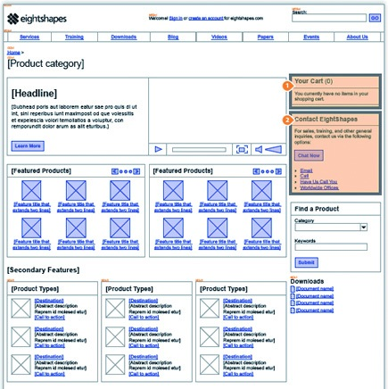
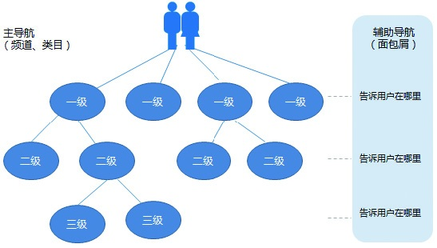
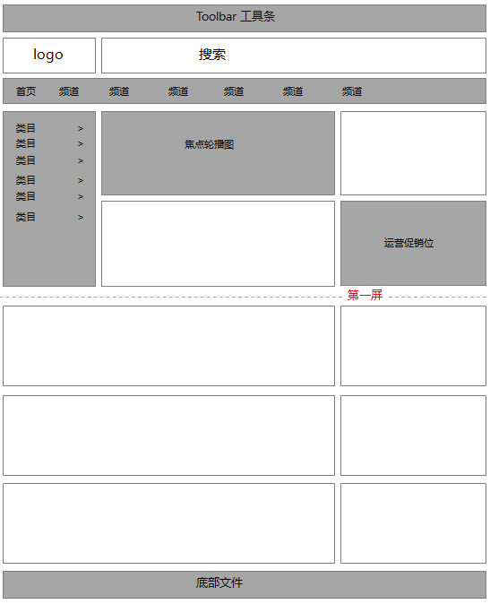
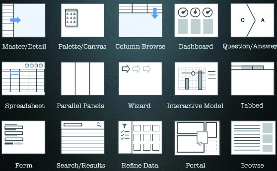
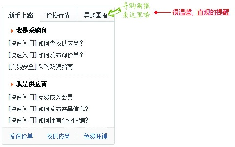
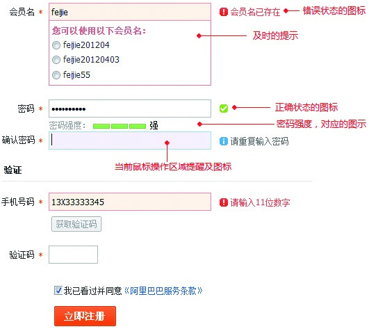
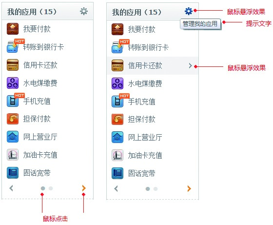
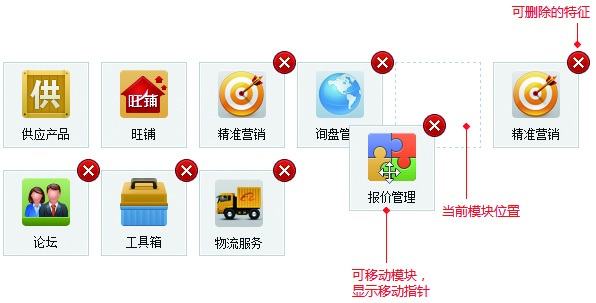

### 3.3.3 交互设计

用户使用互联网产品时，只有先看到产品的界面，才能跟着界面的提示进行操作，这就涉及了交互设计。交互设计处于产品设计的第三环节，它通过对产品界面和行为的设计，与用户之间建立一种有机关系，从而达到让用户更好操作的目标。

在一般的互联网公司，交互设计由产品经理兼顾，在大的公司则专门设立交互设计师的岗位。一般来说，掌握交互知识的产品经理也很容易做到80分，但再往上还是得靠特别出色的交互设计师。

1.信息架构

信息架构是在信息环境中，影响系统组织、导航和布局的组合结构。一个好的信息架构可以让用户很容易地找到目标，同时也会让人、界面、机器有比较流畅的衔接。

在信息架构中，最重要的是导航设计。频道、类目、标签，甚至搜索条的摆放，都是导航系统的组成部分。导航设计的理念是，让用户以最低的成本知道你有什么，他在哪里，怎么去，怎么回。

所以在进行导航设计的时候，最好扁平化，路径不要太深。路径太深，往往会降低效率，不方便用户查找。另外，还要将全局的辅助导航设计好，方便用户实时知道自己在哪里，不至于迷失。如果站点业务比较多，可以提供站点地图，这也是辅助导航的一种重要方式。

进行导航优化时，可以根据卡片分类法[[1]](part0583.xhtml#ch1-back)，让用户参与从而提高导航的易用性。但是在很多情况下，还是要结合业务目标来考虑，有些重要的业务不一定是当下用户所需要的，但还是可以在明显的导航位置上对其进行引导。优秀的产品经理，在一定的情况下需要把握业务与体验的平衡性。

页面的布局其实是和导航相辅相成的。如果把页面比作有流量的资源位，那我们就应该充分利用资源位，也就是把用户最重要的导航放在最明显的位置上，即全局的头部和左侧最上面。一般中间是焦点图推荐区域，右侧是辅助性的功能和模块。因为浏览器的屏幕是有限的，所以对于关键性的信息，要想办法在第一屏进行展示。

在信息架构的布局中，还是有很多现成的知识可以去借鉴和参考的，其中很多已经成为标准的组件了，这样大家在产品设计的时候，就不必为最基础的知识大费周章了。

2.交互细节

在进行交互设计时，要考虑一些细节，比如，让用户在执行某个操作前知道操作后的效果；让用户知道某个区域是可以用鼠标单击或拖拽的，等等。细节决定成败，好的产品往往是每一个细节都做得非常到位。下面简单介绍了几个常见的交互场景。

（1）做必要的引导和提醒，让用户知情。

当版本发生调整的时候，用户多数还是会按照原来的使用习惯进行查找。如果原来的位置被调整了，往往会找不到。所以在对每个位置进行调整以后，应该以明显的引导进行提醒。

（2）及时告诉用户当前的进度，打消用户可能产生的焦虑情绪。

在网速慢的时候，用户会产生焦躁的情绪。所以最好的消除用户焦躁的方式是告诉他们当前的载入进度，这样他们会根据当前的直观反馈，重新分配一个合理的预期。

（3）对于各个状态要及时进行反馈，并给用户建议性的提示。

对于很多正在操作的表单，用户提交失败又不知道怎么才能提交成功，这是一件很痛苦的事情。所以如果能清晰直观地告诉用户应该怎么做，做的对不对，就可以帮助用户提高成功提交表单的效率。

（4）掌握最基本的交互方式：鼠标单击、鼠标悬浮。

鼠标交互事件有悬浮、单击两种。通常悬浮效果，比如背景颜色和按钮颜色的变化，会暗示用户当前状态的变化。单击效果明确了用户需要点击才可以得到当前状态的变化。

（5）让用户对不同状态的特性可见，以便预期操作的结果。

当光标为十字箭头时，拖着应用从一个虚线框到另外一个虚线框，展示了当前应用对应移动的位置。另外，有删除图标的明显地区分了可删除的应用特征。

交互设计是一门很深的学问，很多地方需要结合用户的使用场景反复推敲，这样才能越来越人性化。值得注意的是，不要盲目追求效果，不要为了交互而交互。好的交互是在用户有相关需求时可以很自然地服务到位，而不会让用户觉得多余。

[[1]](part0583.xhtml#ch1)卡片分类法（Card sorting）是一种规划和设计互联网产品或软件产品的信息架构的方法。这种方法也常常被应用到用户研究的过程中，用来比对网站设计者与使用者在对网站资讯分类上的认知差异，作为调整架构的信息依据。用户研究者让用户参与到卡片的收集。
