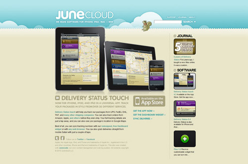

### 3.5.4 美观性

国外几个精美网站截图如下。

每个用户对美的理解都不一样。审美这件事更偏主观色彩。优秀的视觉设计师会将各种元素运用得恰到好处，不论是标题的运用、版面的布局，还是色彩的搭配，他们都有深刻的理解。

有些产品经理会觉得自己对色彩的感觉还算准确，其实这方面还是存在很强的专业性的，视觉设计师可能比产品经理更能把握色彩，建议产品经理不妨多与其进行沟通。当然，很多时候进行视觉风格的改版时，也可以听取用户的意见，了解用户喜欢什么样的风格，这样改版起来会更有把握一些。
